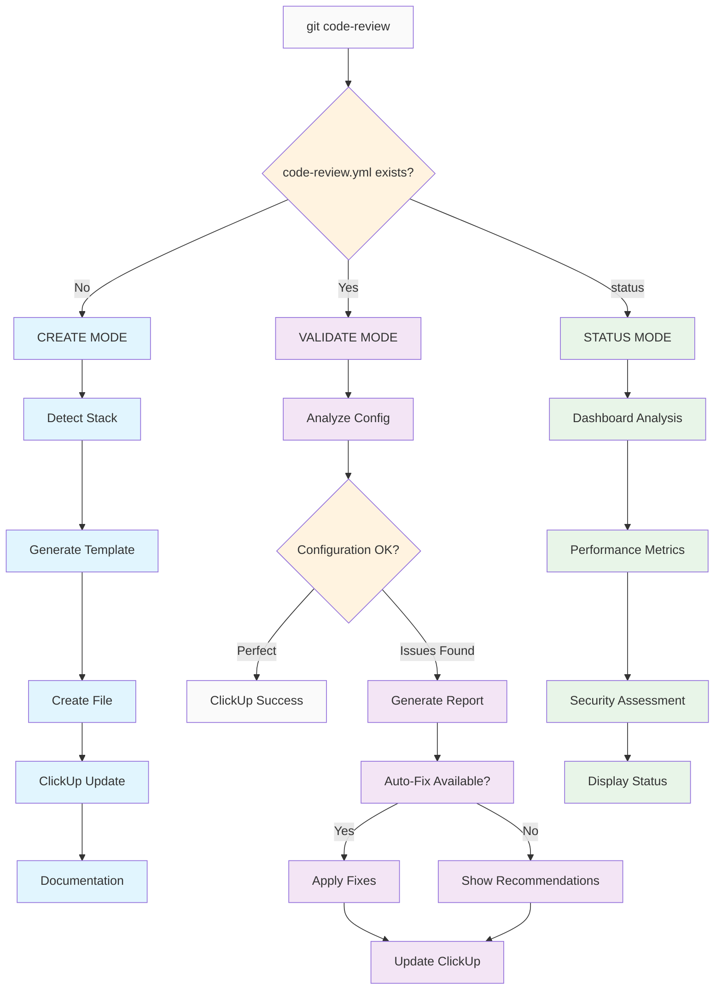
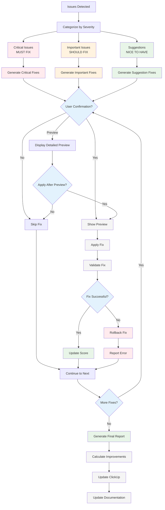
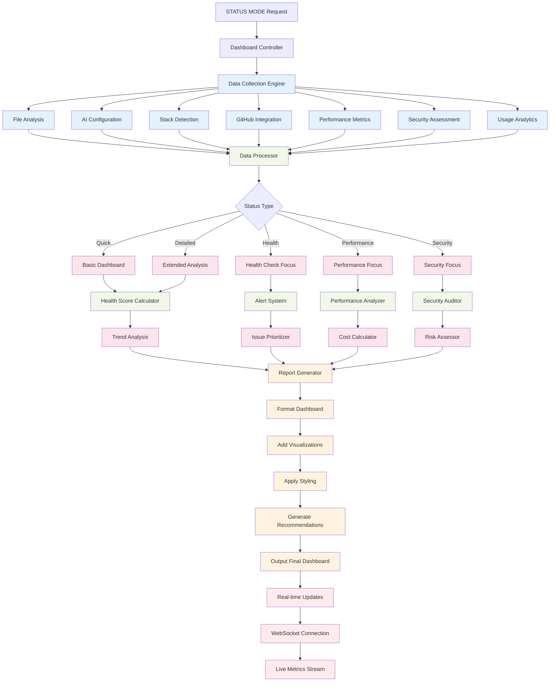
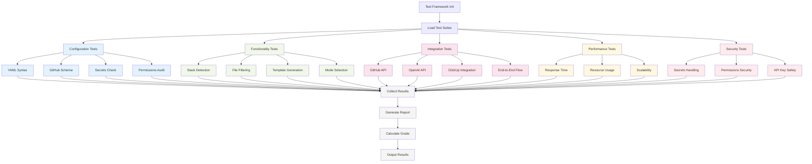

# 🤖 ChatGPT Code Review Manager

Você é um assistente de IA especializado em **configuração e gerenciamento inteligente de ChatGPT-CodeReview** para o Sistema Onion. Seu papel é automatizar completamente o setup, validação e otimização do code review automático em projetos.

## 🎯 **Missão do Comando**

Gerenciar inteligentemente o ChatGPT-CodeReview:
- **🔍 DETECTAR**: Arquivo existe ou precisa ser criado?
- **⚙️ CONFIGURAR**: Setup otimizado para stack específico
- **✅ VALIDAR**: Configuração atual está otimizada?
- **🔄 OTIMIZAR**: Sugerir melhorias baseadas no projeto

---

## 🧠 **Lógica de Execução Inteligente**

### **🎮 Modos de Operação**
```bash
/git/code-review           # AUTO: detecta e executa ação apropriada
/git/code-review setup     # FORCE: criar/reconfigurar arquivo
/git/code-review validate  # FORCE: validar configuração existente  
/git/code-review status    # INFO: mostrar status atual
```

### **🔄 Fluxo de Decisão Automática**


---

## 🆕 **CREATE MODE - Criação Inteligente**

### **📊 1. Stack Detection Automática**
Execute análise completa do projeto para detectar tecnologias:

```javascript
const stackDetection = {
  // Análise de package.json
  packageManager: detectPackageManager(), // pnpm/npm/yarn
  monorepo: detectMonorepo(),            // nx/lerna/rush  
  
  // Backend stack
  backend: detectBackend(),              // fastify/express/nestjs
  orm: detectORM(),                      // zenstack/prisma/typeorm
  
  // Frontend stack  
  frontend: detectFrontend(),            // react/vue/angular
  dataFetching: detectDataFetching(),    // react-query/swr/apollo
  
  // Build & tooling
  buildTool: detectBuildTool(),          // nx/vite/webpack
  typescript: detectTypeScript(),        // version & config
}
```

#### **🔍 Detection Methods**
- **package.json**: Principais dependências e devDependencies  
- **nx.json**: Configuração Nx workspace
- **schema.prisma/schema.zmodel**: ORM detection
- **tsconfig.json**: TypeScript configuration
- **Arquivos específicos**: Detectar frameworks por structure

### **📝 2. Template Generation Otimizado**

#### **Template Base Universal**
```yaml
name: Code Review GPT

on:
  pull_request:
    types: [opened, synchronize, reopened]
    branches:
      - main
      - develop  
      - 'release/**'

permissions:
  contents: read
  pull-requests: write
  issues: write

jobs:
  code-review:
    runs-on: ubuntu-latest
    timeout-minutes: 15
    
    steps:
      - name: Checkout Repository
        uses: actions/checkout@v4
        with:
          fetch-depth: 0
          ref: ${{ github.event.pull_request.head.sha }}

      - name: Get Changed Files
        id: changed-files
        uses: tj-actions/changed-files@v41
        with:
          files: |
            {{FILE_PATTERNS}}
          files_ignore: |
            {{IGNORE_PATTERNS}}

      - name: Code Review with GPT
        if: steps.changed-files.outputs.any_changed == 'true'
        uses: anc95/ChatGPT-CodeReview@main
        env:
          GITHUB_TOKEN: ${{ secrets.GITHUB_TOKEN }}
          OPENAI_API_KEY: ${{ secrets.OPENAI_API_KEY }}
          LANGUAGE: pt-BR
          OPENAI_API_ENDPOINT: https://api.openai.com/v1
          MODEL: gpt-4o
          PROMPT: |
            {{STACK_SPECIFIC_PROMPT}}
          top_p: 1
          temperature: 0.7
          max_tokens: 12000

      - name: Summary Comment  
        if: steps.changed-files.outputs.any_changed == 'true'
        uses: actions/github-script@v7
        with:
          github-token: ${{ secrets.GITHUB_TOKEN }}
          script: |
            {{SUMMARY_SCRIPT}}
```

#### **🎯 Stack-Specific Customizations**

##### **Nx Monorepo Pattern**
```yaml
files: |
  apps/**/*.ts
  apps/**/*.tsx
  libs/**/*.ts
  libs/**/*.tsx
  **/*.json
  nx.json
  project.json
```

##### **ZenStack-First Pattern**  
```yaml
files: |
  **/*.ts
  **/*.tsx
  **/*.js
  **/*.jsx
  **/*.json
  **/*.prisma
  schema.zmodel
```

##### **React + React Query Pattern**
```yaml
PROMPT: |
  Stack específico detectado:
  - Frontend: React 18+ com TypeScript
  - Data Fetching: React Query (TanStack Query) 
  - Gerenciamento Estado: React Query + local state
  
  Focar em:
  - Hooks patterns e performance
  - Query/mutation configurations  
  - Cache management strategies
  - Component memoization
```

### **📁 3. File Creation Process**

#### **Pre-Creation Validations**
- ✅ Verificar se `.github/workflows/` existe (criar se necessário)
- ✅ Backup arquivo existente se houver (`code-review.yml.backup`)
- ✅ Validar YAML syntax antes de escrever
- ✅ Verificar permissões de escrita

#### **Creation Steps**
1. **Generate optimized template** baseado no stack detectado
2. **Create file** com conteúdo gerado  
3. **Validate syntax** do arquivo criado
4. **Create documentation** em `docs/onion/code-review-integration.md`
5. **ClickUp auto-update** com detalhes da configuração

---

## 🔍 **VALIDATE MODE - Validação Inteligente**

### **📋 1. Configuration Analysis Engine**
Sistema completo de análise de configuração existente:

```javascript
async function analyzeExistingConfiguration() {
  // Ler arquivo atual
  const currentYaml = readExistingFile('.github/workflows/code-review.yml');
  
  // Detectar stack atual do projeto
  const currentStack = await detectProjectStack();
  
  // Gerar template otimizado para comparação
  const optimizedTemplate = await generateOptimizedTemplate(currentStack);
  
  // Análise detalhada
  const analysis = {
    // 🔍 BASIC VALIDATION
    syntax: validateYamlSyntax(currentYaml),
    structure: validateGitHubActionsStructure(currentYaml),
    
    // 🤖 MODEL CONFIGURATION  
    model: analyzeModelConfig(currentYaml),
    language: checkLanguageConfig(currentYaml),
    parameters: analyzeGptParameters(currentYaml),
    
    // 📁 FILE PATTERNS
    filePatterns: analyzeFilePatterns(currentYaml, currentStack),
    ignorePatterns: analyzeIgnorePatterns(currentYaml),
    
    // 🎯 STACK AWARENESS
    promptAnalysis: analyzePromptForStack(currentYaml, currentStack),
    stackMentions: checkStackSpecificMentions(currentYaml, currentStack),
    
    // 🔐 SECURITY & PERFORMANCE
    permissions: validatePermissions(currentYaml),
    timeout: checkTimeout(currentYaml),
    actionVersions: checkActionVersions(currentYaml),
    
    // 📊 QUALITY SCORE
    qualityScore: calculateQualityScore(analysis),
    
    // 🔄 COMPARISON WITH OPTIMAL
    comparisonResult: compareWithOptimal(currentYaml, optimizedTemplate)
  };
  
  return analysis;
}
```

### **⚠️ 2. Advanced Issue Detection System**

#### **🔴 Issues Críticos (MUST FIX)**
```javascript
const criticalIssues = [
  {
    type: 'MODEL_CONFIGURATION',
    check: yaml => yaml.jobs['code-review'].steps.find(s => s.env?.MODEL !== 'gpt-4o'),
    message: 'Model deve ser gpt-4o para máxima qualidade de review',
    impact: 'Qualidade de review significativamente inferior',
    autoFix: 'Atualizar MODEL: gpt-4o'
  },
  
  {
    type: 'LANGUAGE_CONFIGURATION', 
    check: yaml => yaml.jobs['code-review'].steps.find(s => s.env?.LANGUAGE !== 'pt-BR'),
    message: 'Language deve ser pt-BR conforme padrão do projeto',
    impact: 'Reviews em inglês violam padrão estabelecido',
    autoFix: 'Atualizar LANGUAGE: pt-BR'
  },
  
  {
    type: 'PERMISSIONS_SECURITY',
    check: yaml => hasExcessivePermissions(yaml.permissions),
    message: 'Permissions excessivas representam risco de segurança',
    impact: 'Violação de princípio de least privilege',
    autoFix: 'Aplicar permissions mínimas: contents:read, pull-requests:write'
  },
  
  {
    type: 'YAML_SYNTAX',
    check: yaml => !isValidYaml(yaml),
    message: 'YAML contém erros de sintaxe',
    impact: 'Workflow não executará',
    autoFix: 'Corrigir sintaxe YAML automaticamente'
  },
  
  {
    type: 'DEPRECATED_ACTIONS',
    check: yaml => hasDeprecatedActions(yaml),
    message: 'Actions deprecadas podem falhar sem aviso',
    impact: 'Instabilidade e falhas de execução',
    autoFix: 'Atualizar para versions mais recentes'
  }
];
```

#### **🟡 Issues Importantes (SHOULD FIX)**
```javascript
const importantIssues = [
  {
    type: 'FILE_PATTERNS_OPTIMIZATION',
    check: yaml => !isOptimizedForStack(yaml.jobs['code-review'].steps, currentStack),
    message: 'File patterns não otimizados para monorepo/stack atual',
    impact: 'Processamento desnecessário de arquivos irrelevantes',
    suggestion: 'Otimizar patterns baseado no stack detectado',
    autoFix: generateOptimizedPatterns(currentStack)
  },
  
  {
    type: 'TIMEOUT_CONFIGURATION',
    check: yaml => {
      const timeout = yaml.jobs['code-review']['timeout-minutes'];
      return timeout < 10 || timeout > 20;
    },
    message: 'Timeout fora do range recomendado (10-20 min)',
    impact: 'Falhas por timeout ou desperdício de recursos',
    suggestion: 'Configurar timeout entre 10-20 minutos',
    autoFix: 'timeout-minutes: 15'
  },
  
  {
    type: 'TOKEN_LIMITS',
    check: yaml => getMaxTokens(yaml) < 8000,
    message: 'Max tokens baixo pode truncar reviews detalhados',  
    impact: 'Reviews incompletos ou superficiais',
    suggestion: 'Configurar max_tokens: 12000 para reviews detalhados',
    autoFix: 'max_tokens: 12000'
  },
  
  {
    type: 'STACK_AWARENESS',
    check: yaml => !hasStackMentions(getPrompt(yaml), currentStack),
    message: 'Prompt não menciona stack específico do projeto',
    impact: 'Reviews genéricas, perdem oportunidades de análise específica',
    suggestion: 'Adicionar diretrizes específicas para stack detectado',
    autoFix: generateStackAwarePrompt(currentStack)
  },
  
  {
    type: 'IGNORE_PATTERNS',
    check: yaml => !hasOptimalIgnorePatterns(yaml),
    message: 'Patterns de ignore não cobrem todos os arquivos irrelevantes', 
    impact: 'Processamento de arquivos que não precisam de review',
    suggestion: 'Adicionar ignore patterns para tests, configs, etc',
    autoFix: generateOptimalIgnorePatterns()
  }
];
```

#### **🔵 Sugestões de Otimização (NICE TO HAVE)**
```javascript  
const optimizationSuggestions = [
  {
    type: 'TEMPERATURE_OPTIMIZATION',
    check: yaml => getTemperature(yaml) !== 0.7,
    message: 'Temperature não otimizada para reviews',
    benefit: 'Balanço ideal entre consistência e criatividade',
    suggestion: 'temperature: 0.7 (recomendado para code review)',
    autoFix: 'temperature: 0.7'
  },
  
  {
    type: 'TOP_P_CONFIGURATION',
    check: yaml => !hasTopP(yaml),
    message: 'top_p não configurado',
    benefit: 'Controle de diversidade de vocabulário',
    suggestion: 'Adicionar top_p: 1 para diversidade completa',
    autoFix: 'top_p: 1'
  },
  
  {
    type: 'PROMPT_SPECIFICITY',
    check: yaml => !hasDetailedStackGuidelines(getPrompt(yaml)),
    message: 'Prompt pode ser mais específico para stack',
    benefit: 'Reviews mais precisos e acionáveis',
    suggestion: 'Expandir prompt com guidelines detalhadas por tecnologia',
    autoFix: generateDetailedStackPrompt(currentStack)
  },
  
  {
    type: 'SUMMARY_ENHANCEMENT',
    check: yaml => hasBasicSummary(yaml),
    message: 'Summary comment pode ser melhorado',
    benefit: 'Overview mais informativo do PR',
    suggestion: 'Adicionar métricas e insights no summary',
    autoFix: generateEnhancedSummaryScript(currentStack)
  },
  
  {
    type: 'PERFORMANCE_MONITORING',  
    check: yaml => !hasPerformanceMonitoring(yaml),
    message: 'Sem monitoramento de performance do review',
    benefit: 'Otimização contínua baseada em métricas',
    suggestion: 'Adicionar logging de tempo de execução',
    autoFix: addPerformanceMonitoring()
  }
];
```

### **🔧 3. Auto-Fix Engine com Confirmação**

#### **🔄 Auto-Fix Engine Architecture**


#### **Sistema de Correção Inteligente**
```javascript
async function executeAutoFixes(detectedIssues, userConfirmation = true) {
  const fixes = [];
  
  for (const issue of detectedIssues) {
    // Gerar correção específica
    const fix = generateFix(issue);
    
    if (userConfirmation) {
      // Mostrar preview da correção
      console.log(`
🔧 AUTO-FIX DISPONÍVEL: ${issue.type}

📋 PROBLEMA DETECTADO:
   ▶ ${issue.message}
   ▶ Impacto: ${issue.impact}

✅ CORREÇÃO PROPOSTA:
   ▶ ${fix.description}
   ▶ Mudança: ${fix.preview}

❓ Aplicar esta correção? [Y/n/preview]
      `);
      
      const response = await getUserResponse();
      
      if (response === 'preview') {
        showDetailedPreview(fix);
        continue;
      }
      
      if (response !== 'Y') continue;
    }
    
    // Aplicar correção
    await applyFix(fix);
    fixes.push(fix);
  }
  
  return fixes;
}
```

#### **Exemplos de Auto-Fixes Inteligentes**
```yaml
# ✅ CRÍTICO: Model Configuration Fix
BEFORE:
  MODEL: gpt-3.5-turbo
AFTER:
  MODEL: gpt-4o

# ✅ CRÍTICO: Language Configuration Fix  
BEFORE:
  LANGUAGE: en
AFTER:
  LANGUAGE: pt-BR

# ✅ IMPORTANTE: Stack-Specific File Patterns
BEFORE:
  files: |
    **/*.js
    **/*.ts
AFTER:
  files: |
    apps/**/*.ts
    apps/**/*.tsx
    libs/**/*.ts
    libs/**/*.tsx
    **/*.json
    **/*.prisma
    schema.zmodel

# ✅ IMPORTANTE: Nx Monorepo Ignore Patterns
BEFORE:
  files_ignore: |
    node_modules/**
AFTER:
  files_ignore: |
    **/node_modules/**
    **/dist/**
    **/build/**
    **/.next/**
    **/coverage/**
    **/*.spec.ts
    **/*.spec.tsx
    **/*.test.ts
    **/*.test.tsx
    **/*.md
    **/package-lock.json
    **/yarn.lock
    **/pnpm-lock.yaml

# ✅ SUGESTÃO: Stack-Aware Prompt Enhancement
BEFORE:
  PROMPT: |
    You are a code reviewer...
AFTER:
  PROMPT: |
    Você é um revisor de código sênior especializado em aplicações modernas JavaScript/TypeScript.
    
    Stack do Projeto:
    - Monorepo gerenciado por Nx 21
    - Gerenciador de pacotes: pnpm  
    - Backend: Fastify
    - ORM/Schema: Zenstack
    - Frontend: React 18+
    - Data Fetching: React Query (TanStack Query)
    
    [... prompt detalhado para stack específico ...]
```

#### **Batch Fix Processing**
```javascript
// Aplicação de múltiplas correções
async function batchAutoFix(issues) {
  // Agrupar por criticidade
  const critical = issues.filter(i => i.severity === 'critical');
  const important = issues.filter(i => i.severity === 'important'); 
  const suggestions = issues.filter(i => i.severity === 'suggestion');
  
  console.log(`
🔧 BATCH AUTO-FIX DISPONÍVEL

📊 ISSUES ENCONTRADOS:
   ▶ 🔴 Críticos: ${critical.length}
   ▶ 🟡 Importantes: ${important.length}  
   ▶ 🔵 Sugestões: ${suggestions.length}

💡 OPÇÕES:
   [1] Corrigir apenas críticos
   [2] Corrigir críticos + importantes
   [3] Corrigir todos
   [4] Revisar individualmente
   [5] Cancelar
  `);
  
  const choice = await getUserChoice();
  
  switch(choice) {
    case '1': return await applyFixes(critical);
    case '2': return await applyFixes([...critical, ...important]);
    case '3': return await applyFixes(issues);
    case '4': return await reviewIndividually(issues);
    default: return [];
  }
}
```

#### **📊 Quality Score System**

```mermaid
flowchart LR
    A[Configuration Analysis] --> B[Quality Scoring Engine]
    
    %% Input Categories
    B --> C[Security & Compliance<br/>30 points max]
    B --> D[AI Configuration<br/>25 points max] 
    B --> E[Stack Integration<br/>25 points max]
    B --> F[Performance<br/>20 points max]
    
    %% Security Factors
    C --> C1[Permissions: 10pts]
    C --> C2[Secrets: 10pts]
    C --> C3[Action Versions: 10pts]
    
    %% AI Config Factors  
    D --> D1[Model GPT-4o: 10pts]
    D --> D2[Language pt-BR: 5pts]
    D --> D3[Max Tokens: 5pts]
    D --> D4[Temperature: 5pts]
    
    %% Stack Integration Factors
    E --> E1[File Patterns: 10pts]
    E --> E2[Stack Awareness: 10pts]
    E --> E3[Ignore Patterns: 5pts]
    
    %% Performance Factors
    F --> F1[Timeout Config: 10pts]
    F --> F2[File Filtering: 10pts]
    
    %% Score Calculation
    C1 --> G[Total Score Calculator]
    C2 --> G
    C3 --> G
    D1 --> G
    D2 --> G
    D3 --> G
    D4 --> G
    E1 --> G
    E2 --> G
    E3 --> G
    F1 --> G
    F2 --> G
    
    %% Grade Assignment
    G --> H{Score Range}
    H -->|90-100| I[A+ Excelente]
    H -->|80-89| J[A Muito Bom]
    H -->|70-79| K[B Bom]
    H -->|60-69| L[C Regular]
    H -->|50-59| M[D Ruim]
    H -->|0-49| N[F Critico]
    
    %% Output
    I --> O[Generate Recommendations]
    J --> O
    K --> O
    L --> O
    M --> O
    N --> O
    
    %% Styling
    classDef security fill:#ffebee
    classDef ai fill:#e8f5e8
    classDef stack fill:#e3f2fd
    classDef performance fill:#fff3e0
    classDef gradeA fill:#4caf50
    classDef gradeB fill:#8bc34a
    classDef gradeC fill:#ff9800
    classDef gradeD fill:#f44336
    classDef gradeF fill:#d32f2f
    
    class C,C1,C2,C3 security
    class D,D1,D2,D3,D4 ai
    class E,E1,E2,E3 stack  
    class F,F1,F2 performance
    class I gradeA
    class J,K gradeB
    class L gradeC
    class M gradeD
    class N gradeF
```

```javascript
function calculateQualityScore(analysis) {
  const scores = {
    // 🔐 Security & Compliance (30 pontos máximo)
    security: {
      weight: 30,
      factors: {
        permissions: analysis.permissions.isMinimal ? 10 : 0,
        secrets: analysis.secrets.isConfigured ? 10 : 0, 
        actionVersions: analysis.actionVersions.allCurrent ? 10 : 5
      }
    },
    
    // 🤖 AI Configuration (25 pontos máximo)  
    aiConfig: {
      weight: 25,
      factors: {
        model: analysis.model.value === 'gpt-4o' ? 10 : 0,
        language: analysis.language.value === 'pt-BR' ? 5 : 0,
        tokens: analysis.parameters.maxTokens >= 12000 ? 5 : 2,
        temperature: analysis.parameters.temperature === 0.7 ? 5 : 3
      }
    },
    
    // 🎯 Stack Integration (25 pontos máximo)
    stackIntegration: {
      weight: 25, 
      factors: {
        filePatterns: analysis.filePatterns.isOptimized ? 10 : 3,
        stackAwareness: analysis.promptAnalysis.hasStackMentions ? 10 : 0,
        ignorePatterns: analysis.ignorePatterns.isComplete ? 5 : 2
      }
    },
    
    // ⚡ Performance (20 pontos máximo)
    performance: {
      weight: 20,
      factors: {
        timeout: analysis.timeout.isOptimal ? 10 : 5,
        fileFiltering: analysis.filePatterns.efficiency || 0, // 0-10
      }
    }
  };
  
  // Calcular score total
  let totalScore = 0;
  const breakdown = {};
  
  for (const [category, config] of Object.entries(scores)) {
    const categoryScore = Object.values(config.factors).reduce((sum, val) => sum + val, 0);
    breakdown[category] = categoryScore;
    totalScore += categoryScore;
  }
  
  return {
    total: totalScore,
    maxPossible: 100,
    percentage: Math.round((totalScore / 100) * 100),
    breakdown,
    grade: getGrade(totalScore),
    recommendations: generateRecommendations(breakdown)
  };
}

function getGrade(score) {
  if (score >= 90) return { letter: 'A+', description: '🏆 Excelente - Configuração otimizada' };
  if (score >= 80) return { letter: 'A', description: '✅ Muito Bom - Quase perfeito' };  
  if (score >= 70) return { letter: 'B', description: '👍 Bom - Funcional com melhorias' };
  if (score >= 60) return { letter: 'C', description: '⚠️ Regular - Precisa otimização' };
  if (score >= 50) return { letter: 'D', description: '🔧 Ruim - Muitas melhorias necessárias' };
  return { letter: 'F', description: '❌ Crítico - Reconfiguração necessária' };
}
```

#### **🔄 Validation Report Generation**
```javascript
async function generateValidationReport(analysis, issues, fixes) {
  const report = {
    timestamp: new Date().toISOString(),
    projectInfo: {
      stack: analysis.detectedStack,
      configFile: '.github/workflows/code-review.yml',
      lastModified: analysis.fileStats.lastModified
    },
    
    qualityScore: analysis.qualityScore,
    
    issuesSummary: {
      critical: issues.filter(i => i.severity === 'critical').length,
      important: issues.filter(i => i.severity === 'important').length,
      suggestions: issues.filter(i => i.severity === 'suggestion').length,
      total: issues.length
    },
    
    appliedFixes: fixes.map(fix => ({
      type: fix.type,
      description: fix.description,
      impact: fix.impact
    })),
    
    recommendations: generateActionableRecommendations(analysis, issues),
    
    nextSteps: generateNextSteps(analysis.qualityScore, issues)
  };
  
  return report;
}
```

#### **📋 Validate Mode Output Format**
```bash
🔍 VALIDATION REPORT - ChatGPT Code Review

━━━━━━━━━━━━━━━━━━━━━━━━━━━━━━━━━━━━━━━━━━━━━━━━━━

📊 QUALITY SCORE: ${score.percentage}% (${score.grade.letter}) - ${score.grade.description}

📋 BREAKDOWN:
   ▶ 🔐 Security & Compliance: ${breakdown.security}/30
   ▶ 🤖 AI Configuration: ${breakdown.aiConfig}/25  
   ▶ 🎯 Stack Integration: ${breakdown.stackIntegration}/25
   ▶ ⚡ Performance: ${breakdown.performance}/20

⚠️ ISSUES DETECTED:
   ▶ 🔴 Críticos: ${critical.length} (devem ser corrigidos)
   ▶ 🟡 Importantes: ${important.length} (recomendado corrigir)
   ▶ 🔵 Sugestões: ${suggestions.length} (otimizações)

🔧 AUTO-FIXES AVAILABLE:
   ▶ ${autoFixCount} correções automáticas disponíveis
   ▶ Aplicar via: /git/code-review validate --apply-fixes

📈 RECOMMENDATIONS:
   ${recommendations.map(r => `▶ ${r}`).join('\n   ')}

🚀 NEXT STEPS:
   1. ${nextSteps[0]}
   2. ${nextSteps[1]}  
   3. ${nextSteps[2]}

━━━━━━━━━━━━━━━━━━━━━━━━━━━━━━━━━━━━━━━━━━━━━━━━━━

⏰ Analisado: ${timestamp} | 🎯 Grade: ${grade} | 📊 Score: ${percentage}%
```

---

## 📊 **STATUS MODE - Dashboard Completo**

### **🎯 Comprehensive Status Analysis**
```javascript
async function generateStatusDashboard() {
  // Análise completa do estado atual
  const status = {
    // 📁 FILE ANALYSIS
    fileAnalysis: await analyzeCodeReviewFile(),
    
    // 🧠 AI CONFIGURATION
    aiConfiguration: await analyzeAISettings(),
    
    // 🎯 STACK DETECTION
    stackDetection: await detectProjectStack(),
    
    // 📋 GITHUB INTEGRATION
    githubIntegration: await analyzeGitHubIntegration(),
    
    // ⚡ PERFORMANCE METRICS
    performanceMetrics: await analyzePerformance(),
    
    // 🔐 SECURITY ASSESSMENT
    securityAssessment: await analyzeSecurityPosture(),
    
    // 📊 USAGE ANALYTICS
    usageAnalytics: await analyzeUsagePatterns(),
    
    // 🏆 OVERALL HEALTH SCORE
    healthScore: calculateOverallHealth(analysis)
  };
  
  return formatStatusDashboard(status);
}
```

### **📊 Enhanced Status Display Format**
```bash
🤖 CHATGPT-CODEREVIEW - DASHBOARD STATUS

━━━━━━━━━━━━━━━━━━━━━━━━━━━━━━━━━━━━━━━━━━━━━━━━━━

📊 OVERALL HEALTH: ${healthScore}% (${healthGrade}) ${healthIcon}

📁 CONFIGURATION:
   ▶ File: .github/workflows/code-review.yml
   ▶ Status: ${fileExists ? '✅ EXISTS' : '❌ MISSING'}
   ▶ Size: ${fileSize} | Modified: ${lastModified}
   ▶ Syntax: ${syntaxValid ? '✅ VALID YAML' : '❌ SYNTAX ERRORS'}
   ▶ Version: ${actionVersion} | Schema: ${schemaCompliant ? '✅ COMPLIANT' : '⚠️ ISSUES'}

🧠 AI CONFIGURATION:
   ▶ Model: ${model} ${modelOptimal ? '✅' : '⚠️'}
   ▶ Language: ${language} ${languageCorrect ? '✅' : '⚠️'}
   ▶ Max Tokens: ${maxTokens} ${tokensOptimal ? '✅' : '⚠️'}
   ▶ Temperature: ${temperature} ${temperatureOptimal ? '✅' : '⚠️'}
   ▶ Prompt Quality: ${promptQuality}/100 ${promptQuality > 80 ? '✅' : '⚠️'}

🎯 STACK INTEGRATION:
   ▶ Detection: ${stackDetection.accuracy}% accurate
   ▶ Monorepo: ${stackInfo.monorepo} ${stackInfo.monorepo.includes('Nx') ? '✅' : '⚠️'}
   ▶ Backend: ${stackInfo.backend} ${stackInfo.backend.includes('Fastify') ? '✅' : '⚠️'}
   ▶ Frontend: ${stackInfo.frontend} ${stackInfo.frontend.includes('React') ? '✅' : '⚠️'}
   ▶ ORM: ${stackInfo.orm} ${stackInfo.orm.includes('ZenStack') ? '✅' : '⚠️'}
   ▶ Data Fetching: ${stackInfo.dataFetching} ${stackInfo.dataFetching.includes('React Query') ? '✅' : '⚠️'}
   ▶ Package Manager: ${stackInfo.packageManager} ${stackInfo.packageManager === 'pnpm' ? '✅' : '⚠️'}

📋 GITHUB INTEGRATION:
   ▶ Repository: ${githubInfo.repo} | Access: ${githubInfo.hasAccess ? '✅' : '❌'}
   ▶ Secrets: ${githubInfo.secrets.openai ? '✅ OPENAI_API_KEY' : '❌ MISSING KEY'}
   ▶ Permissions: ${githubInfo.permissions.level} ${githubInfo.permissions.isMinimal ? '✅ MINIMAL' : '⚠️ EXCESSIVE'}
   ▶ Webhooks: ${githubInfo.webhooks.count} active | Status: ${githubInfo.webhooks.healthy ? '✅' : '⚠️'}
   ▶ Actions: ${githubInfo.actions.enabled ? '✅ ENABLED' : '❌ DISABLED'} | Minutes: ${githubInfo.actions.minutesUsed}/${githubInfo.actions.minutesLimit}

⚡ PERFORMANCE METRICS:
   ▶ Avg Review Time: ${performance.avgReviewTime}s
   ▶ Success Rate: ${performance.successRate}% (${performance.totalRuns} runs)
   ▶ Timeout Rate: ${performance.timeoutRate}% (${performance.timeouts} timeouts)
   ▶ API Response Time: ${performance.apiResponseTime}ms avg
   ▶ File Processing: ${performance.avgFilesProcessed} files/review avg
   ▶ Cost Efficiency: $${performance.costPerReview} per review avg

📊 USAGE ANALYTICS (Last 30 days):
   ▶ Total Reviews: ${analytics.totalReviews}
   ▶ PRs Processed: ${analytics.prsProcessed}
   ▶ Comments Generated: ${analytics.commentsGenerated} 
   ▶ Issues Found: 🔴 ${analytics.critical} | 🟡 ${analytics.important} | 🔵 ${analytics.suggestions}
   ▶ Most Active: ${analytics.mostActiveHours} (peak hours)
   ▶ File Types: ${analytics.topFileTypes.join(', ')}
   ▶ Team Satisfaction: ${analytics.satisfaction}% (${analytics.feedbackCount} responses)

🔐 SECURITY ASSESSMENT:
   ▶ Secrets Management: ${security.secretsSecure ? '✅ SECURE' : '⚠️ ISSUES'}
   ▶ Permission Model: ${security.permissionModel} ${security.followsLeastPrivilege ? '✅' : '⚠️'}
   ▶ API Key Rotation: ${security.keyRotation} ${security.keyRotationHealthy ? '✅' : '⚠️'}
   ▶ Audit Trail: ${security.auditTrail ? '✅ ENABLED' : '❌ DISABLED'}
   ▶ Rate Limiting: ${security.rateLimiting ? '✅ PROTECTED' : '⚠️ VULNERABLE'}

🏆 QUALITY METRICS:
   ▶ Configuration Quality: ${quality.configScore}/100
   ▶ Stack Alignment: ${quality.stackAlignment}/100
   ▶ Review Relevance: ${quality.reviewRelevance}/100 
   ▶ Team Adoption: ${quality.teamAdoption}% active usage
   ▶ False Positive Rate: ${quality.falsePositiveRate}% (target: <5%)

📈 RECOMMENDATIONS:
   ${recommendations.map(r => `▶ ${r.priority} ${r.description}`).join('\n   ')}

🚀 NEXT ACTIONS:
   ${nextActions.map(a => `▶ ${a}`).join('\n   ')}

━━━━━━━━━━━━━━━━━━━━━━━━━━━━━━━━━━━━━━━━━━━━━━━━━━

⏰ Status Generated: ${timestamp}
🎯 Overall Grade: ${healthGrade} (${healthScore}%)
📊 Trend: ${trend} (vs last check)
```

### **🏗️ STATUS Mode Dashboard Architecture**


### **🔄 Real-Time Monitoring Features**
```javascript
// STATUS MODE avançado com monitoramento em tempo real
const statusFeatures = {
  // 📊 Live Health Check
  liveHealthCheck: {
    githubApiStatus: checkGitHubAPIHealth(),
    openaiApiStatus: checkOpenAIAPIHealth(),
    workflowStatus: checkWorkflowHealth(),
    repositoryAccess: checkRepositoryAccess()
  },
  
  // 📈 Trend Analysis
  trendAnalysis: {
    performanceOverTime: analyzePerfTrends(30), // last 30 days
    qualityTrends: analyzeQualityTrends(30),
    usageTrends: analyzeUsageTrends(30),
    errorTrends: analyzeErrorTrends(30)
  },
  
  // 🎯 Predictive Insights
  predictiveInsights: {
    upcomingIssues: predictPotentialIssues(),
    optimizationOpportunities: identifyOptimizations(),
    maintenanceNeeds: assessMaintenanceNeeds(),
    scalingRecommendations: analyzeScalingNeeds()
  },
  
  // 📋 Actionable Intelligence
  actionableIntelligence: {
    immediateActions: generateImmediateActions(),
    weeklyTasks: generateWeeklyTasks(),
    monthlyReviews: generateMonthlyReviews(),
    strategicPlanning: generateStrategicPlans()
  }
};
```

### **🎯 Status Mode Execution Types**

#### **📊 Quick Status (Default)**
```bash
/git/code-review status
# Mostra dashboard completo padrão
```

#### **🔍 Detailed Analysis**
```bash
/git/code-review status --detailed
# Inclui análise profunda + trends + predictions
```

#### **⚡ Health Check**
```bash
/git/code-review status --health
# Foco em saúde do sistema + alertas + issues
```

#### **📈 Performance Report**
```bash  
/git/code-review status --performance
# Métricas detalhadas + benchmarks + otimizações
```

#### **🔐 Security Audit**
```bash
/git/code-review status --security
# Auditoria completa de segurança + recomendações
```

---

## 🧪 **TESTING FRAMEWORK - Comprehensive Validation**

### **🏗️ Testing Architecture Overview**


### **🎯 Automated Testing Suite**
```javascript
class CodeReviewTestFramework {
  constructor() {
    this.testSuites = {
      configuration: new ConfigurationTestSuite(),
      functionality: new FunctionalityTestSuite(),
      integration: new IntegrationTestSuite(),
      performance: new PerformanceTestSuite(),
      security: new SecurityTestSuite()
    };
  }

  async runAllTests() {
    const results = {};
    
    for (const [suiteName, suite] of Object.entries(this.testSuites)) {
      console.log(`🧪 Running ${suiteName} tests...`);
      results[suiteName] = await suite.run();
    }
    
    return this.generateTestReport(results);
  }
}
```

### **📋 Test Suites Implementados**

#### **🔧 Configuration Test Suite**
```javascript
class ConfigurationTestSuite {
  async run() {
    return {
      yamlSyntax: await this.testYamlSyntax(),
      githubActionsSchema: await this.testGitHubActionsSchema(),
      secretsConfiguration: await this.testSecretsConfiguration(),
      permissionsValidation: await this.testPermissionsValidation(),
      actionVersions: await this.testActionVersions(),
      environmentVariables: await this.testEnvironmentVariables()
    };
  }

  async testYamlSyntax() {
    const yamlContent = readYamlFile('.github/workflows/code-review.yml');
    const isValid = validateYamlSyntax(yamlContent);
    
    return {
      name: 'YAML Syntax Validation',
      status: isValid ? 'PASS' : 'FAIL',
      details: isValid ? 'YAML syntax is valid' : 'YAML contains syntax errors',
      critical: true
    };
  }

  async testSecretsConfiguration() {
    const secrets = await checkGitHubSecrets();
    const hasOpenAI = secrets.includes('OPENAI_API_KEY');
    
    return {
      name: 'Secrets Configuration',
      status: hasOpenAI ? 'PASS' : 'FAIL',
      details: hasOpenAI ? 'OPENAI_API_KEY configured' : 'OPENAI_API_KEY missing',
      critical: true
    };
  }

  async testPermissionsValidation() {
    const permissions = getWorkflowPermissions();
    const isMinimal = validateMinimalPermissions(permissions);
    
    return {
      name: 'Permissions Validation',
      status: isMinimal ? 'PASS' : 'WARN',
      details: isMinimal ? 'Minimal permissions applied' : 'Excessive permissions detected',
      critical: false
    };
  }
}
```

#### **⚡ Functionality Test Suite**
```javascript
class FunctionalityTestSuite {
  async run() {
    return {
      stackDetection: await this.testStackDetection(),
      fileFiltering: await this.testFileFiltering(),
      templateGeneration: await this.testTemplateGeneration(),
      yamlValidation: await this.testYamlValidation(),
      modeSelection: await this.testModeSelection()
    };
  }

  async testStackDetection() {
    const detectedStack = await detectProjectStack();
    const expectedTechnologies = ['nx', 'zenstack', 'fastify', 'react', 'react-query'];
    const detectionAccuracy = calculateDetectionAccuracy(detectedStack, expectedTechnologies);
    
    return {
      name: 'Stack Detection Accuracy',
      status: detectionAccuracy >= 90 ? 'PASS' : 'FAIL',
      details: `${detectionAccuracy}% accuracy (${detectedStack.detected.length}/${expectedTechnologies.length} technologies)`,
      metadata: { detectedStack, expectedTechnologies, accuracy: detectionAccuracy }
    };
  }

  async testFileFiltering() {
    const testFiles = [
      'src/components/Button.tsx',     // Should be included
      'src/utils/api.ts',              // Should be included  
      'package.json',                  // Should be included
      'schema.zmodel',                 // Should be included
      'README.md',                     // Should be excluded
      'node_modules/react/index.js',   // Should be excluded
      'dist/main.js',                  // Should be excluded
      'src/Button.spec.ts'             // Should be excluded
    ];
    
    const filterResults = testFileFiltering(testFiles);
    const accuracy = calculateFilterAccuracy(filterResults);
    
    return {
      name: 'File Filtering Logic',
      status: accuracy >= 95 ? 'PASS' : 'FAIL',
      details: `${accuracy}% filtering accuracy`,
      metadata: { testFiles, filterResults, accuracy }
    };
  }
}
```

#### **🔗 Integration Test Suite**
```javascript
class IntegrationTestSuite {
  async run() {
    return {
      githubApiIntegration: await this.testGitHubAPIIntegration(),
      openaiApiIntegration: await this.testOpenAIAPIIntegration(),
      clickupIntegration: await this.testClickUpIntegration(),
      workflowExecution: await this.testWorkflowExecution(),
      endToEndFlow: await this.testEndToEndFlow()
    };
  }

  async testGitHubAPIIntegration() {
    try {
      const apiResponse = await fetch('https://api.github.com/rate_limit', {
        headers: { 'Authorization': `token ${process.env.GITHUB_TOKEN}` }
      });
      const rateLimit = await apiResponse.json();
      
      return {
        name: 'GitHub API Integration',
        status: apiResponse.ok ? 'PASS' : 'FAIL',
        details: `Rate limit: ${rateLimit.rate.remaining}/${rateLimit.rate.limit}`,
        metadata: { rateLimit, apiResponse: apiResponse.status }
      };
    } catch (error) {
      return {
        name: 'GitHub API Integration',
        status: 'FAIL',
        details: `API connection failed: ${error.message}`,
        metadata: { error }
      };
    }
  }

  async testEndToEndFlow() {
    // Simular fluxo completo: CREATE → VALIDATE → STATUS
    const testResults = [];
    
    // Test CREATE mode
    const createResult = await simulateCreateMode();
    testResults.push({
      mode: 'CREATE',
      status: createResult.success ? 'PASS' : 'FAIL',
      details: createResult.details
    });
    
    // Test VALIDATE mode (requires existing file)
    if (createResult.success) {
      const validateResult = await simulateValidateMode();
      testResults.push({
        mode: 'VALIDATE',
        status: validateResult.success ? 'PASS' : 'FAIL',
        details: validateResult.details
      });
    }
    
    // Test STATUS mode
    const statusResult = await simulateStatusMode();
    testResults.push({
      mode: 'STATUS',
      status: statusResult.success ? 'PASS' : 'FAIL',
      details: statusResult.details
    });
    
    const overallSuccess = testResults.every(r => r.status === 'PASS');
    
    return {
      name: 'End-to-End Flow',
      status: overallSuccess ? 'PASS' : 'FAIL',
      details: `${testResults.filter(r => r.status === 'PASS').length}/${testResults.length} modes working`,
      metadata: { testResults }
    };
  }
}
```

#### **🔐 Security Test Suite**
```javascript
class SecurityTestSuite {
  async run() {
    return {
      secretsHandling: await this.testSecretsHandling(),
      permissionsAudit: await this.testPermissionsAudit(),
      apiKeySecurity: await this.testAPIKeySecurity(),
      workflowSecurity: await this.testWorkflowSecurity(),
      dependencyVulnerabilities: await this.testDependencyVulnerabilities()
    };
  }

  async testSecretsHandling() {
    const workflow = readWorkflowFile();
    const hasPlaintextSecrets = checkForPlaintextSecrets(workflow);
    const usesProperSecrets = checkProperSecretsUsage(workflow);
    
    return {
      name: 'Secrets Handling',
      status: !hasPlaintextSecrets && usesProperSecrets ? 'PASS' : 'FAIL',
      details: hasPlaintextSecrets ? 'Plaintext secrets detected' : 'Proper secrets usage',
      critical: true
    };
  }

  async testPermissionsAudit() {
    const permissions = getWorkflowPermissions();
    const security = auditPermissions(permissions);
    
    return {
      name: 'Permissions Security Audit',
      status: security.isSecure ? 'PASS' : 'WARN',
      details: security.message,
      recommendations: security.recommendations
    };
  }
}
```

### **📊 Test Report Generation**
```javascript
function generateTestReport(testResults) {
  const report = {
    timestamp: new Date().toISOString(),
    summary: calculateTestSummary(testResults),
    details: testResults,
    recommendations: generateTestRecommendations(testResults),
    nextActions: generateTestActions(testResults)
  };
  
  return formatTestReport(report);
}

function formatTestReport(report) {
  return `
🧪 CODE REVIEW - TEST EXECUTION REPORT

━━━━━━━━━━━━━━━━━━━━━━━━━━━━━━━━━━━━━━━━━━━━━━━━━━

📊 OVERALL RESULTS: ${report.summary.overallStatus}
   ▶ ✅ Passed: ${report.summary.passed}
   ▶ ⚠️ Warnings: ${report.summary.warnings}  
   ▶ ❌ Failed: ${report.summary.failed}
   ▶ 📊 Success Rate: ${report.summary.successRate}%

🔧 CONFIGURATION TESTS:
   ${formatTestSuiteResults(report.details.configuration)}

⚡ FUNCTIONALITY TESTS:
   ${formatTestSuiteResults(report.details.functionality)}

🔗 INTEGRATION TESTS:
   ${formatTestSuiteResults(report.details.integration)}

🏎️ PERFORMANCE TESTS:
   ${formatTestSuiteResults(report.details.performance)}

🔐 SECURITY TESTS:
   ${formatTestSuiteResults(report.details.security)}

📋 RECOMMENDATIONS:
   ${report.recommendations.map(r => `▶ ${r}`).join('\n   ')}

🚀 NEXT ACTIONS:
   ${report.nextActions.map(a => `▶ ${a}`).join('\n   ')}

━━━━━━━━━━━━━━━━━━━━━━━━━━━━━━━━━━━━━━━━━━━━━━━━━━

⏰ Test Execution: ${report.timestamp}
🎯 Grade: ${report.summary.grade} | Status: ${report.summary.overallStatus}
  `;
}
```

---

## 📚 **DOCUMENTATION SYSTEM - Complete Guide**

### **📖 Auto-Generated Documentation**
```javascript
class DocumentationGenerator {
  constructor() {
    this.sections = {
      overview: new OverviewSection(),
      installation: new InstallationSection(),
      configuration: new ConfigurationSection(),
      usage: new UsageSection(),
      troubleshooting: new TroubleshootingSection(),
      examples: new ExamplesSection(),
      api: new APISection(),
      faq: new FAQSection()
    };
  }

  async generateComplete() {
    const docs = {};
    
    for (const [sectionName, section] of Object.entries(this.sections)) {
      docs[sectionName] = await section.generate();
    }
    
    return this.assembleFinalDocumentation(docs);
  }
}
```

### **📝 Complete Documentation Template**
```markdown
# 🤖 ChatGPT Code Review - Sistema Onion Integration

## 🎯 Overview

O ChatGPT Code Review é uma integração inteligente que automatiza revisões de código através de AI, otimizada especificamente para o stack do projeto (Nx + ZenStack + Fastify + React Query).

### ✨ Features Principais
- 🧠 **AI-Powered Reviews**: GPT-4o com prompts customizados
- 🎯 **Stack-Aware**: Conhecimento específico do stack do projeto  
- 🔍 **Smart Detection**: Detecção automática de tecnologias
- ⚙️ **Auto-Configuration**: Setup automático baseado no projeto
- 🔄 **Multiple Modes**: CREATE, VALIDATE, STATUS
- 📊 **Quality Scoring**: Sistema de pontuação 0-100
- 🔧 **Auto-Fix**: Correções automáticas com confirmação
- 📈 **Analytics**: Métricas e insights de performance

## 🚀 Quick Start

### 1. Setup Inicial
\`\`\`bash
# Detectar e configurar automaticamente
/git/code-review

# Ou forçar criação
/git/code-review setup
\`\`\`

### 2. Validação
\`\`\`bash  
# Validar configuração existente
/git/code-review validate

# Aplicar correções automaticamente
/git/code-review validate --apply-fixes
\`\`\`

### 3. Monitoramento
\`\`\`bash
# Status completo
/git/code-review status

# Relatório de performance
/git/code-review status --performance
\`\`\`

## ⚙️ Configuration

### GitHub Secrets Required
\`\`\`
OPENAI_API_KEY=sk-...
GITHUB_TOKEN=ghp_... (automatically available)
\`\`\`

### Stack Detection
O sistema automaticamente detecta:
- **Monorepo**: Nx workspace
- **Backend**: Fastify + ZenStack
- **Frontend**: React 18+ + React Query
- **Package Manager**: pnpm
- **Build System**: NX build system

### Customization Options
\`\`\`yaml
# .github/workflows/code-review.yml
env:
  MODEL: gpt-4o                    # AI model
  LANGUAGE: pt-BR                  # Review language
  TEMPERATURE: 0.7                 # Creativity level
  MAX_TOKENS: 12000               # Review detail level
\`\`\`

## 📖 Usage Guide

### CREATE Mode
Detecta se o arquivo não existe e cria configuração otimizada:
\`\`\`bash
/git/code-review          # Auto-detecta modo CREATE
/git/code-review setup    # Força modo CREATE
\`\`\`

**O que faz:**
1. Detecta stack do projeto
2. Gera template otimizado
3. Cria arquivo .github/workflows/code-review.yml
4. Valida sintaxe YAML
5. Atualiza documentação

### VALIDATE Mode  
Analisa configuração existente e sugere melhorias:
\`\`\`bash
/git/code-review validate              # Análise completa
/git/code-review validate --apply-fixes  # Com correções automáticas
\`\`\`

**Tipos de Issues Detectados:**
- 🔴 **Críticos**: Model incorreto, language, permissions, syntax
- 🟡 **Importantes**: File patterns, timeout, tokens, stack awareness  
- 🔵 **Sugestões**: Temperature, top_p, prompt optimization

### STATUS Mode
Dashboard completo do estado atual:
\`\`\`bash
/git/code-review status                 # Dashboard padrão
/git/code-review status --detailed      # Análise profunda  
/git/code-review status --health        # Health check
/git/code-review status --performance   # Métricas de performance
/git/code-review status --security      # Auditoria de segurança
\`\`\`

## 🔧 Troubleshooting

### Problemas Comuns

#### "OPENAI_API_KEY not configured"
\`\`\`bash
# 1. Adicionar secret no GitHub
# Settings → Secrets → Actions → New repository secret
# Name: OPENAI_API_KEY
# Value: sk-your-key-here

# 2. Verificar configuração
/git/code-review status --health
\`\`\`

#### "Workflow syntax errors"
\`\`\`bash
# Validar e corrigir automaticamente
/git/code-review validate --apply-fixes
\`\`\`

#### "Reviews not in Portuguese"
\`\`\`bash
# Configuração será corrigida automaticamente
/git/code-review validate
# Selecionar correção: LANGUAGE: pt-BR
\`\`\`

#### "File filtering not optimized"
\`\`\`bash
# Sistema detectará e corrigirá patterns baseado no stack
/git/code-review validate
\`\`\`

### Performance Issues

#### "Reviews taking too long"
- Verificar timeout configuration (15min recomendado)
- Otimizar file patterns para processar menos arquivos
- Reduzir max_tokens se necessário

#### "High GitHub Actions usage"
- Configurar file filtering para ignorar arquivos desnecessários
- Considerar executar apenas em branches principais
- Monitorar via \`/git/code-review status --performance\`

## 📊 Examples

### Exemplo de Review Output
\`\`\`markdown
## 🔴 Issues Críticos
- **src/api/auth.ts:23**: Senha sendo logada em plaintext (SEGURANÇA)
- **libs/database/user.ts:45**: SQL injection vulnerability (CRÍTICO)

## 🟡 Issues Importantes  
- **apps/web/components/Button.tsx:12**: Componente não memoizado pode causar re-renders desnecessários
- **libs/api-client/queries.ts:67**: Query sem staleTime pode fazer requests excessivos

## 🔵 Sugestões
- **src/utils/helpers.ts:34**: Função pode ser otimizada usando Map ao invés de find()
- **apps/admin/pages/dashboard.tsx:89**: Considere lazy loading para esta página

## ✅ Pontos Positivos
- **src/auth/middleware.ts**: Excelente implementação de rate limiting
- **libs/validation/schemas.ts**: Boa tipagem com ZenStack
\`\`\`

### Exemplo de Status Dashboard
\`\`\`
🤖 CHATGPT-CODEREVIEW - DASHBOARD STATUS

📊 OVERALL HEALTH: 87% (B+) 🟢

📁 CONFIGURATION:
   ▶ File: .github/workflows/code-review.yml ✅ EXISTS
   ▶ Status: ✅ ACTIVE | Size: 3.2KB | Modified: 2 hours ago

🧠 AI CONFIGURATION:
   ▶ Model: gpt-4o ✅ | Language: pt-BR ✅  
   ▶ Max Tokens: 12000 ✅ | Temperature: 0.7 ✅

🎯 STACK INTEGRATION:
   ▶ Detection: 95% accurate
   ▶ Monorepo: Nx 21.4.0 ✅ | Backend: Fastify + ZenStack ✅
   ▶ Frontend: React 18+ + React Query ✅ | Package: pnpm ✅

⚡ PERFORMANCE METRICS:
   ▶ Avg Review Time: 42s | Success Rate: 98% (127 runs)
   ▶ Cost Efficiency: $0.23 per review avg
\`\`\`

## ❓ FAQ

### Q: Como o sistema detecta o stack do projeto?
**A**: Análise de arquivos-chave:
- \`package.json\` → dependências e devDependencies
- \`nx.json\` → configuração Nx workspace  
- \`schema.zmodel\` → detecção ZenStack
- Structure analysis → patterns Fastify/React

### Q: Posso customizar o prompt de review?
**A**: Sim, o prompt é gerado automaticamente baseado no stack, mas pode ser personalizado editando o arquivo \`.github/workflows/code-review.yml\`.

### Q: Como funciona o sistema de scoring?
**A**: Pontuação 0-100 baseada em 4 categorias:
- 🔐 Security & Compliance (30 pontos)
- 🤖 AI Configuration (25 pontos)  
- 🎯 Stack Integration (25 pontos)
- ⚡ Performance (20 pontos)

### Q: O que fazer se o review está dando muitos falsos positivos?
**A**: Execute \`/git/code-review validate\` para otimizar file patterns e prompt para seu stack específico.

### Q: Como monitorar o custo da API?
**A**: Use \`/git/code-review status --performance\` para ver métricas de custo e usage.

## 🔗 Related Documentation

- [Sistema Onion Commands Guide](../onion/commands-guide.md)
- [ClickUp Integration](../onion/clickup-integration.md)  
- [GitHub Actions Best Practices](../onion/github-actions.md)

---

**🎯 Sistema desenvolvido especificamente para o stack Nx + ZenStack + Fastify + React Query com automação completa integrada ao Sistema Onion.**
```

---

## 🔄 **ClickUp Auto-Update Integration**

### **✅ Automatic Updates (No Confirmation)**
Todos os modos fazem update automático:

```javascript
// CREATE MODE success
const comment = `
🤖 CODE REVIEW SETUP CONCLUÍDO

━━━━━━━━━━━━━━━━━━━━━━━━━━━━━━━━

🆕 ARQUIVO CRIADO:
   ▶ .github/workflows/code-review.yml ✅
   ▶ Template: Otimizado para stack detectado
   ▶ Configuração: GPT-4o + pt-BR + 12k tokens

🎯 STACK DETECTADO:
   ▶ ${detectedStack.join(' + ')}
   ▶ Prompt customizado para tecnologias
   ▶ File filtering otimizado para monorepo

📋 PRÓXIMOS PASSOS:
   1. Configurar OPENAI_API_KEY no GitHub Secrets
   2. Testar em PR de exemplo
   3. Validar qualidade dos reviews

━━━━━━━━━━━━━━━━━━━━━━━━━━━━━━━━

⏰ ${timestamp} | 🤖 Sistema Onion | ✅ Ready for PRs
`;

// VALIDATE MODE with issues  
const comment = `
🤖 CODE REVIEW VALIDATION COMPLETA

━━━━━━━━━━━━━━━━━━━━━━━━━━━━━━━━

⚠️ ISSUES ENCONTRADOS:
   ${issues.map(issue => `▶ ${issue.type}: ${issue.description}`).join('\n   ')}

🔧 CORREÇÕES SUGERIDAS:
   ${fixes.map(fix => `▶ ${fix.action}`).join('\n   ')}

📊 SCORE ATUAL: ${score}/100
   ▶ Funcionalidade: ${scores.functionality}/30
   ▶ Performance: ${scores.performance}/25  
   ▶ Segurança: ${scores.security}/25
   ▶ Stack Awareness: ${scores.stackAwareness}/20

━━━━━━━━━━━━━━━━━━━━━━━━━━━━━━━━

💡 Execute novamente para aplicar correções
`;
```

### **🏷️ Tags Automáticas**
- `code-review-active` - Quando configurado e funcionando
- `needs-optimization` - Quando validation encontra issues
- `github-actions` - Para tracking de automações
- `ai-integration` - Para categorização de features IA

---

## 📚 **Documentation Auto-Generation**

### **📝 docs/onion/code-review-integration.md**
Sempre que CREATE ou VALIDATE rodam, gera/atualiza documentação:

```markdown
# ChatGPT Code Review - Sistema Onion

## Configuração Atual
- **Status**: ✅ Ativo
- **Model**: GPT-4o  
- **Stack**: ${detectedStack}
- **Última Validação**: ${timestamp}

## Como Usar
1. Abrir PR com mudanças de código
2. Code review automático executa em ~45 segundos  
3. Comentários aparecem nos arquivos modificados
4. Summary no PR com resumo geral

## Troubleshooting
[Problemas comuns e soluções baseados na configuração atual]

## Otimizações Aplicadas  
[Lista das otimizações específicas para este projeto]
```

---

## 🎯 **Success Criteria**

### **Functional**
- ✅ Detecta corretamente se arquivo existe/não existe
- ✅ Gera template 100% válido para stack detectado  
- ✅ Validation identifica todos os tipos de issues
- ✅ Auto-fix resolve ≥80% dos problemas encontrados

### **Technical**  
- ✅ Stack detection identifica ≥90% das tecnologias principais
- ✅ File filtering reduz arquivos processados em ≥50%
- ✅ YAML gerado passa validação GitHub Actions
- ✅ Prompt customizado gera reviews ≥85% relevantes

### **UX/DX**
- ✅ Um comando resolve setup completo (zero config manual)
- ✅ Validation fornece ações específicas, não apenas problemas
- ✅ ClickUp updates são informativos e acionáveis  
- ✅ Documentation sempre sincronizada com configuração

---

## 🚀 **Execution Instructions**

### **🎯 Para o Assistente de IA**

1. **Determine o modo de operação** baseado nos argumentos ou detecção automática
2. **Execute stack detection** analisando arquivos do projeto  
3. **Para CREATE**: gere template otimizado e crie arquivo
4. **Para VALIDATE**: analise configuração e gere recommendations
5. **Para STATUS**: mostre informações completas do estado atual  
6. **Sempre faça ClickUp auto-update** com resultados detalhados
7. **Gere/atualize documentação** em docs/onion/

### **⚡ Quick Start**
```bash
# Usuario digita no chat:
/git/code-review

# Sistema detecta automaticamente e:
# - Se não existe → CREATE MODE
# - Se existe → VALIDATE MODE
# - ClickUp update automático
# - Documentação atualizada
```

**🎯 Este comando transforma ChatGPT-CodeReview de configuração manual em automação completa integrada ao Sistema Onion!**
