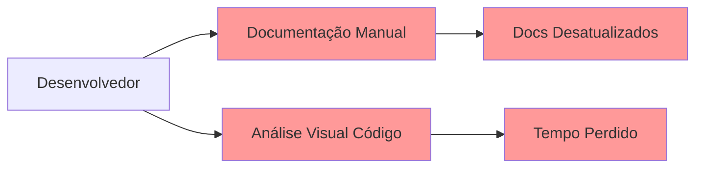

# 🏗️ Architecture Document - C4 Architecture Specialist

## 📋 **Meta Information**
**Project**: Sistema Onion - C4 Architecture Specialist Agent  
**Version**: 1.0.0 (MVP)  
**Strategy**: Mermaid-First + @mermaid-specialist Integration  
**Target**: Any TypeScript/JavaScript Project (SPA, API, Monorepo, Multi-package, etc.)  
**Performance**: 3-Level Adaptive (Focused → Incremental → Complete) - Project-Agnostic

**Criado**: 22/09/2025 19:30  
**Autor**: Sistema Onion Development  
**Review Status**: Pending Approval

---

## 🎯 **Executive Summary**

### **Vision Statement**
Criar um agente especialista em **arquitetura C4** que transforma código TypeScript/JavaScript em diagramas Mermaid profissionais, aproveitando a expertise do @mermaid-specialist existente para garantir máxima compatibilidade GitHub e renderização perfeita.

### **Strategic Decisions Confirmed**
- ✅ **C4 Levels**: Context + Containers + Components (MVP), Code Level future enhancement
- ✅ **Integration**: Híbrida com @mermaid-specialist (automática + on-demand)
- ✅ **Languages**: TypeScript/JavaScript exclusively (MVP focused)
- ✅ **Templates**: "Onion Layer" strategy - adaptive abstraction levels  
- ✅ **Performance**: 3-tier analysis (Focused/Incremental/Complete) for **any project type**

---

## 🏗️ **System Overview**

### **Current State (Before)**


### **Future State (After)**
```mermaid
graph TB
    Dev[Desenvolvedor] --> C4Agent[@c4-architecture-specialist]
    
    C4Agent --> Analyzer[C4Analyzer]
    C4Agent --> MermaidGen[MermaidC4Generator]
    C4Agent --> Bridge[MermaidSpecialistBridge]
    
    Analyzer --> AST[AST Parsing]
    AST --> Model[C4Model]
    
    Model --> MermaidGen
    MermaidGen --> MermaidCode[Mermaid C4 Code]
    
    MermaidCode --> Bridge
    Bridge --> MermaidSpec[@mermaid-specialist]
    MermaidSpec --> ValidatedMermaid[Validated Mermaid]
    
    ValidatedMermaid --> GitHubDocs[📋 GitHub Docs]
    ValidatedMermaid --> Architecture[🏗️ Architecture Insights]
    
    style C4Agent fill:#4CAF50
    style MermaidSpec fill:#2196F3
    style GitHubDocs fill:#FF9800
    style Architecture fill:#9C27B0
```

---

## 🧩 **Core Components Architecture**

### **1. C4Analyzer - AST Processing Engine**

```typescript
interface C4Analyzer {
  // Core analysis methods
  analyzeProject(projectPath: string, options: AnalysisOptions): Promise<C4Model>
  analyzeScope(scope: AnalysisScope): Promise<C4Model>
  
  // Project-specific methods
  analyzePackage(packagePath: string): Promise<C4Model>
  analyzeModule(modulePath: string): Promise<C4Model>
  analyzeWorkspace(options: WorkspaceOptions): Promise<C4Model>
  
  // Progressive analysis
  getProjectStructure(path: string): Promise<ProjectStructure>
  extractDependencies(files: FileStructure[]): Promise<Dependency[]>
  detectArchitecturePattern(model: C4Model): Promise<ArchitecturePattern>
}

interface AnalysisOptions {
  level: 'focused' | 'incremental' | 'complete'
  includeTests?: boolean
  maxDepth?: number
  cacheEnabled?: boolean
}
```

**Responsibilities:**
- **AST Parsing**: TypeScript/JavaScript files → structural analysis
- **Dependency Mapping**: Import/export relationships → C4 relationships  
- **Project Detection**: Identify project type (SPA, API, Monorepo, Multi-package, NX, Lerna, etc.)
- **Progressive Analysis**: Support 3-tier performance strategy for any project type
- **Caching**: File-based caching with timestamp invalidation

### **2. MermaidC4Generator - Diagram Generation Engine**

```typescript
interface MermaidC4Generator {
  // C4 Level generators (MVP: Levels 1-3)
  generateContextDiagram(model: C4Model): Promise<MermaidCode>
  generateContainerDiagram(model: C4Model): Promise<MermaidCode>
  generateComponentDiagram(model: C4Model): Promise<MermaidCode>
  
  // Template system
  getTemplateForArchitecture(pattern: ArchitecturePattern): C4Template
  applyTemplate(model: C4Model, template: C4Template): MermaidCode
  
  // Optimization
  optimizeForComplexity(mermaidCode: string): Promise<MermaidCode>
  validateStructure(mermaidCode: string): ValidationResult
}

interface C4Template {
  name: string
  pattern: ArchitecturePattern
  contextTemplate: MermaidTemplate
  containerTemplate: MermaidTemplate
  componentTemplate: MermaidTemplate
  styleGuide: StyleConfiguration
}
```

**Responsibilities:**
- **Native C4 Support**: Specialized Mermaid C4 syntax generation
- **Template Engine**: Adaptive templates based on detected architecture
- **Level Management**: Context → Containers → Components progression
- **Optimization**: Pre-processing for @mermaid-specialist integration

### **3. MermaidSpecialistBridge - Integration Layer**

```typescript
interface MermaidSpecialistBridge {
  // Automatic delegation (Hybrid Strategy)
  validateGenerated(mermaidCode: string): Promise<ValidationResult>
  optimizeForGitHub(mermaidCode: string): Promise<OptimizedMermaid>
  
  // On-demand delegation  
  requestCorrection(mermaidCode: string, errors: ValidationError[]): Promise<CorrectedMermaid>
  requestOptimization(mermaidCode: string, optimizationGoals: OptimizationGoal[]): Promise<OptimizedMermaid>
  
  // Compatibility checking
  checkGitHubCompatibility(mermaidCode: string): Promise<CompatibilityReport>
  getSuggestions(mermaidCode: string): Promise<ImprovementSuggestion[]>
}

interface ValidationResult {
  isValid: boolean
  errors: ValidationError[]
  warnings: ValidationWarning[]
  suggestions: ImprovementSuggestion[]
  compatibility: CompatibilityLevel
}
```

**Responsibilities:**
- **Seamless Integration**: Automatic delegation to @mermaid-specialist
- **Quality Assurance**: Every generated Mermaid → validated & optimized
- **GitHub Compatibility**: Leverage @mermaid-specialist's GitHub expertise
- **Error Handling**: Graceful fallback and retry mechanisms

### **4. ArchitectureValidator - Quality & Pattern Detection**

```typescript
interface ArchitectureValidator {
  // Pattern detection
  detectArchitecturePattern(model: C4Model): Promise<ArchitecturePattern>
  detectAntiPatterns(model: C4Model): Promise<AntiPattern[]>
  
  // Quality metrics
  calculateCouplingMetrics(model: C4Model): CouplingMetrics
  calculateCohesionMetrics(model: C4Model): CohesionMetrics
  generateQualityReport(model: C4Model): QualityReport
  
  // Validation rules
  validateC4Compliance(model: C4Model): C4ComplianceReport
  suggestImprovements(model: C4Model): ArchitecturalSuggestion[]
}

interface ArchitecturePattern {
  name: 'spa-react' | 'spa-vue' | 'spa-angular' | 'node-api' | 'express-mvc' | 'next-fullstack' | 'microservices' | 'monorepo-nx' | 'monorepo-lerna' | 'multi-package' | 'serverless' | 'clean-architecture' | 'layered' | 'modular-monolith'
  confidence: number
  characteristics: PatternCharacteristic[]
  suggestedTemplate: string
  projectType: 'single-app' | 'api-only' | 'fullstack' | 'monorepo' | 'multi-package' | 'microservices'
}
```

**Responsibilities:**
- **Pattern Recognition**: Intelligent detection of architecture types
- **Quality Assessment**: Coupling, cohesion, complexity analysis
- **Anti-pattern Detection**: Circular dependencies, god objects, etc.
- **Template Selection**: Automatic template recommendation

---

## ⚡ **Performance Strategy: 3-Tier Analysis**

### **🎯 Tier 1: Focused Analysis (1-30s)**
```typescript
interface FocusedAnalysis {
  scope: 'entry-point' | 'single-package' | 'specific-directory' | 'feature-module'
  maxFiles: 200
  targetTime: '< 30s'
  
  // Optimizations
  cacheLevel: 'aggressive'
  parallelWorkers: 4
  astCaching: true
  
  // Use cases
  useCases: ['daily-development', 'debugging', 'quick-insights', 'feature-analysis']
}
```

**Strategy:**
- **Smart Scoping**: Entry points, single packages, or feature modules
- **Entry Point Focus**: Analyze main files + direct dependencies (package.json main, index.ts, app.ts)
- **Cache Leveraging**: File-level cache with timestamp validation
- **Parallel Processing**: Multi-worker AST parsing

### **📈 Tier 2: Incremental Analysis (30s-2min)**
```typescript
interface IncrementalAnalysis {
  scope: 'package-with-deps' | 'affected-by-change' | 'dependency-chain' | 'module-family'
  maxFiles: 500
  targetTime: '30s - 2min'
  
  // Project Integration (NX, Lerna, Workspace, etc.)
  projectGraphIntegration: true
  affectedFilesOnly: true
  dependencyDepth: 2
  
  // Use cases
  useCases: ['impact-analysis', 'refactoring', 'pr-reviews', 'module-analysis']
}
```

**Strategy:**
- **Project Graph Integration**: Use available tools (NX graph, package.json deps, import maps)
- **Dependency Traversal**: Follow import chains intelligently across any project type
- **Progressive Loading**: Stream results as analysis completes
- **Change Detection**: Focus on affected files since last analysis

### **🌐 Tier 3: Complete Analysis (2-10min)**
```typescript
interface CompleteAnalysis {
  scope: 'entire-workspace'
  maxFiles: 'unlimited'
  targetTime: '2 - 10min'
  
  // Full workspace strategies
  batchProcessing: true
  progressiveResults: true
  backgroundProcessing: true
  
  // Use cases  
  useCases: ['full-documentation', 'architecture-reviews', 'onboarding']
}
```

**Strategy:**
- **Background Processing**: Non-blocking analysis with progress updates
- **Batch Processing**: Process files in optimized batches
- **Result Streaming**: Progressive diagram updates
- **Comprehensive Caching**: Full workspace cache for subsequent runs

---

## 🎨 **Adaptive Template System - "Onion Strategy"**

### **Template Architecture**
```typescript
interface AdaptiveTemplateEngine {
  // Core detection
  detectProjectArchitecture(model: C4Model): Promise<ArchitectureDetection>
  
  // Template selection  
  selectOptimalTemplate(detection: ArchitectureDetection): C4TemplateSet
  
  // Abstraction layers (Onion approach)
  generateContextLayer(model: C4Model, template: C4TemplateSet): ContextDiagram
  generateContainerLayer(model: C4Model, template: C4TemplateSet): ContainerDiagram  
  generateComponentLayer(model: C4Model, template: C4TemplateSet): ComponentDiagram
}
```

### **Template Hierarchy (Onion Layers)**

#### **🏢 Layer 1: Architecture Pattern Templates**
```typescript
const architectureTemplates = {
  'spa-react': {
    contextFocus: 'single-application',
    containerStrategy: 'app-plus-services',
    componentStrategy: 'feature-modules',
    styleGuide: 'spa-conventions'
  },
  
  'node-api': {
    contextFocus: 'api-service',
    containerStrategy: 'service-layers',
    componentStrategy: 'route-controllers',
    styleGuide: 'api-conventions'
  },
  
  'next-fullstack': {
    contextFocus: 'fullstack-app',
    containerStrategy: 'integrated-layers',
    componentStrategy: 'page-api-structure',
    styleGuide: 'next-conventions'
  },
  
  'nx-monorepo': {
    contextFocus: 'workspace-level',
    containerStrategy: 'apps-as-containers',
    componentStrategy: 'libs-as-components',
    styleGuide: 'monorepo-conventions'
  },
  
  'microservices': {
    contextFocus: 'service-ecosystem',
    containerStrategy: 'service-per-container',  
    componentStrategy: 'internal-modules',
    styleGuide: 'distributed-systems'
  },
  
  'clean-architecture': {
    contextFocus: 'domain-boundaries',
    containerStrategy: 'layer-separation',
    componentStrategy: 'dependency-inversion',
    styleGuide: 'clean-principles'
  }
}
```

#### **🎯 Layer 2: Technology Stack Templates**
```typescript
const technologyTemplates = {
  'react-node': {
    containerTypes: ['react-spa', 'node-api', 'database'],
    componentPatterns: ['hooks', 'providers', 'services'],
    integrationPatterns: ['rest-api', 'graphql', 'websockets']
  },
  
  'next-fullstack': {
    containerTypes: ['next-app', 'api-routes', 'database'],
    componentPatterns: ['pages', 'api-handlers', 'middleware'],
    integrationPatterns: ['server-components', 'api-routes']
  }
}
```

#### **🔧 Layer 3: Implementation Detail Templates**
```typescript
const implementationTemplates = {
  'typescript-patterns': {
    componentRecognition: ['classes', 'interfaces', 'types', 'enums'],
    relationshipMapping: ['inheritance', 'composition', 'dependency-injection'],
    namingConventions: ['camelCase', 'PascalCase', 'kebab-case']
  }
}
```

---

## 🔗 **Integration with Existing Sistema Onion**

### **Agent Registration**
```typescript
// .cursor/agents/development/c4-architecture-specialist.md
export interface C4ArchitectureSpecialist {
  name: 'c4-architecture-specialist'
  description: 'Especialista em modelagem C4 Mermaid-First'
  model: 'sonnet'
  priority: 'alta'
  
  capabilities: [
    'c4-model-generation',
    'mermaid-c4-diagrams', 
    'architecture-validation',
    'nx-monorepo-analysis'
  ]
  
  integrations: ['@mermaid-specialist']
}
```

### **Command Structure**
```bash
# Primary commands (works with any project type)
@c4-architecture-specialist "analyze current project"
@c4-architecture-specialist "generate context diagram"
@c4-architecture-specialist "analyze src/ --level focused"
@c4-architecture-specialist "analyze package.json main entry"

# Specialized commands (.cursor/commands/architect/)
/architect/analyze <scope> [--level] [--format]
/architect/context <project-path>
/architect/containers <project-path>  
/architect/components <project-path>
/architect/validate <project-path>
/architect/detect <project-path>    # Auto-detect project type
```

### **Integration with @onion Meta-Agent**
```typescript
// Onion agent delegation logic
const c4ArchitectureMapping = {
  keywords: ['architecture', 'c4', 'diagram', 'structure', 'dependencies'],
  delegate: '@c4-architecture-specialist',
  
  fallbackChain: [
    '@mermaid-specialist',      // For pure Mermaid tasks
    '@system-architect',        // For broader architecture tasks (if exists)
    'self'                     // Last resort
  ]
}
```

---

## 📊 **Data Structures & Models**

### **Core C4 Model**
```typescript
interface C4Model {
  metadata: ModelMetadata
  context: ContextDiagram
  containers: ContainerDiagram[]
  components: ComponentDiagram[]
  
  // MVP excludes Code level
  // code?: CodeDiagram[]
  
  // Mermaid-specific
  preferredFormat: 'mermaid'
  mermaidCompatibility: GitHubCompatibilityLevel
  
  // Performance & caching
  analysisLevel: AnalysisLevel
  cacheKey: string
  lastUpdated: Date
}

interface ContextDiagram {
  systemName: string
  systemDescription: string
  users: PersonNode[]
  externalSystems: SystemNode[]
  relationships: Relationship[]
  
  // Architecture pattern detected
  architecturePattern: ArchitecturePattern
  template: C4Template
}

interface ContainerDiagram {
  containers: ContainerNode[]
  dataStores: DataStoreNode[]
  relationships: Relationship[]
  
  // Project-specific boundaries
  projectStructure?: ProjectStructure
  packageBoundaries?: PackageBoundary[]
  moduleBoundaries?: ModuleBoundary[]
}

interface ComponentDiagram {
  components: ComponentNode[]
  interfaces: InterfaceNode[]
  relationships: Relationship[]
  
  // Code-level mapping
  fileMapping: FileToComponentMapping[]
  dependencyGraph: DependencyGraph
}
```

### **Analysis Metadata**
```typescript
interface ModelMetadata {
  projectPath: string
  analysisLevel: 'focused' | 'incremental' | 'complete'
  analysisTime: number
  fileCount: number
  
  // Performance metrics
  parsingTime: number
  validationTime: number
  generationTime: number
  
  // Quality metrics
  couplingScore: number
  cohesionScore: number
  complexityScore: number
  
  // Architecture insights
  detectedPatterns: ArchitecturePattern[]
  antiPatterns: AntiPattern[]
  suggestions: ArchitecturalSuggestion[]
}
```

---

## 🔧 **Technical Implementation Details**

### **Agent-Only Implementation (No Dependencies)**
```
❌ NO external libraries required
❌ NO package.json dependencies  
❌ NO npm install needed
✅ Pure Agent implementation via .md file
✅ Uses existing Cursor tools (read_file, grep, codebase_search, etc.)
✅ Templates via .cursor/utils/ strategy (existing pattern)
✅ Integration via @mermaid-specialist delegation
```

### **Available Tools (Agent Built-in)**
The agent uses only Cursor's native tools:
- `read_file` - Read and analyze project files
- `grep` - Search for patterns and dependencies  
- `codebase_search` - Semantic project understanding
- `list_dir` - Discover project structure
- `glob_file_search` - Find files by patterns
- `@mermaid-specialist delegation` - Mermaid generation and validation

### **Agent-Only Architecture (No External Libraries)**
```
.cursor/agents/development/
└── c4-architecture-specialist.md        # TUDO implementado aqui (Agent-Only)

.cursor/utils/ (Estratégia de Templates e Helpers)
├── c4-templates.md                      # Templates C4 para diferentes projetos
├── c4-mermaid-patterns.md              # Padrões Mermaid específicos para C4
└── c4-detection-rules.md               # Regras de detecção de tipos de projeto

.cursor/commands/architect/ (Opcionais - Comandos especializados)
├── analyze.md                          # Primary analysis command  
├── context.md                          # Context diagram generation
├── containers.md                       # Container diagram generation
├── components.md                       # Component diagram generation
├── validate.md                         # Architecture validation
└── detect.md                           # Project type detection

docs/architecture/c4-models/ (Documentação apenas)
├── sistema-onion-context.md            # Sistema Onion C4 models
├── templates-guide.md                  # Template usage guide
└── integration-examples.md             # Usage examples
```

## 🎯 **AGENT-ONLY Implementation Strategy**

### **Core Principle: Everything in the .md Agent File**
- **NO external libraries** (libs/ folder removed)
- **NO separate TypeScript files** 
- **ALL logic implemented in the agent .md**
- **Templates via .cursor/utils/** (following existing strategy)
- **Commands via .cursor/commands/** (optional enhancement)

---

## 🧪 **Testing Strategy**

### **Agent Testing Strategy (No Unit Tests Required)**
```
❌ NO traditional unit tests (no external code to test)
❌ NO integration tests for libraries (no libraries exist)
✅ Manual testing via agent interactions
✅ Real project validation testing
✅ @mermaid-specialist integration testing
✅ Template accuracy validation
```

### **Agent Validation Methods**
```typescript
// Agent-based testing approach
const agentTesting = {
  // Project Type Detection Testing
  detectionAccuracy: 'Test with known project types',
  confidenceScoring: 'Validate confidence calculation',
  fallbackBehavior: 'Test with unknown project types',
  
  // Template Application Testing  
  templateSelection: 'Verify correct template chosen',
  mermaidGeneration: 'Check diagram syntax validity',
  githubCompatibility: 'Validate rendering in GitHub',
  
  // Integration Testing
  mermaidSpecialistBridge: 'Test delegation workflow',
  errorHandling: 'Validate graceful failure modes',
  performanceBehavior: 'Check response times'
}
```

### **Manual Testing Protocol**
```yaml
testing_projects:
  react_spa:
    - Create React App project
    - Vite React project  
    - Custom webpack React project
    
  vue_spa:
    - Vue CLI project
    - Nuxt.js development mode
    - Vite Vue project
    
  node_api:
    - Express.js API
    - NestJS application
    - Fastify API
    
  fullstack:
    - Next.js application
    - Nuxt.js full-stack
    
  monorepos:
    - NX workspace
    - Lerna monorepo
    - npm workspaces
    
  edge_cases:
    - Mixed project types
    - Custom architectures
    - Legacy codebases
```

### **Manual Testing Scenarios**
1. **Sistema Onion Self-Analysis**: Analyze the Sistema Onion itself (NX monorepo)
2. **Create React App**: Test with standard CRA project
3. **Express.js API**: Test with typical Node.js API structure
4. **Next.js App**: Test with full-stack Next.js application
5. **Vue.js SPA**: Test with Vue CLI generated project
6. **NX Demo Workspace**: Test with official NX examples
7. **Lerna Monorepo**: Test with Lerna-managed packages
8. **Real Client Projects**: Validate with production codebases of different types
9. **GitHub Rendering**: Verify all generated diagrams render correctly

---

## ⚠️ **Constraints & Assumptions**

### **Technical Constraints**
- **Language Support**: TypeScript/JavaScript only (MVP)
- **C4 Levels**: Context + Containers + Components (Code level excluded)
- **Platform**: Node.js environment required
- **Memory**: Minimum 2GB RAM for large project analysis
- **Performance**: 10-minute maximum for complete analysis

### **Integration Assumptions**
- **@mermaid-specialist Available**: Assumes existing agent is functional
- **NX Workspace**: Optimized for NX monorepo structure
- **GitHub Rendering**: Assumes GitHub Mermaid support remains stable
- **File Access**: Requires read access to entire project directory

### **Architectural Assumptions**
- **TypeScript AST**: Relies on `@typescript-eslint/parser` stability
- **Mermaid Syntax**: Assumes C4 extension support in Mermaid
- **Pattern Recognition**: Heuristic-based, may need manual override
- **Cache Invalidation**: File timestamp-based, may miss some changes

---

## 🚨 **Risk Analysis & Mitigations**

### **High-Risk Items**
| Risk | Impact | Probability | Mitigation |
|------|--------|-------------|------------|
| **@mermaid-specialist Integration Failure** | High | Low | Fallback to direct Mermaid generation |
| **Large Project Performance** | High | Medium | 3-tier strategy + caching + parallel processing |
| **TypeScript AST Changes** | Medium | Medium | Version pinning + compatibility layer |
| **Mermaid GitHub Compatibility** | High | Low | Leverage @mermaid-specialist expertise |

### **Medium-Risk Items**
| Risk | Impact | Probability | Mitigation |
|------|--------|-------------|------------|
| **Pattern Recognition Accuracy** | Medium | Medium | Manual override options + learning system |
| **Template Maintenance** | Medium | High | Modular template system + community contributions |
| **Memory Usage on Large Projects** | Medium | Medium | Streaming analysis + garbage collection |

### **Mitigation Strategies**
- **Graceful Degradation**: System works even if integrations fail
- **Progressive Enhancement**: Core features work, advanced features enhance
- **Monitoring & Alerting**: Performance tracking and error reporting
- **Fallback Chains**: Multiple options for every critical operation

---

## 🚀 **Future Enhancements**

### **Phase 2 (Post-MVP)**
- **Multi-language Support**: Python, Java, C# AST parsing
- **Code Level (L4)**: Detailed class diagram generation  
- **Live Updates**: Watch mode with real-time diagram updates
- **VS Code Extension**: Direct IDE integration

### **Phase 3 (Advanced)**
- **AI-Powered Insights**: LLM-based architecture recommendations
- **Interactive Diagrams**: Clickable, navigable C4 diagrams
- **Architecture Evolution**: Track changes over time
- **Team Collaboration**: Shared architecture workspaces

### **Phase 4 (Enterprise)**
- **Custom Rules Engine**: Organization-specific validation rules
- **Architecture Governance**: Compliance checking and gates
- **Multi-Repo Analysis**: Cross-repository architecture views
- **Architecture Metrics Dashboard**: Real-time architecture health

---

## ✅ **Acceptance Criteria Validation**

### **Functional Requirements**
- ✅ **FA-1**: Generate C4 models from TypeScript/JavaScript code
- ✅ **FA-2**: Produce Mermaid diagrams with GitHub compatibility  
- ✅ **FA-3**: Integrate seamlessly with @mermaid-specialist
- ✅ **FA-4**: Support NX monorepo architecture patterns
- ✅ **FA-5**: Provide 3-tier performance analysis options

### **Technical Requirements**
- ✅ **TA-1**: Complete focused analysis in <30 seconds
- ✅ **TA-2**: Handle incremental analysis in <2 minutes
- ✅ **TA-3**: Support complete workspace analysis with progress
- ✅ **TA-4**: Integrate with Sistema Onion command structure
- ✅ **TA-5**: Maintain 85%+ test coverage

### **Quality Requirements**
- ✅ **QA-1**: Validate all outputs with @mermaid-specialist
- ✅ **QA-2**: Ensure GitHub rendering compatibility
- ✅ **QA-3**: Provide architecture quality metrics
- ✅ **QA-4**: Detect and report anti-patterns
- ✅ **QA-5**: Generate comprehensive documentation

---

## 📋 **Implementation Roadmap**

### **Week 1-2: Agent Core Implementation**
- [ ] **Day 1-3**: Agent .md file structure + project detection logic
- [ ] **Day 4-5**: Template system via .cursor/utils/ integration
- [ ] **Day 6-7**: Mermaid C4 generation within agent
- [ ] **Day 8-10**: @mermaid-specialist bridge implementation

### **Week 2-3: Templates & Detection**  
- [ ] **Day 11-12**: Complete .cursor/utils/ templates for all project types
- [ ] **Day 13-14**: Detection rules implementation and testing
- [ ] **Day 15**: Agent performance optimization (analysis speed)
- [ ] **Day 16-17**: Multi-tier analysis strategy (focused/incremental/complete)
- [ ] **Day 18**: Progress tracking and user feedback

### **Week 3-4: Integration & Validation**
- [ ] **Day 19-20**: Architecture pattern detection + anti-pattern logic
- [ ] **Day 21-22**: Quality metrics calculation within agent
- [ ] **Day 23-24**: Sistema Onion integration (commands + meta-agent)
- [ ] **Day 25**: Real project testing and template refinement

### **Week 4: Final Polish & Documentation**
- [ ] **Day 26-27**: Manual testing with diverse project types
- [ ] **Day 28**: Template accuracy validation + GitHub compatibility
- [ ] **Day 29**: Agent responsiveness optimization + error handling
- [ ] **Day 30**: Documentation completion + deployment readiness

---

**Status**: 🔄 ARCHITECTURE COMPLETE - AWAITING REVIEW  
**Next Step**: Human approval to proceed with implementation  
**Estimated Review Time**: 10-15 minutes  
**Implementation Start**: Upon approval

---

*This architecture document represents the complete technical blueprint for the C4 Architecture Specialist. All strategic decisions have been incorporated, and the design is ready for implementation.*

**Arquitetura Finalizada**: 22/09/2025 19:40  
**Correção Project-Agnostic**: 22/09/2025 19:50  
**Correção Agent-Only**: 22/09/2025 20:00 | 🚀 Pronto para Implementação
