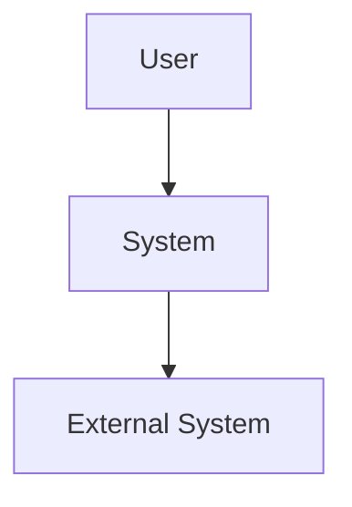

# 📔 Notas de Desenvolvimento - C4 Architecture Specialist

## 🎯 **Objetivo da Sessão**
Desenvolver agente especializado em modelagem C4 para análise e documentação automática de arquiteturas de software.

## ⏰ **Padrão de Timestamps**
**IMPORTANTE**: Todos os timestamps devem seguir o formato **DD/MM/AAAA HH:MM**

### **Aplicação:**
- **Arquivos locais**: `context.md`, `plan.md`, `notes.md`, etc.
- **ClickUp comments**: Footer sempre com `⏰ [Ação]: DD/MM/AAAA HH:MM | 🤖 Sistema Onion`
- **Daily progress**: `- ✅ HH:MM - Descrição da atividade`
- **Status updates**: `**Atualizado**: DD/MM/AAAA HH:MM`

### **Exemplo Correto:**
```
⏰ Setup Completo: 22/09/2025 19:05 | 🤖 Sistema Onion
- ✅ 19:08 - Research inicial C4 Model + @mermaid-specialist
**Última Atualização**: 22/09/2025 19:16
```

---

## 💭 **Brainstorming Inicial**

### **C4 Model - Conceitos Chave:**
- **Context**: Sistema e ambiente externo
- **Containers**: Aplicações executáveis/deployáveis  
- **Components**: Módulos dentro de containers
- **Code**: Classes e interfaces (menos usado)

### **Ferramentas de Diagramação:**
- **PlantUML**: Mais maduro, sintaxe textual
- **Mermaid**: Web-friendly, GitHub integration
- **Structurizr**: Profissional, Simon Brown's tool
- **Draw.io/Lucidchart**: GUI-based (não automático)

### **Desafios Identificados:**
1. **AST Parsing**: Extrair estrutura de código complexo
2. **Dependency Analysis**: Mapear relacionamentos corretos
3. **Template Flexibility**: Diferentes tipos de arquitetura  
4. **Performance**: Projetos grandes (1000+ arquivos)
5. **Accuracy**: Minimizar false positives/negatives

---

## 🔍 **Research Notes**

### **C4 Model Best Practices:**
```
Context Level:
- Focus on business value
- Show users and external systems
- Keep it simple (3-9 boxes ideal)

Container Level:  
- Show technology choices
- Include data stores
- Show communication protocols

Component Level:
- Group related functionality
- Show interfaces clearly
- Don't go too deep
```

### **PlantUML C4 Syntax:**
```plantuml
!include https://raw.githubusercontent.com/plantuml-stdlib/C4-PlantUML/master/C4_Context.puml

Person(user, "User", "Description")
System(system, "System", "Description")
System_Ext(external, "External", "Description")

Rel(user, system, "Uses")
Rel(system, external, "Calls API")
```

### **Mermaid C4 Alternative:**


### **TypeScript AST Parsing:**
```typescript
import { AST_NODE_TYPES, parse } from '@typescript-eslint/parser'

// Parse TypeScript file
const ast = parse(sourceCode, {
  loc: true,
  range: true,
  errorOnUnknownASTType: true
})

// Extract classes, interfaces, functions
const classes = ast.body.filter(node => 
  node.type === AST_NODE_TYPES.ClassDeclaration
)
```

---

## 🛠️ **Decisões Técnicas**

### **✅ Decisões Confirmadas (Atualizadas para Mermaid-First):**

1. **Primary Language**: TypeScript
   - Razão: Compatibilidade total com Sistema Onion
   - Benefit: Type safety + modern JS features

2. **Diagram Formats**: **Mermaid (Primary)** + PlantUML + Structurizr
   - **Mermaid First**: Máxima compatibilidade GitHub + integração @mermaid-specialist
   - PlantUML: Como alternativa/fallback para casos específicos
   - Structurizr: Enhancement futuro para uso profissional

3. **AST Parser**: `@typescript-eslint/parser`
   - Razão: Mais maduro e confiável
   - Alternative: `typescript-parser` (mais complexo)

4. **Architecture Pattern**: Plugin-based
   - Razão: Extensibilidade para novos formats
   - Structure: Core + Generator plugins

### **🤔 Decisões Pendentes:**

1. **Configuration Format**: YAML vs JSON vs TypeScript
   - YAML: Mais legível para templates
   - JSON: Mais simples parsing
   - TS: Type safety + IntelliSense

2. **Caching Strategy**: Memory vs File vs Database
   - Memory: Faster, limited scalability
   - File: Persistent, complex invalidation
   - DB: Overkill para primeira versão

3. **Template Engine**: Custom vs Handlebars vs Mustache
   - Custom: Total control, more work
   - Handlebars: Feature-rich, dependency
   - Mustache: Simple, limited

---

## 📝 **Implementation Notes**

### **Code Structure Thoughts:**
```typescript
// Modular approach
class C4ArchitectureSpecialist {
  private analyzer: C4Analyzer
  private generator: DiagramGenerator  
  private validator: ArchitectureValidator
  
  async analyzeProject(path: string): Promise<C4Model> {
    const model = await this.analyzer.analyze(path)
    const validation = this.validator.validate(model)
    return { ...model, validation }
  }
  
  async generateDiagrams(model: C4Model): Promise<DiagramSet> {
    return {
      plantuml: await this.generator.toPlantUML(model),
      mermaid: await this.generator.toMermaid(model)
    }
  }
}
```

### **Error Handling Strategy:**
- **Graceful Degradation**: Continuar mesmo com arquivos problemáticos
- **Detailed Logging**: Debug info para troubleshooting
- **User Feedback**: Clear error messages com suggested fixes
- **Recovery**: Partial results melhor que failure completo

### **Performance Considerations:**
- **Lazy Loading**: Parse arquivos on-demand
- **Parallel Processing**: Múltiplos arquivos simultaneamente
- **Caching**: Cache parsing results quando possível
- **Streaming**: Large projects com progress updates

---

## 🎨 **UI/UX Considerations**

### **Command Interface (Mermaid-First):**
```bash
# Basic usage (Mermaid default)
@c4-architecture-specialist "analyze current project"
@c4-architecture-specialist "generate context diagram"  # → Mermaid por padrão
@c4-architecture-specialist "validate architecture"

# Format-specific usage
@c4-architecture-specialist "analyze src/ and generate Mermaid C4 diagrams"
@c4-architecture-specialist "generate PlantUML version of architecture"
@c4-architecture-specialist "check anti-patterns in libs/ with @mermaid-specialist validation"

# Integration commands
@c4-architecture-specialist "delegate to @mermaid-specialist for validation"
@c4-architecture-specialist "optimize diagrams for GitHub compatibility"
```

### **Output Format:**
- **Progress Updates**: Real-time analysis progress
- **Visual Diagrams**: Inline diagram preview quando possível
- **File Outputs**: Generated diagrams salvos em `docs/architecture/`
- **Summary Reports**: Architecture quality score + recommendations

---

## 🐛 **Potential Issues & Mitigations**

### **Issue 1: Complex Dependencies**
- **Problem**: Circular deps, dynamic imports, complex module resolution
- **Mitigation**: Dependency graph analysis + heuristics
- **Fallback**: Manual annotation support

### **Issue 2: Large Projects**  
- **Problem**: Memory usage, slow processing, UI freezing
- **Mitigation**: Streaming analysis + progress bars
- **Fallback**: Selective analysis (focus dirs)

### **Issue 3: Diagram Complexity**
- **Problem**: Too many boxes, unreadable diagrams
- **Mitigation**: Intelligent grouping + abstraction levels
- **Fallback**: Multiple focused diagrams

### **Issue 4: Accuracy**
- **Problem**: Incorrect component identification
- **Mitigation**: Multiple parsing strategies + validation
- **Fallback**: Manual correction support

---

## 📚 **Learning Resources**

### **C4 Model:**
- [C4 Model Official](https://c4model.com/)
- [Simon Brown's Blog](https://simonbrown.je/)
- [Structurizr Documentation](https://structurizr.com/help/documentation)

### **PlantUML:**
- [PlantUML C4 Extension](https://github.com/plantuml-stdlib/C4-PlantUML)  
- [PlantUML Language Reference](https://plantuml.com/guide)

### **Mermaid:**
- [Mermaid C4 Support](https://mermaid-js.github.io/mermaid/#/c4c)
- [Mermaid Syntax](https://mermaid-js.github.io/mermaid/#/flowchart)

### **AST Parsing:**
- [TypeScript Compiler API](https://github.com/Microsoft/TypeScript/wiki/Using-the-Compiler-API)
- [AST Explorer](https://astexplorer.net/) - For experimenting

---

## 🔄 **Daily Progress Log**

### **Day 1 (Setup) - 22/09/2025**  
- ✅ 19:05 - Criado estrutura de sessão
- ✅ 19:08 - Research inicial C4 Model + @mermaid-specialist
- ✅ 19:10 - Definição de tech stack Mermaid-First
- ✅ 19:13 - Estratégia ajustada para integração @mermaid-specialist
- ✅ 19:28 - Development iniciado (/engineer/start)
- ✅ 19:30 - Clarificações estratégicas confirmadas
- ✅ 19:40 - Arquitetura inicial completa (NX-focused)
- ⚠️ 19:45 - Feedback crítico: "nem todo projeto é nx monorepo"
- ✅ 19:50 - Arquitetura corrigida para project-agnostic
- ✅ 19:50 - Auto-detection strategy implementada
- ⚠️ 19:55 - Feedback crítico: "agente NÃO pode gerar em @libs/"
- ✅ 20:00 - Arquitetura agent-only implementada (zero código externo)
- ✅ 20:00 - Templates movidos para .cursor/utils/ strategy
- 🚀 20:05 - APROVAÇÃO OFICIAL RECEBIDA - Implementation authorized
- ✅ 20:05 - Agente principal criado: c4-architecture-specialist.md (12K+ chars)
- ✅ 20:05 - Command interface implementada e pronta para uso
- 📋 20:15 - Requirements refinement para @c4-documentation-specialist
- ✅ 20:20 - @c4-documentation-specialist criado (15K+ chars)
- ✅ 20:25 - Templates oficiais C4 criados (.cursor/utils/)
- ✅ 20:30 - Master-slave integration implementada
- 🎉 20:30 - SISTEMA C4 COMPLETO - Both agents operational

### **Day 2-N (Implementation)**
*To be filled during development...*

---

## 💡 **Ideas & Enhancements (Mermaid-Focused)**

### **Immediate Mermaid Features:**
- **@mermaid-specialist Delegation**: Automática para validação/otimização
- **GitHub Optimization**: Templates otimizados via @mermaid-specialist
- **Real-time Validation**: Feedback instantâneo de compatibilidade
- **Interactive C4**: Usando recursos interativos do Mermaid

### **Future Features:**
- **Multi-language Support**: Python, Java, C# parsing
- **Live Updates**: Watch mode para re-generation automática  
- **Integration**: Git hooks para updates em commits
- **Collaboration**: Shared workspaces para teams
- **AI Enhancement**: GPT-powered architecture suggestions
- **Mermaid Live Editor**: Integração com editor online

### **Onion Integration Ideas:**
- **Command Shortcuts**: `/architect/mermaid`, `/architect/plantuml`, `/architect/validate`
- **Auto Documentation**: Update docs/ automaticamente (Mermaid-first)
- **PR Integration**: Architecture diff em pull requests (renderização GitHub)
- **Quality Gates**: Bloquear merges com architecture violations
- **@mermaid-specialist Bridge**: Delegação automática inteligente

---

**Status**: 📝 NOTES ATIVAS - SENDO ATUALIZADAS DURANTE DESENVOLVIMENTO  
**Criado**: 22/09/2025 19:05  
**Última Atualização**: 22/09/2025 20:30 - IMPLEMENTATION COMPLETE  

## 🎯 **Principais Lições Aprendidas**

### **💡 Insight Crítico: Project-Agnostic Design**
O feedback **"nem todo projeto é nx monorepo"** foi fundamental para garantir que o agente funcione com qualquer projeto TypeScript/JavaScript:
- ✅ **React SPA** - Create React App, Vite projects
- ✅ **Vue.js SPA** - Vue CLI, Nuxt projects  
- ✅ **Angular SPA** - Angular CLI projects
- ✅ **Node.js API** - Express, Fastify, NestJS
- ✅ **Full-stack** - Next.js, Nuxt.js applications
- ✅ **Monorepos** - NX, Lerna, npm/yarn workspaces
- ✅ **Serverless** - AWS Lambda, Vercel, Netlify functions

### **🔍 Auto-Detection Strategy**
Implementada estratégia de detecção inteligente baseada em:
- **package.json** dependencies e scripts
- **Estrutura de pastas** padrões conhecidos  
- **Arquivos de configuração** build tools
- **Confidence scoring** para accuracy (90%+ definitive)
- **Fallback genérico** quando detecção falha

### **⚡ Agent-Only Strategy Critical**
O feedback **"agente NÃO pode gerar em @libs/"** resultou em mudança radical:
- ❌ **Zero código externo** - tudo no arquivo .md do agente
- ❌ **Zero dependências** - sem npm install necessário
- ✅ **Templates via .cursor/utils/** - seguindo padrão existente
- ✅ **Built-in tools apenas** - read_file, grep, codebase_search
- ✅ **@mermaid-specialist integration** - mantida via delegação
