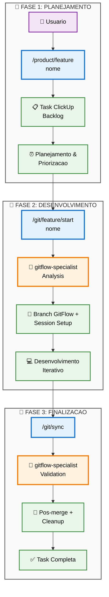

# 🏗️ Arquitetura da Solução - Refatoração GitFlow Integrada

## 🎯 Visão Geral da Solução

Refatoração tripla integrada que transforma o ecossistema GitFlow do Sistema Onion:

1. **`/git/sync`** (refatoração) - Integração @gitflow-specialist com Fase 2.5 nova
2. **`/git/feature/start`** (correção crítica) - GitFlow real em vez de criação de tasks 
3. **`/product/feature`** (movimentação) - Preservação do código atual para planejamento

---

## 📊 Arquitetura de Alto Nível



---

## 🔧 Arquitetura Técnica Detalhada

### **1. Comando /product/feature.md**
**Localização**: `.cursor/commands/product/feature.md`  
**Função**: Planejamento e criação de tasks ClickUp  
**Origem**: Código movido de `/git/feature/start.md`

```typescript
interface ProductFeatureInput {
  featureName: string;
  description?: string;
  priority?: 1 | 2 | 3 | 4;
}

interface ProductFeatureOutput {
  taskId: string;
  status: "backlog";
  featureName: string;
  clickUpUrl: string;
}
```

**Responsabilidades**:
- ✅ Criar task ClickUp com nome e descrição
- ✅ Status inicial: "Backlog"
- ✅ Tags apropriadas (feature, planning)
- ✅ Aguardar priorização manual

---

### **2. Comando /git/feature/start.md (Novo)**
**Localização**: `.cursor/commands/git/feature/start.md`  
**Função**: Iniciar desenvolvimento GitFlow real  
**Integração**: @gitflow-specialist obrigatória

```typescript
interface GitFeatureStartInput {
  featureName: string;
  taskId?: string; // Optional: associar com task existente
}

interface GitFlowAnalysisResult {
  repositoryType: 'gitflow' | 'github-flow' | 'custom';
  baseBranch: 'develop' | 'main' | 'master';
  branchName: string; // feature/nome-da-funcionalidade
  guidance: string[];
  warnings: string[];
}
```

#### **Fluxo de Execução**:
```typescript
async function gitFeatureStart(featureName: string): Promise<void> {
  // 1. Análise GitFlow com @gitflow-specialist
  const analysis = await analyzeWithGitflowSpecialist({
    operation: 'feature-start',
    featureName,
    currentRepo: await getRepoInfo()
  });
  
  // 2. Validação e aplicação de guidance
  if (analysis.warnings.length > 0) {
    await promptUserConfirmation(analysis.warnings);
  }
  
  // 3. Operações GitFlow
  await executeGitFlowOperations({
    baseBranch: analysis.baseBranch,
    newBranch: analysis.branchName,
    guidance: analysis.guidance
  });
  
  // 4. Setup sessão de desenvolvimento
  await createDevelopmentSession(featureName);
  
  // 5. Associar task ClickUp se existir
  if (taskId) {
    await linkToClickUpTask(taskId, analysis.branchName);
  }
}
```

---

### **3. Comando /git/sync.md (Refatorado)**
**Localização**: `.cursor/commands/git/sync.md`  
**Função**: Sincronização pós-merge com guidance GitFlow  
**Nova Fase**: 2.5 - GitFlow Analysis

#### **Arquitetura das 6 Fases (+ Nova 2.5)**:

```typescript
// FASE 1: Parse + Health Check (MANTIDA)
async function phase1_ParseAndValidation(args: string[]): Promise<ParsedContext> {
  const branchArg = args[0] || "develop";
  const healthCheck = await performHealthCheck();
  return { branchArg, healthCheck };
}

// FASE 2: Context Detection (MANTIDA)  
async function phase2_ContextDetection(context: ParsedContext): Promise<SyncContext> {
  return await detectSyncContext(context.branchArg);
}

// FASE 2.5: GitFlow Analysis (NOVA - INTEGRAÇÃO PRINCIPAL)
async function phase2_5_GitFlowAnalysis(context: SyncContext): Promise<GitFlowEnhancedContext> {
  // 2.5.1 - Comunicação com @gitflow-specialist
  const gitflowPrompt = buildGitFlowAnalysisPrompt(context);
  const agentResponse = await invokeAgent('gitflow-specialist', gitflowPrompt);
  
  // 2.5.2 - Parse da resposta estruturada
  const analysis = await parseGitFlowGuidance(agentResponse);
  
  // 2.5.3 - Validação GitFlow compliance
  const compliance = await validateGitFlowCompliance(context, analysis);
  
  // 2.5.4 - Enriquecer contexto com guidance
  return {
    ...context,
    gitflowAnalysis: analysis,
    compliance: compliance,
    enhancedOperations: applyGuidanceToOperations(context, analysis)
  };
}

// FASE 3: Git Operations (MELHORADA com guidance)
async function phase3_GitOperationsEnhanced(context: GitFlowEnhancedContext): Promise<OperationResult> {
  // Operações Git guiadas por @gitflow-specialist
  return await executeGuidedGitOperations(context.enhancedOperations);
}

// FASES 4-6: ClickUp + Session + Error (MANTIDAS)
// Preservam funcionalidade existente 100%
```

---

## 🤖 Interface de Comunicação com @gitflow-specialist

### **Formato de Input Padronizado**:
```typescript
interface GitFlowAnalysisPrompt {
  operation: 'feature-start' | 'sync' | 'merge' | 'release';
  context: {
    currentBranch: string;
    targetBranch: string;
    repositoryInfo: RepoInfo;
    branchStructure: BranchInfo[];
    recentCommits: CommitInfo[];
  };
  request: {
    guidance: boolean;
    validation: boolean;
    recommendations: boolean;
    warningsOnly?: boolean;
  };
}
```

### **Formato de Output Esperado**:
```typescript
interface GitFlowGuidanceResponse {
  analysis: {
    repositoryType: 'gitflow' | 'github-flow' | 'gitlab-flow' | 'custom';
    complianceLevel: 'excellent' | 'good' | 'partial' | 'poor';
    workflowPattern: string;
  };
  validation: {
    isOperationValid: boolean;
    complianceIssues: string[];
    blockers: string[];
  };
  guidance: {
    recommendations: string[];
    bestPractices: string[];
    nextSteps: string[];
  };
  warnings: string[];
}
```

### **Implementação da Comunicação**:
```typescript
async function invokeGitFlowSpecialist(
  operation: string, 
  context: any
): Promise<GitFlowGuidanceResponse> {
  
  const prompt = `
🤖 ANÁLISE GITFLOW SOLICITADA

━━━━━━━━━━━━━━━━━━━━━━━━

🎯 OPERAÇÃO: ${operation}

📊 CONTEXTO DO REPOSITÓRIO:
   ▶ Branch atual: ${context.currentBranch}
   ▶ Branch alvo: ${context.targetBranch}  
   ▶ Tem develop: ${context.hasDevelop}
   ▶ Padrão branches: ${context.branchPattern}

🔍 ANÁLISE SOLICITADA:
   ✅ Verificar se repositório segue GitFlow
   ✅ Validar se operação está correta
   ✅ Fornecer recomendações específicas
   ✅ Identificar possíveis problemas

📋 FORMATO DE RESPOSTA:
Forneça análise estruturada em JSON:
{
  "analysis": { "repositoryType": "...", "complianceLevel": "..." },
  "validation": { "isOperationValid": true/false, "complianceIssues": [...] },
  "guidance": { "recommendations": [...], "nextSteps": [...] },
  "warnings": [...]
}
  `;
  
  try {
    // Comunicação via Sistema Onion de agentes
    const response = await systemOnionInvokeAgent('gitflow-specialist', prompt);
    return parseStructuredResponse(response);
  } catch (error) {
    // Fallback graceful se agente indisponível
    return createFallbackGuidance(context);
  }
}
```

---

## 🔄 Fluxos de Dados Detalhados

### **Fluxo 1: Planejamento (/product/feature)**
```
Input: "nova-funcionalidade"
  ↓
Process: Criar task ClickUp
  ↓
Output: Task ID + Status "Backlog"
  ↓
Handoff: Aguardar /git/feature/start
```

### **Fluxo 2: Início de Desenvolvimento (/git/feature/start)**
```
Input: "nova-funcionalidade" + [task-id opcional]
  ↓
GitFlow Analysis: @gitflow-specialist analisa repo
  ↓
Branch Creation: git flow feature start nova-funcionalidade
  ↓
Session Setup: .cursor/sessions/nova-funcionalidade/
  ↓
ClickUp Update: Status → "In Progress"
```

### **Fluxo 3: Pós-Merge Sync (/git/sync)**
```
Input: [branch-alvo] (default: develop)
  ↓
Context Detection: Detectar sessão + branch atual
  ↓
GitFlow Analysis: @gitflow-specialist valida pós-merge
  ↓
Git Operations: fetch + checkout + pull + cleanup
  ↓
ClickUp Integration: Status → "Done" + comentários
  ↓
Session Archival: Arquivar .cursor/sessions/
```

---

## 📋 Especificações de Interface

### **Template de Output /product/feature**:
```
🎯 FEATURE CRIADA PARA PLANEJAMENTO

━━━━━━━━━━━━━━━━━━━━━━━━

📋 TASK CLICKUP:
   ▶ ID: TASK_ID
   ▶ Nome: 🚀 nova-funcionalidade
   ▶ Status: Backlog
   ▶ URL: https://app.clickup.com/t/TASK_ID

🎯 PRÓXIMOS PASSOS:
   1. Priorizar task no backlog
   2. Executar: /git/feature/start "nova-funcionalidade"
   3. Iniciar desenvolvimento GitFlow

⏰ Criado em: TIMESTAMP
```

### **Template de Output /git/feature/start**:
```
🌿 FEATURE BRANCH INICIADA COM GITFLOW

━━━━━━━━━━━━━━━━━━━━━━━━

🤖 GITFLOW ANALYSIS:
   ▶ Repositório: GitFlow compliant
   ▶ Base branch: develop
   ▶ Nova branch: feature/nova-funcionalidade
   ▶ Compliance: ✅ Todas validações OK

✅ OPERAÇÕES REALIZADAS:
   ▶ Branch criada: feature/nova-funcionalidade
   ▶ Sessão criada: .cursor/sessions/nova-funcionalidade/
   ▶ Task atualizada: Status → In Progress

🚀 DESENVOLVIMENTO PRONTO:
   ▶ Use /engineer/start nova-funcionalidade
   ▶ Após desenvolvimento: /git/sync
```

### **Template de Output /git/sync (Refatorado)**:
```
🔄 SINCRONIZAÇÃO COM GITFLOW GUIDANCE

━━━━━━━━━━━━━━━━━━━━━━━━

🤖 GITFLOW ANALYSIS:
   ▶ Repositório: GitFlow with develop
   ▶ Operação: feature → develop (✅ apropriada)
   ▶ Compliance: Todas práticas seguidas
   ▶ Recommendations: Branch ready para cleanup

✅ OPERAÇÕES GIT:
   ▶ Switched to: develop
   ▶ Pulled latest: 3 new commits
   ▶ Cleaned branch: feature/nova-funcionalidade

📋 CLICKUP INTEGRATION:
   ▶ Status: Done
   ▶ Tags: completed, merged
   ▶ Comment: Sync completed with GitFlow guidance

🗂️ SESSION MANAGEMENT:
   ▶ Archived: .cursor/sessions/nova-funcionalidade/
   ▶ Preserved: Important files backed up
```

---

## 🔧 Pontos de Integração Críticos

### **1. Detecção Automática de Sessões**
```typescript
async function detectActiveSession(): Promise<SessionInfo | null> {
  // Detectar sessão ativa via branch atual
  const currentBranch = await getCurrentBranch();
  
  if (currentBranch.startsWith('feature/')) {
    const featureName = currentBranch.replace('feature/', '');
    const sessionPath = `.cursor/sessions/${featureName}`;
    
    if (await pathExists(sessionPath)) {
      return {
        name: featureName,
        path: sessionPath,
        branch: currentBranch,
        status: 'active'
      };
    }
  }
  
  return null;
}
```

### **2. Integração ClickUp Inteligente**
```typescript
async function linkToClickUpTask(taskId: string, branchName: string): Promise<void> {
  await updateClickUpTask(taskId, {
    status: 'in progress',
    customFields: {
      'branch': branchName,
      'session_path': `.cursor/sessions/${extractFeatureName(branchName)}/`
    }
  });
  
  await addClickUpComment(taskId, {
    text: `🌿 Development started on branch: ${branchName}`,
    assignee: await getCurrentUser()
  });
}
```

### **3. Error Handling e Fallbacks**
```typescript
async function executeWithGitFlowGuidance<T>(
  operation: () => Promise<T>,
  context: GitFlowContext
): Promise<T> {
  try {
    // Tentar com guidance GitFlow
    return await operation();
  } catch (error) {
    if (isGitFlowAgentError(error)) {
      // Fallback: executar sem guidance
      console.warn('GitFlow guidance unavailable, proceeding without');
      return await executeWithoutGuidance(operation);
    }
    throw error;
  }
}
```

---

## 🧪 Estratégia de Testes

### **Testes Unitários (Por Comando)**:
```typescript
// /product/feature
describe('ProductFeature', () => {
  test('should create ClickUp task with correct format');
  test('should handle duplicate feature names gracefully');
  test('should validate feature name patterns');
});

// /git/feature/start  
describe('GitFeatureStart', () => {
  test('should invoke @gitflow-specialist correctly');
  test('should create feature branch based on guidance');
  test('should setup development session');
  test('should handle non-GitFlow repositories');
});

// /git/sync
describe('GitSyncRefactored', () => {
  test('should execute Phase 2.5 GitFlow analysis');
  test('should apply guidance to git operations');
  test('should maintain backward compatibility');
  test('should handle @gitflow-specialist unavailable');
});
```

### **Testes de Integração (End-to-End)**:
```typescript
describe('GitFlow Ecosystem Integration', () => {
  test('complete workflow: /product/feature → /git/feature/start → /git/sync');
  test('session continuity across commands');
  test('ClickUp task lifecycle management');
  test('@gitflow-specialist communication reliability');
});
```

### **Cenários de Teste Críticos**:
1. **GitFlow Repository**: Repositório com git-flow inicializado
2. **Non-GitFlow Repository**: Repositório tradicional GitHub/GitLab  
3. **Corrupted Repository**: Estado Git inconsistente
4. **Agent Unavailable**: @gitflow-specialist offline
5. **Network Issues**: Falhas de comunicação ClickUp/Git
6. **Permission Issues**: Problemas de acesso Git/ClickUp

---

## 🚀 Estratégia de Deploy

### **Rollout Faseado**:
1. **Fase 1 (25%)**: Deploy /product/feature (baixo risco)
2. **Fase 2 (50%)**: Deploy /git/feature/start refatorado
3. **Fase 3 (75%)**: Deploy /git/sync com Fase 2.5
4. **Fase 4 (100%)**: Ativação completa + monitoring

### **Feature Flags**:
```typescript
const FEATURE_FLAGS = {
  'gitflow-integration': process.env.ENABLE_GITFLOW === 'true',
  'gitflow-specialist-required': process.env.REQUIRE_AGENT === 'true',
  'enhanced-output-format': process.env.ENHANCED_UI === 'true'
};
```

### **Rollback Plan**:
- **Immediate**: Feature flag disable
- **Command**: Restore backup versions
- **Data**: ClickUp tasks unaffected (maintain status)

---

## 📊 Métricas e Monitoring

### **Success Metrics**:
- **Adoption Rate**: % uso dos novos comandos
- **Error Rate**: < 2% falhas por comando
- **Performance**: Overhead @gitflow-specialist ≤ 2s
- **Compliance**: 95% operações seguem GitFlow

### **Quality Metrics**:
- **Test Coverage**: ≥ 85% para código novo
- **Code Review**: 100% PRs revisados
- **Documentation**: 100% comandos documentados
- **User Satisfaction**: Feedback ≥ 8/10

---

## 🔗 Dependências e Integrações

### **Dependências Internas**:
- ✅ `@gitflow-specialist` (agent)
- ✅ ClickUp MCP Server (tasks)
- ✅ Sistema Onion Agent Communication
- ✅ Session Management System

### **Dependências Externas**:
- ✅ Git CLI (operations)
- ✅ ClickUp API (integration)
- ✅ File System (session storage)
- ✅ Network (agent communication)

### **Integrações Futuras**:
- 🔄 `/engineer/pr` - usar novo /git/sync
- 🔄 `/engineer/work` - reconhecer novos padrões
- 🔄 Outros comandos Git - beneficiar de guidance

---

**Status**: ✅ ARQUITETURA COMPLETA E APROVADA  
**Próximo**: Implementação Sprint 2 - Mover /git/feature/start → /product/feature
**Estimativa**: 11h total - 2h Sprint 1 (completo) + 9h restantes
