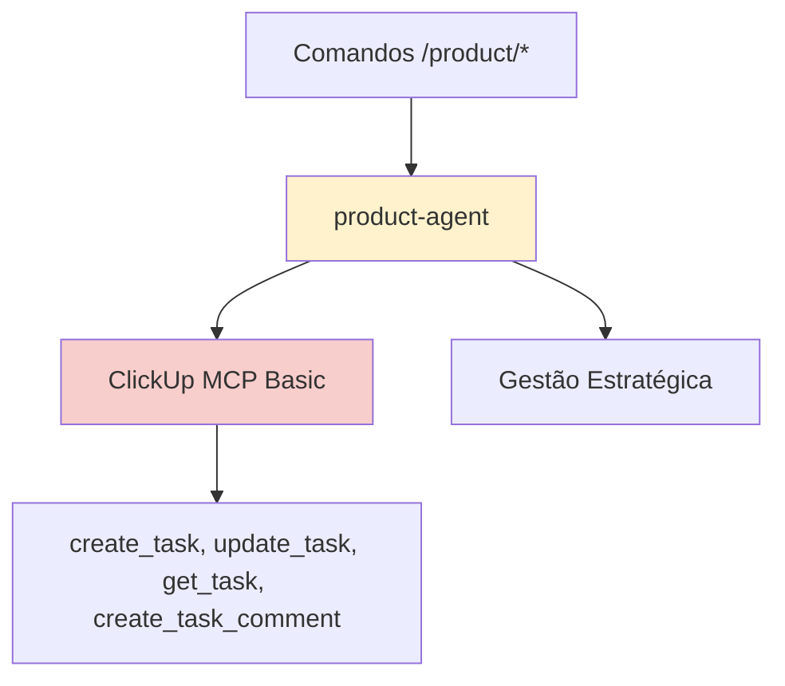
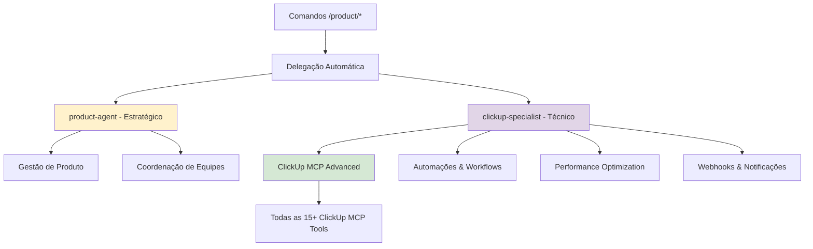
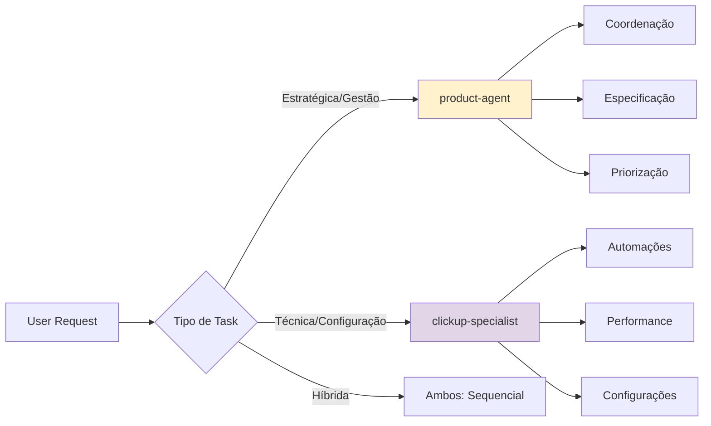

# Architecture: ClickUp Specialist Agent

## 🏗️ **Visão Geral de Alto Nível**

### Sistema Atual (Antes)


### Sistema Expandido (Depois)


## 📁 **Componentes Afetados e Relações**

### Componentes Diretos
1. **Novo Arquivo**: `.cursor/agents/development/clickup-specialist.md`
2. **Atualização**: `docs/onion/agents-reference.md` 
3. **Atualização**: `README.md` (contagem 12 → 15 agentes)

### Componentes Indiretos
1. **Sistema de delegação automática** dos comandos `/product/*`
2. **Comandos engineer** que usam ClickUp indiretamente via product-agent
3. **Fluxos de workflow** documentados em `engineering-flows.md`

### Dependências
- **ClickUp MCP** deve estar funcionando (✅ confirmado)
- **product-agent** existente (✅ confirmado)
- **Padrão de agentes** estabelecido (✅ analisado)

## 🎯 **Padrões e Melhores Práticas**

### Padrão de Agent Files
Baseado na análise de `python-developer.md`, `research-agent.md`, e `product-agent.md`:

```yaml
---
name: clickup-specialist
description: Especialista técnico em ClickUp MCP que otimiza integrações, cria automações e gerencia configurações avançadas. Use para otimizações técnicas do ClickUp.
model: sonnet
tools: [lista completa de ferramentas]
color: orange  # Categoria técnica/sistemas
priority: alta
expertise: [array de especialidades técnicas]
---
```

### Estrutura de Conteúdo (Padrão identificado)
1. **Filosofia/Abordagem**: Como o agente pensa e trabalha
2. **Áreas de Foco**: Especialidades técnicas específicas
3. **Metodologia**: Como executa as tarefas
4. **Ferramentas/Integração**: Uso específico das tools
5. **Padrões de Qualidade**: Standards e melhores práticas
6. **Exemplos Práticos**: Casos de uso reais

### Complementaridade com product-agent


## 🔧 **Dependências Externas**

### ClickUp MCP Tools (Confirmadas ✅)
**Core Tools** (já usadas pelo product-agent):
```
mcp_clickup-mcp-server_create_task
mcp_clickup-mcp-server_update_task
mcp_clickup-mcp-server_get_task
mcp_clickup-mcp-server_create_task_comment
```

**Advanced Tools** (expandir para clickup-specialist):
```
mcp_clickup-mcp-server_get_workspace_hierarchy
mcp_clickup-mcp-server_get_space_tags
mcp_clickup-mcp-server_add_tag_to_task
mcp_clickup-mcp-server_remove_tag_from_task
mcp_clickup-mcp-server_move_task
mcp_clickup-mcp-server_duplicate_task
mcp_clickup-mcp-server_delete_task
mcp_clickup-mcp-server_get_task_comments
mcp_clickup-mcp-server_create_bulk_tasks
mcp_clickup-mcp-server_update_bulk_tasks
mcp_clickup-mcp-server_move_bulk_tasks
mcp_clickup-mcp-server_delete_bulk_tasks
mcp_clickup-mcp-server_get_workspace_tasks
mcp_clickup-mcp-server_attach_task_file
mcp_clickup-mcp-server_get_task_time_entries
mcp_clickup-mcp-server_start_time_tracking
mcp_clickup-mcp-server_stop_time_tracking
```

### Development Tools (Padrão identificado)
```
read_file, write, search_replace, MultiEdit, run_terminal_cmd, read_lints, todo_write, codebase_search, web_search
```

### ClickUp API Knowledge
- **Rate Limits**: 100 requests/minute, otimização de bulk operations
- **Webhooks**: Configuration via ClickUp interface, event types
- **Custom Fields**: Dynamic field management, type validation
- **Automation Triggers**: Status changes, assignee updates, date-based

## ⚖️ **Restrições e Suposições**

### Restrições Técnicas
1. **ClickUp MCP disponível**: Todas as ferramentas devem estar acessíveis
2. **Performance**: Não impactar tempo de resposta do sistema
3. **Compatibilidade**: Não quebrar integrações existentes
4. **Rate Limits**: Respeitar limites da API ClickUp

### Restrições Arquiteturais
1. **Padrão de agentes**: Deve seguir estrutura YAML + Markdown
2. **Complementaridade**: Não duplicar funcionalidades do product-agent
3. **Delegação**: Integrar com sistema de comandos existente
4. **Naming**: Seguir convenções estabelecidas (development/ subpasta)

### Suposições
1. **Usuários conhecem ClickUp**: Configurações básicas já estabelecidas
2. **Ambiente estável**: ClickUp workspace configurado corretamente
3. **Permissões adequadas**: Access tokens com scopes necessários
4. **Versionamento**: ClickUp API v2 será mantida estável

## 🔄 **Trade-offs e Alternativas**

### Trade-offs Principais

#### 1. **Especialização vs Generalização**
**Escolha**: Alta especialização em ClickUp MCP  
**Trade-off**: Menos flexibilidade, mais eficiência  
**Alternativa rejeitada**: Agente genérico de "project management"

#### 2. **Modelo Sonnet vs Opus**
**Escolha**: Sonnet (eficiência)  
**Trade-off**: Menos capacidade de análise complexa, mais velocidade  
**Justificativa**: ClickUp operations são estruturadas, não precisam raciocínio complexo

#### 3. **Tools: Subset vs All ClickUp MCP**
**Escolha**: Todas as ferramentas ClickUp MCP  
**Trade-off**: Maior complexidade, máxima flexibilidade  
**Alternativa rejeitada**: Apenas core tools (limitaria funcionalidade)

#### 4. **Integração: Manual vs Automática**
**Escolha**: Delegação automática  
**Trade-off**: Complexidade de setup, UX transparente  
**Alternativa rejeitada**: Invocação manual (@clickup-specialist)

### Alternativas Consideradas

#### Alternativa A: Expandir product-agent
**Prós**: Menos complexidade, um agente único  
**Contras**: Mistura estratégico com técnico, agente muito complexo  
**Rejeitada**: Violaria princípio de responsabilidade única

#### Alternativa B: Múltiplos agentes específicos
**Prós**: Especialização máxima  
**Contras**: Muita fragmentação, delegação complexa  
**Rejeitada**: Overhead de coordenação excessivo

## ⚠️ **Consequências e Riscos**

### Consequências Positivas
1. **Especialização técnica**: ClickUp MCP otimizado ao máximo
2. **Manutenibilidade**: Separação clara de responsabilidades
3. **Extensibilidade**: Base sólida para futuras automações
4. **Performance**: Operações ClickUp otimizadas

### Consequências Negativas
1. **Complexidade adicional**: Mais um agente para manter
2. **Coordenação**: Necessidade de integração com product-agent
3. **Overhead inicial**: Setup e configuração de delegação
4. **Curva de aprendizado**: Usuários precisam entender diferença

### Riscos Identificados

#### Risco 1: Conflito entre agentes
**Probabilidade**: Baixa  
**Impacto**: Alto  
**Mitigação**: Definição clara de responsabilidades, testes de integração

#### Risco 2: Performance degradation
**Probabilidade**: Média  
**Impacto**: Médio  
**Mitigação**: Bulk operations, cache inteligente, rate limit awareness

#### Risco 3: ClickUp MCP instabilidade
**Probabilidade**: Baixa  
**Impacto**: Alto  
**Mitigação**: Error handling robusto, fallback para product-agent

## 📋 **Arquivos Principais a Serem Criados/Editados**

### Arquivo Principal
**`.cursor/agents/development/clickup-specialist.md`**
- Agent definition completo
- YAML header com todas as ferramentas
- Metodologia e exemplos práticos
- Especialidades técnicas detalhadas

### Atualizações de Documentação
**`docs/onion/agents-reference.md`**
- Nova seção para clickup-specialist
- Exemplos de uso
- Integração com product-agent
- Guidelines de quando usar cada um

**`README.md`**
- Atualizar contagem de agentes: 12 → 15
- Badge de ClickUp integration expandida

### Testes e Validação
**`.cursor/sessions/clickup-specialist/tests.md`**
- Casos de teste para cada ferramenta ClickUp MCP
- Cenários de integração com product-agent
- Performance benchmarks

## 🔧 **Implementação Técnica Detalhada**

### Especialidades Técnicas Core
1. **ClickUp MCP Optimization**
   - Bulk operations para performance
   - Rate limit management inteligente
   - Error handling e retry logic

2. **Workflow Automation**
   - Status-based triggers
   - Assignee automation
   - Tag management automático
   - Time tracking integration

3. **Advanced Configuration**
   - Custom fields management
   - Template creation e application
   - Space/List/Folder organization
   - Permission e sharing configuration

4. **Notification & Webhooks**
   - Webhook setup e configuration
   - Notification routing
   - Event filtering e processing
   - Integration com external systems

### Integration Patterns

#### Pattern 1: Complementar product-agent
```python
# Fluxo típico
user_request -> command -> delegation_system -> 
    product_agent(strategic) + clickup_specialist(technical)
```

#### Pattern 2: Standalone técnico
```python
# Operações puramente técnicas
user_request -> command -> delegation_system -> 
    clickup_specialist(configurations, optimizations)
```

#### Pattern 3: Consulta técnica
```python
# product-agent consulta clickup-specialist
product_agent -> clickup_specialist.optimize_query() -> result
```

## 📊 **Success Metrics**

### Métricas Técnicas
1. **Performance**: Redução de 20%+ no tempo de operações ClickUp
2. **Funcionalidades**: 100% das ClickUp MCP tools utilizáveis
3. **Automações**: 3+ workflows automatizados implementados
4. **Error Rate**: < 5% de errors em operações ClickUp

### Métricas de Integração
1. **Compatibilidade**: 100% dos comandos existentes funcionando
2. **Delegação**: Reconhecimento automático em 90%+ dos casos
3. **Documentação**: 100% das funcionalidades documentadas
4. **User Experience**: Transparência total para usuários finais

---

## 🎯 **Próximos Passos de Implementação**

1. **Criar agent file**: `.cursor/agents/development/clickup-specialist.md`
2. **Configurar ferramentas**: Todas as ClickUp MCP tools + development tools
3. **Implementar especialidades**: Automações, performance, configurações
4. **Documentar integração**: agents-reference.md e README.md
5. **Testar funcionalidade**: Todos os workflows críticos
6. **Validar performance**: Benchmarks de operações ClickUp

**A arquitetura está pronta para implementação! 🚀**
