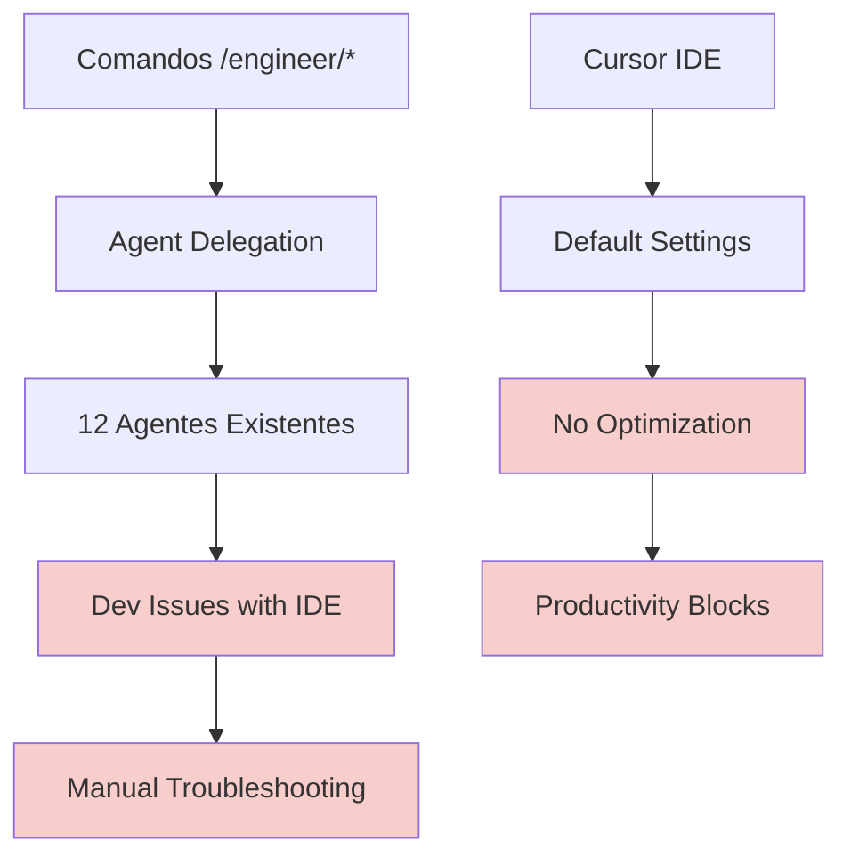
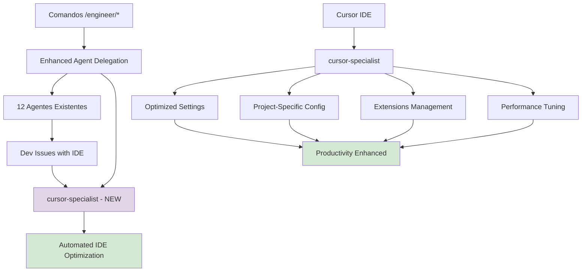

# Architecture: Cursor Specialist Agent

## 🏗️ **Visão Geral de Alto Nível**

### Sistema Atual (Antes)


### Sistema Expandido (Depois)  


---

## 🎯 **Componentes e Arquivos a Serem Afetados**

### 📁 **Novos Arquivos (Criação)**
1. **`.cursor/agents/development/cursor-specialist.md`**
   - Agent file principal
   - YAML header + Markdown estruturado
   - 7 especialidades técnicas

2. **Configurações de Projeto (Oportunidades Identificadas)**:
   - **`.cursorrules`** - Regras específicas do projeto (INEXISTENTE atualmente)
   - **`.cursorignore`** - Arquivos a ignorar (INEXISTENTE atualmente) 
   - **Workspace settings** otimizadas

### 📝 **Arquivos Existentes (Atualização)**
1. **`docs/onion/agents-reference.md`** - Nova seção cursor-specialist
2. **`README.md`** - Badge atualizado (13 → 14 agentes)

### 🔧 **Integração com Estrutura Existente**
**`.cursor/commands/engineer/`** - Modificação para detectar problemas de IDE:
- `start.md` - Setup automático de ambiente quando necessário
- `work.md` - Resolução automática de problemas durante desenvolvimento

---

## 🛠️ **Análise Completa de Artefatos .cursor Descobertos**

### 📊 **Estrutura Atual Mapeada (55 arquivos)**

#### **AGENTS (12 agentes)** - Padrões Identificados:
```yaml
# Distribuição por Modelo:
- sonnet: 9 agentes (75%) - eficiência
- opus: 3 agentes (25%) - análise complexa (product, code-reviewer, metaspec-gate-keeper)

# Distribuição por Cores (em uso):
- blue: python-developer, react-developer
- purple: research-agent (JÁ EM USO!)
- red: metaspec-gate-keeper, branch-metaspec-checker  
- green: code-reviewer, branch-code-reviewer
- yellow: product-agent
- cyan: test-engineer, test-planner, branch-test-planner
- orange: branch-documentation-writer
```

#### **COMMANDS (26 comandos organizados)**:
```
all-tools.md          # Lista todas as ferramentas
warm-up.md           # Preparação geral

common/              # Templates e prompts compartilhados
  ├── prompts/       # README.md, technical.md
  └── templates/     # business_context_template.md, technical_context_template.md

docs/                # Build de documentação
  ├── build-business-docs.md
  ├── build-index.md
  ├── build-tech-docs.md
  └── refine-vision.md

engineer/            # Workflow de desenvolvimento
  ├── start.md       # ⭐ INTEGRAÇÃO PRINCIPAL
  ├── work.md        # ⭐ HOOK PARA IDE ISSUES  
  ├── plan.md, docs.md, bump.md
  ├── pre-pr.md, pr.md
  └── warm-up.md

meta/                # Meta-comandos
  └── create-agent.md  # ⭐ TEMPLATE DE CRIAÇÃO

product/             # Gestão de produto  
  ├── task.md, spec.md, check.md
  ├── collect.md, refine.md
  ├── light-arch.md
  └── warm-up.md
```

#### **SESSIONS (4 sessões ativas)**:
- `cursor-specialist/` - Nossa sessão atual
- `docs-restructure/` - Reorganização de docs
- `linear-to-clickup/` - Migração de sistema
- `translate-cursor-docs/` - Tradução PT-BR

---

## 🔍 **Oportunidades Críticas Identificadas**

### 🚨 **GAPS no Projeto (Configurações Cursor Ausentes)**
```bash
# Arquivos de configuração Cursor INEXISTENTES:
.cursorrules         # ❌ Não existe
.cursorignore        # ❌ Não existe  
.vscode/             # ❌ Não existe
cursor-workspace/    # ❌ Não existe
```

### 🎯 **Especialidades Expandidas (7 áreas)**
1. **`cursor-configuration`** - Settings, Chat, Models, Features  
2. **`workspace-optimization`** - .cursorrules, .cursorignore, projeto-específico
3. **`extensions-ecosystem`** - VSCode compatibility, installs, management
4. **`api-integrations`** - OpenAI, Anthropic, Google, Azure keys  
5. **`performance-tuning`** - HTTP/2, memory, context windows, caching
6. **`productivity-automation`** - Keybindings, snippets, templates, workflows
7. **`troubleshooting-expertise`** - Logs, connectivity, proxy, debugging

### ⚡ **Integração Inteligente (Automática)**
```mermaid
graph LR
    A[/engineer/start] --> B{IDE Issues?}
    B -->|Yes| C[Auto-call cursor-specialist]
    B -->|No| D[Continue Normal Flow]
    
    E[Other Agent] --> F{Cursor Error?}  
    F -->|Yes| G[Delegate to cursor-specialist]
    F -->|No| H[Continue Task]
    
    C --> I[Fix & Continue]
    G --> I
```

---

## 🔧 **Especificações Técnicas Finais**

### **YAML Header Otimizado**
```yaml
---
name: cursor-specialist
description: Especialista técnico em otimização, configuração e troubleshooting do Cursor IDE. Use para resolver problemas de ambiente, configurar workspace e maximizar produtividade.
model: sonnet
tools: read_file, write, search_replace, MultiEdit, run_terminal_cmd, codebase_search, list_dir, glob_file_search, web_search, read_lints, todo_write
color: lightblue  # NOVA COR (purple já usado por research-agent)
priority: alta
expertise: ["cursor-ide", "workspace-config", "productivity-optimization", "extensions-management", "api-integration", "performance-tuning", "troubleshooting"]
---
```

### **Ferramentas Justificadas**
- **`read_file`, `write`, `MultiEdit`**: Modificar settings.json, .cursorrules, configs
- **`run_terminal_cmd`**: Instalar extensions, restart Cursor, system operations  
- **`codebase_search`**: Descobrir configurações existentes, padrões de problema
- **`list_dir`, `glob_file_search`**: Explorar estrutura de configurações
- **`web_search`**: Pesquisar extensions, troubleshooting solutions
- **`read_lints`**: Analisar erros relacionados a configuração
- **`todo_write`**: Tracking de otimizações e configurações pendentes

---

## 📋 **Dependências e Restrições**

### **Dependências Críticas**
1. **Sistema Onion** funcionando (base)
2. **Cursor IDE** ativo (para testes e aplicação)
3. **Estrutura .cursor/** preservada (padrões)
4. **Access filesystem** para configs (permissões)

### **Dependencies Externas** 
- **Nenhuma nova biblioteca** necessária
- **Usar ferramentas existentes** do ecossistema
- **Compatibilidade VSCode** extensions

### **Restrições Arquiteturais**
- **Cor purple indisponível** (research-agent usa)
- **Padrão YAML rigoroso** obrigatório
- **Não overlap** com especialidades existentes  
- **Sonnet model** (economia, não precisa Opus)

---

## ⚙️ **Trade-offs e Alternativas**

### **Trade-off: Cor do Agente**
- **Problema**: Purple já usado por research-agent
- **Solução**: lightblue (produtividade/tools)
- **Alternativa**: gray, teal

### **Trade-off: Modelo Sonnet vs Opus**
- **Escolha**: Sonnet 
- **Justificativa**: Configurações IDE são lógicas mas não ultra-complexas
- **Economia**: Reduz custo operacional
- **Performance**: Tempo de resposta mais rápido

### **Trade-off: Scope Projeto vs Global**  
- **Escolha**: Ambos, com preferência para projeto
- **Justificativa**: Flexibilidade máxima
- **Implementação**: Detectar contexto automaticamente

---

## 🚨 **Riscos e Mitigações**

### **Risco: Conflito de Configurações**
- **Problema**: Configurações globais vs projeto podem conflitar
- **Mitigação**: Priorizar projeto, documentar hierarquia

### **Risco: Extension Compatibility**
- **Problema**: Extensions podem quebrar entre updates
- **Mitigação**: Versioning recommendations, fallback configs

### **Risco: Performance Impact**
- **Problema**: Over-optimization pode degradar performance
- **Mitigação**: Benchmarking, configurações incrementais

---

## 🎯 **Success Metrics**

### **Métricas Técnicas**
- [ ] Agent file segue 100% padrão existente
- [ ] 7 especialidades técnicas implementadas
- [ ] Integration com comandos /engineer/* funcional
- [ ] .cursorrules e .cursorignore criados como exemplos

### **Métricas de Qualidade**  
- [ ] Zero conflitos com agentes existentes
- [ ] Troubleshooting automated para problemas comuns  
- [ ] Documentação completa e atualizada
- [ ] Linting 100% clean

### **Métricas de Produtividade**
- [ ] Setup time reduzido para novos desenvolvedores
- [ ] IDE issues resolution automated
- [ ] Configuration standardized across projects
- [ ] Extension management streamlined

---

## 📋 **Próximos Passos para Implementação**

### **Fase 1: Core Implementation**
1. Criar `.cursor/agents/development/cursor-specialist.md`
2. Implementar as 7 especialidades técnicas  
3. Configurar integration patterns

### **Fase 2: Configuration Templates**
1. Criar `.cursorrules` template para projeto
2. Criar `.cursorignore` template  
3. Documentar workspace settings padrão

### **Fase 3: Integration & Testing**
1. Modificar `/engineer/start` para setup automático
2. Testar delegation automática
3. Validar com outros agentes

### **Fase 4: Documentation & Polish**
1. Atualizar `agents-reference.md`
2. Atualizar `README.md`
3. Criar exemplos práticos de uso
