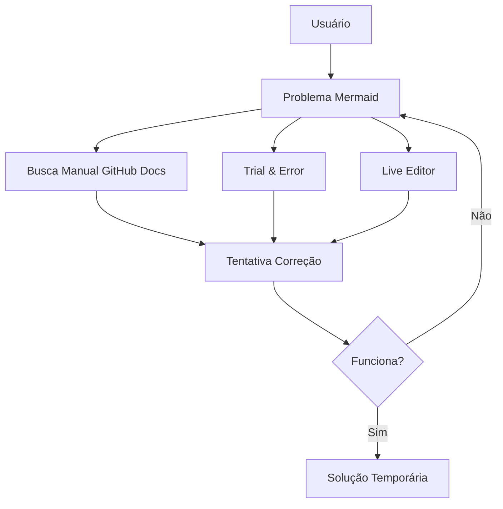
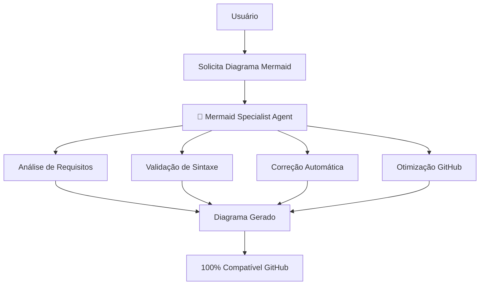
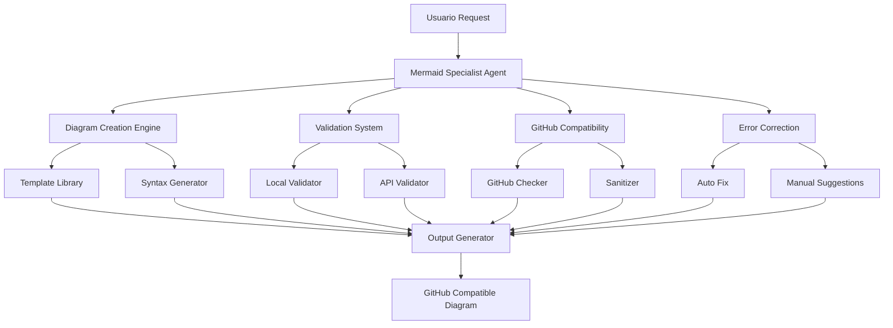

# 🏗️ Arquitetura - Mermaid Specialist Agent

**Task**: 86ac03vpw - Mermaid Specialist Agent - Criação Completa  
**Status**: 🏗️ Em Definição  
**Data**: 22/09/2025

---

## 🎯 **Visão Geral de Alto Nível**

### **Sistema Atual (Antes)**


### **Sistema Futuro (Depois)**


---

## 🧩 **Componentes e Arquitetura**

### **1. 📁 Estrutura Principal**

```
.cursor/agents/development/mermaid-specialist.md
│
├── 📋 YAML Header
│   ├── name: mermaid-specialist
│   ├── description: Especialista completo em diagramas Mermaid
│   ├── model: claude-4-sonnet
│   ├── tools: [11 ferramentas Sistema Onion]
│   ├── color: lightcyan
│   ├── priority: alta
│   └── expertise: [7 especialidades técnicas]
│
├── 🎯 Core Capabilities
│   ├── Diagram Creation Engine
│   ├── Syntax Validation System
│   ├── GitHub Compatibility Checker
│   └── Error Correction Automator
│
├── 📊 Diagram Type Handlers (9+ tipos)
│   ├── Flowchart Engine (graph TD/LR/BT/RL)
│   ├── Sequence Diagram Engine
│   ├── Class Diagram Engine
│   ├── State Diagram Engine (v2)
│   ├── Entity Relationship Engine
│   ├── User Journey Engine
│   ├── Gantt Chart Engine
│   ├── Pie Chart Engine
│   └── Git Graph Engine
│
├── 🔧 Specialist Systems
│   ├── Syntax Validation Module
│   ├── GitHub Compatibility Module
│   ├── Performance Optimization Module
│   ├── Error Diagnosis Module
│   ├── Best Practices Module
│   ├── Cross-Platform Module
│   └── Interactive Features Module
│
├── 📚 Knowledge Base
│   ├── Templates Library (casos comuns)
│   ├── Troubleshooting Guide
│   ├── Examples Gallery
│   └── FAQ & Solutions
│
└── 🔗 Integration Layer
    ├── Sistema Onion Integration
    ├── ClickUp MCP Integration
    └── External APIs Integration
```

### **2. 🎨 Componentes Core Detalhados**

#### **Diagram Creation Engine**
```typescript
interface DiagramCreationEngine {
  // Parser de descrições naturais para sintaxe Mermaid
  parseDescription(text: string): MermaidSyntax
  
  // Gerador de sintaxe otimizada
  generateSyntax(type: DiagramType, requirements: Requirements): string
  
  // Validador em tempo real
  validateSyntax(mermaidCode: string): ValidationResult
  
  // Otimizador para GitHub
  optimizeForGitHub(mermaidCode: string): string
}
```

#### **GitHub Compatibility Checker**
```typescript
interface GitHubCompatibilityChecker {
  // Verifica compatibilidade com limitações GitHub
  checkCompatibility(mermaidCode: string): CompatibilityReport
  
  // Remove elementos problemáticos
  sanitizeForGitHub(mermaidCode: string): string
  
  // Converte caracteres especiais
  normalizeCharacters(text: string): string
  
  // Valida limites de complexidade
  validateComplexity(diagram: ParsedDiagram): ComplexityReport
}
```

#### **Error Diagnosis Module**
```typescript
interface ErrorDiagnosisModule {
  // Identifica tipos de erro específicos
  diagnoseError(mermaidCode: string, error: Error): DiagnosisReport
  
  // Sugere correções específicas
  suggestFixes(diagnosis: DiagnosisReport): FixSuggestion[]
  
  // Aplica correções automáticas
  autoFix(mermaidCode: string, fixes: FixSuggestion[]): string
  
  // Explica problemas em linguagem natural
  explainIssue(error: Error): string
}
```

---

## 🔧 **Padrões e Melhores Práticas**

### **1. Padrões Mantidos (Sistema Onion)**
- ✅ **YAML Header Structure**: Idêntico aos 16 agentes existentes
- ✅ **Tools Integration**: Todas as ferramentas padrão do Sistema Onion
- ✅ **Markdown Structure**: Seções organizadas e hierárquicas
- ✅ **Color Schema**: lightcyan (técnico mas visual)
- ✅ **Priority System**: alta (funcionalidade crítica)

### **2. Padrões Introduzidos (Mermaid Specific)**
- 🆕 **Template System**: Biblioteca de templates por tipo de diagrama
- 🆕 **Validation Pipeline**: Multi-stage validation (Syntax → GitHub → Performance)
- 🆕 **Auto-Correction**: Sistema inteligente de correção automática
- 🆕 **Compatibility Matrix**: Mapeamento de recursos vs plataformas

### **3. Melhores Práticas Aplicadas**
```yaml
# Exemplo de template estruturado
flowchart_template:
  syntax: "flowchart TD"
  github_safe: true
  max_nodes: 50
  character_filter: "emoji_strip"
  optimization_level: "github_compatible"
```

---

## 🌐 **Dependências Externas**

### **APIs e Ferramentas**
1. **Mermaid Live Editor API**
   - **Uso**: Validação em tempo real
   - **Endpoint**: https://mermaid.live/
   - **Propósito**: Teste de compatibilidade

2. **GitHub Mermaid Renderer**
   - **Uso**: Validação de compatibilidade
   - **Limitações**: Rate limits, recursos suportados
   - **Propósito**: Garantir renderização

3. **Mermaid.js Documentation**
   - **Uso**: Referência oficial de sintaxe
   - **Atualização**: WebSearch automática
   - **Propósito**: Manter atualizado

### **Sistema Onion Dependencies**
- ✅ **Read/Write/Edit**: Manipulação de arquivos
- ✅ **WebSearch**: Documentação atualizada
- ✅ **Codebase_search**: Análise de diagramas existentes
- ✅ **TodoWrite**: Gerenciamento de tarefas
- ✅ **Grep**: Busca por patterns Mermaid

---

## ⚖️ **Trade-offs e Alternativas**

### **Decisões Arquiteturais**

#### **1. Modelo Claude-4-Sonnet vs Outros**
**Escolhido**: Claude-4-Sonnet  
**Justificativa**: Máxima capacidade de análise de sintaxe complexa  
**Trade-off**: Custo mais alto vs Qualidade superior  
**Alternativa**: Modelos menores para validações simples

#### **2. Validação Local vs API Externa**
**Escolhido**: Híbrido (Local + API)  
**Justificativa**: Local para velocidade, API para precisão  
**Trade-off**: Complexidade vs Robustez  
**Alternativa**: Apenas local (menos preciso)

#### **3. Templates Estáticos vs Dinâmicos**
**Escolhido**: Templates Dinâmicos  
**Justificativa**: Adapta-se a requisitos específicos  
**Trade-off**: Complexidade vs Flexibilidade  
**Alternativa**: Templates estáticos (mais simples)

---

## 🚨 **Restrições e Limitações**

### **Restrições Técnicas**
1. **GitHub Mermaid Limitations**:
   - Não suporta emojis em nós
   - Limite de complexidade (nodes/edges)
   - Subset de recursos Mermaid.js

2. **Performance Constraints**:
   - Validação deve ser <5 segundos
   - Memory usage limitado
   - Rate limits de APIs externas

3. **Compatibilidade Requirements**:
   - 100% compatibilidade GitHub
   - Fallback para sintaxe conservadora
   - Cross-platform consistency

### **Restrições de Projeto**
1. **Sistema Onion Integration**:
   - Não quebrar funcionalidades existentes
   - Seguir padrões estabelecidos
   - Manter performance geral

2. **Maintenance Considerations**:
   - Documentação atualizada automaticamente
   - Testes automatizados
   - Backward compatibility

---

## 📁 **Principais Arquivos Criados/Editados**

### **Arquivos Principais**
1. **`.cursor/agents/development/mermaid-specialist.md`**
   - Arquivo principal do agente
   - YAML header + corpo completo
   - **Status**: 🆕 Criação

### **Arquivos de Suporte**
2. **`.cursor/sessions/mermaid-specialist-agent/`**
   - **context.md**: ✅ Criado
   - **architecture.md**: 🏗️ Este arquivo
   - **plan.md**: ✅ Criado
   - **notes.md**: ✅ Criado

### **Arquivos de Documentação**
3. **Templates e Exemplos** (dentro do agente):
   - Biblioteca de templates por tipo
   - Exemplos práticos de cada diagrama
   - Troubleshooting guide
   - FAQ e soluções comuns

---

## 🎯 **Consequências e Impactos**

### **Impactos Positivos**
1. ✅ **Produtividade**: Criação automática de diagramas compatíveis
2. ✅ **Qualidade**: 100% compatibilidade GitHub garantida
3. ✅ **Manutenibilidade**: Correção automática de problemas
4. ✅ **Escalabilidade**: Suporte a todos os tipos de diagrama
5. ✅ **Integração**: Perfeita com Sistema Onion existente

### **Possíveis Consequências Negativas**
1. ⚠️ **Complexidade**: Agente mais complexo que média
   - **Mitigação**: Documentação extensiva e exemplos
2. ⚠️ **Dependência Externa**: APIs podem falhar
   - **Mitigação**: Fallbacks e validação local
3. ⚠️ **Performance**: Validação pode ser lenta para diagramas grandes
   - **Mitigação**: Otimização e cache inteligente

### **Riscos Mitigados**
1. ✅ **Compatibilidade**: Sistema de validação robusto
2. ✅ **Manutenção**: Auto-update via WebSearch
3. ✅ **Performance**: Limits e optimizations built-in
4. ✅ **Usabilidade**: Templates e troubleshooting guide

---

## 📊 **Diagrama de Arquitetura Simplificado**



---

## ✅ **Aprovação para Implementação**

### **Arquitetura Validada**
- ✅ **Padrões Sistema Onion**: 100% compatível
- ✅ **Funcionalidades Core**: Todas definidas
- ✅ **Integrações**: Mapeadas e validadas
- ✅ **Performance**: Targets definidos
- ✅ **Qualidade**: Critérios estabelecidos

### **Próximos Passos**
1. ✅ **Aprovação Humana**: Aguardando revisão
2. 🔄 **Implementação Fase 1**: Estrutura Base
3. 🔄 **Desenvolvimento Iterativo**: Seguindo plan.md
4. 🔄 **Testes Contínuos**: Validação em cada fase

---

**Status**: ✅ ARQUITETURA COMPLETA - Pronta para implementação  
**Complexidade**: MÉDIA-ALTA (justificada pela abrangência)  
**Confiança**: ALTA (baseada em padrões estabelecidos)**
