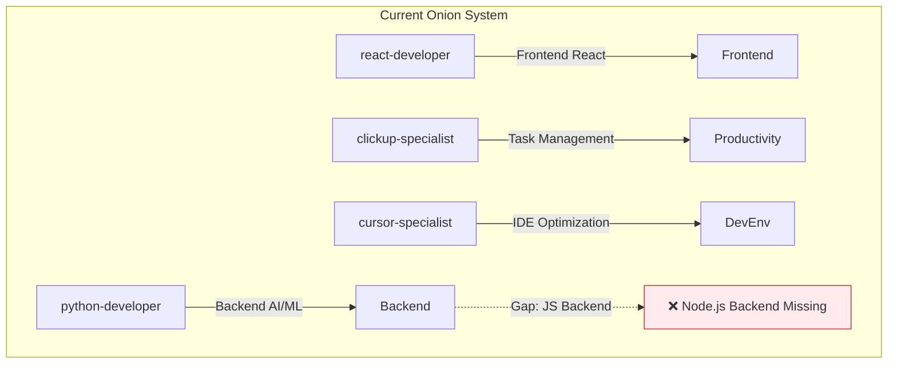
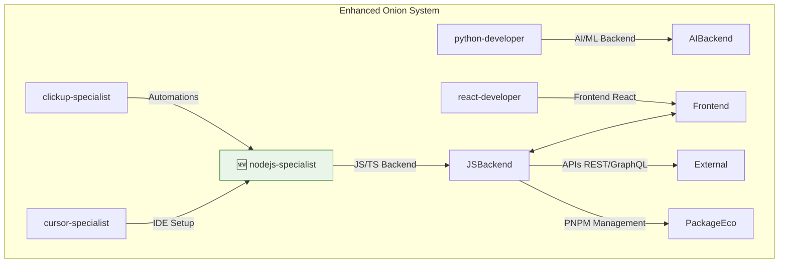
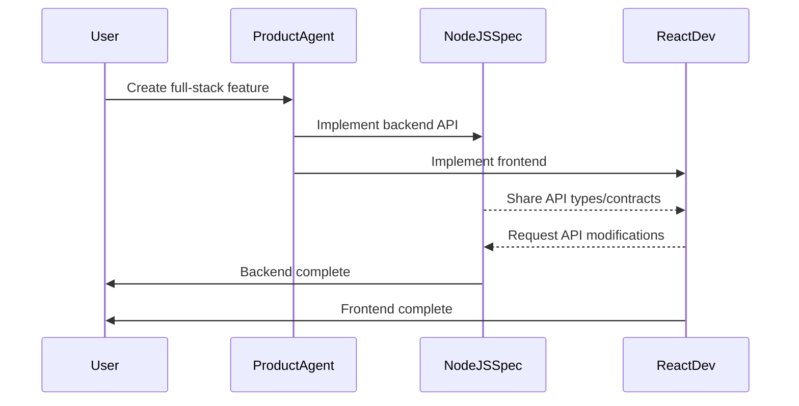

# NodeJS Specialist Agent - Arquitetura Técnica

## 🏗️ **Visão Geral da Arquitetura**

### **Sistema Antes da Mudança**


### **Sistema Após a Implementação** 


---

## 🎯 **Componentes Arquiteturais**

### **1. Agent Definition Structure**
```yaml
# .cursor/agents/development/nodejs-specialist.md
---
name: nodejs-specialist
description: Especialista em desenvolvimento backend JavaScript/TypeScript com Node.js, PNPM ecosystem e performance optimization. Use PROATIVAMENTE para APIs complexas, configurações TypeScript backend e otimizações de performance Node.js.
model: sonnet
tools: read_file, write, search_replace, MultiEdit, run_terminal_cmd, read_lints, todo_write, codebase_search, web_search
color: teal
priority: alta
expertise: ["nodejs", "typescript-backend", "api-development", "pnpm-ecosystem", "testing-frameworks", "performance-optimization", "security-best-practices"]
---
```

### **2. Core Specializations Architecture**

#### **A. nodejs** - Runtime & Ecosystem
```typescript
// Core Node.js runtime expertise
- Process management & clustering
- Memory optimization & garbage collection
- Event loop understanding & async patterns
- Module system (CommonJS vs ESM)
- Built-in modules leverage (fs, path, crypto, etc.)
```

#### **B. typescript-backend** - Type Safety & Configuration  
```typescript
// Backend-specific TypeScript patterns
- tsconfig.json optimization for Node.js
- Declaration file management
- Type-safe API development
- Integration with Node.js native types
- Compilation targets and module resolution
```

#### **C. api-development** - Modern API Patterns
```typescript
// REST & GraphQL API architecture
- Fastify performance-first approach
- Express.js battle-tested patterns  
- GraphQL with @nestjs/graphql or apollo-server
- OpenAPI/Swagger documentation
- Middleware composition patterns
```

#### **D. pnpm-ecosystem** - ⭐ **Modern Package Management**
```json
{
  "packageManager": "pnpm@9.12.4",
  "scripts": {
    "dev": "pnpm run build && node dist/index.js",
    "build": "tsc && pnpm run copy-assets",
    "test": "pnpm run test:unit && pnpm run test:integration"
  },
  "pnpm": {
    "overrides": {
      "@types/node": "^20.0.0"
    },
    "peerDependencyRules": {
      "ignoreMissing": ["webpack"]
    }
  }
}
```

#### **E. testing-frameworks** - Modern Testing Stack
```typescript
// Jest/Vitest patterns for Node.js
- Unit testing with mocks and spies
- Integration testing with supertest
- Performance testing with autocannon
- E2E testing with Playwright
- Coverage reporting and thresholds
```

#### **F. performance-optimization** - Production-Grade Performance
```typescript
// Performance monitoring and optimization
- CPU profiling with clinic.js
- Memory leak detection with @nodejs/leak
- Database query optimization 
- Caching strategies (Redis, memory)
- Load balancing and clustering
```

#### **G. security-best-practices** - Security by Design
```typescript
// Node.js security essentials
- Input validation with joi/yup
- Authentication with JWT/OAuth2
- Rate limiting with express-rate-limit
- Helmet.js security headers
- Dependency vulnerability scanning
```

---

## 🔗 **Integração com Sistema Onion**

### **Comando Integration Patterns**

#### **1. `/engineer/start` Integration**
```bash
# Automatic invocation scenarios:
- Task mentions "Node.js", "Express", "Fastify", "TypeScript backend"
- Package.json modifications needed
- API development requirements
- Performance optimization requests

# Delegation example:
@nodejs-specialist "Analyze this Express API performance issue - response times > 2s"
```

#### **2. `/product/task` Integration**
```bash
# Complementarity with product-agent:
- product-agent: Defines API requirements and business logic
- nodejs-specialist: Implements technical architecture and optimizations

# Example workflow:
1. product-agent creates task: "Implement user authentication API"  
2. Auto-delegation to nodejs-specialist for technical implementation
3. nodejs-specialist delivers: JWT auth + rate limiting + validation
```

#### **3. Cross-Agent Collaboration**


---

## 🛠️ **Ferramentas e Dependências**

### **Core Tools Integration**
```yaml
# Standard Development Tools
read_file: Source code analysis and understanding
write: Creating new Node.js files and configurations  
search_replace: Code refactoring and updates
MultiEdit: Bulk operations across multiple files
run_terminal_cmd: PNPM commands, build processes, testing
read_lints: ESLint, TSC error analysis
todo_write: Task management and progress tracking
codebase_search: Finding patterns across Node.js projects

# Specialized Research Tool  
web_search: Latest Node.js best practices, package research, security advisories
```

### **PNPM Command Integration** ⭐
```bash
# Common PNPM operations the agent will execute:
pnpm install                    # Package installation
pnpm add fastify @types/node   # Add dependencies with types
pnpm add -D typescript eslint  # Add dev dependencies
pnpm run build                 # Build TypeScript projects
pnpm run test                  # Run test suites
pnpm run lint                  # Code quality checks
pnpm dlx create-fastify        # Scaffold projects with dlx
pnpm audit                     # Security vulnerability scanning
pnpm outdated                  # Dependency update checking
```

### **External Dependencies**
```typescript
// Knowledge bases accessed via web_search
- Node.js official documentation
- TypeScript handbook  
- Fastify ecosystem plugins
- Express.js middleware patterns
- NPM package registry for versions
- Security advisories (GitHub Security Lab)
- Performance benchmarking results
```

---

## 📊 **Padrões e Melhores Práticas**

### **Architectural Patterns**
```typescript
// 1. Layered Architecture
src/
├── controllers/     // HTTP request handlers
├── services/       // Business logic layer
├── repositories/   // Data access layer  
├── middleware/     // Request/response processing
├── types/          // TypeScript definitions
├── utils/          // Utility functions
└── config/         // Configuration management

// 2. Dependency Injection
import { Container } from 'inversify'
import { DatabaseService } from './services/database.service'

const container = new Container()
container.bind<DatabaseService>(DatabaseService).toSelf()
```

### **Performance Patterns**
```typescript
// 1. Connection Pooling
import { Pool } from 'pg'

const pool = new Pool({
  connectionString: process.env.DATABASE_URL,
  max: 20,           // Maximum connections
  idleTimeoutMillis: 30000,
  connectionTimeoutMillis: 2000
})

// 2. Response Caching  
import { LRUCache } from 'lru-cache'

const cache = new LRUCache<string, any>({
  max: 500,
  ttl: 1000 * 60 * 10 // 10 minutes
})
```

### **Security Patterns**
```typescript
// 1. Input Validation
import Joi from 'joi'

const userSchema = Joi.object({
  email: Joi.string().email().required(),
  password: Joi.string().min(8).pattern(/^(?=.*[a-z])(?=.*[A-Z])(?=.*\d)/)
})

// 2. Rate Limiting
import rateLimit from 'express-rate-limit'

const apiLimiter = rateLimit({
  windowMs: 15 * 60 * 1000, // 15 minutes
  max: 100, // Limit each IP to 100 requests per windowMs
  standardHeaders: true,
  legacyHeaders: false
})
```

---

## 🚀 **Deployment e DevOps**

### **Build Pipeline Integration**
```typescript
// TypeScript compilation optimization
{
  "compilerOptions": {
    "target": "ES2022",           // Modern Node.js target
    "module": "Node16",           // Node.js ESM support
    "moduleResolution": "Node16",
    "allowSyntheticDefaultImports": true,
    "esModuleInterop": true,
    "strict": true,
    "skipLibCheck": true,
    "declaration": true,          // Generate .d.ts files
    "outDir": "./dist",
    "rootDir": "./src"
  },
  "include": ["src/**/*"],
  "exclude": ["node_modules", "dist", "**/*.test.ts"]
}
```

### **Production Optimization**
```dockerfile
# Multi-stage Docker optimization
FROM node:20-alpine AS builder
WORKDIR /app
COPY package.json pnpm-lock.yaml ./
RUN corepack enable pnpm && pnpm install --frozen-lockfile
COPY . .
RUN pnpm run build

FROM node:20-alpine AS runtime  
WORKDIR /app
COPY --from=builder /app/dist ./dist
COPY --from=builder /app/node_modules ./node_modules
COPY package.json ./
EXPOSE 3000
CMD ["node", "dist/index.js"]
```

---

## 🔄 **Trade-offs e Considerações**

### **Decisões Arquiteturais**

#### **1. Fastify vs Express**
```typescript
// Trade-off Analysis
Fastify Advantages:
+ 2-3x faster performance out of the box
+ Built-in TypeScript support  
+ Modern async/await patterns
+ Better JSON serialization
+ Plugin ecosystem growing rapidly

Express Advantages:  
+ Larger ecosystem and community
+ More middleware options
+ Battle-tested in production
+ Extensive documentation and tutorials
+ Easier migration from existing projects

// Agent Recommendation: Context-dependent choice
// - New high-performance APIs → Fastify
// - Legacy system integration → Express
```

#### **2. PNPM vs NPM/Yarn**
```typescript  
// PNPM Advantages (confirmed by user)
+ Disk space efficiency (shared packages)
+ Faster installation (parallel processing)
+ Strict node_modules structure (no phantom dependencies)
+ Better monorepo support with workspaces
+ Security improvements (content-addressable storage)

// Implementation Strategy:
// - All new projects use PNPM by default
// - Migration guides for existing NPM/Yarn projects
// - PNPM-optimized scripts and workflows
```

### **Limitações e Riscos**

#### **1. Learning Curve**
```typescript
// Potential Risk: Fastify adoption
- Mitigation: Provide comprehensive templates and examples
- Fallback: Express patterns as alternative approach

// Risk: PNPM tooling differences  
- Mitigation: Clear migration documentation
- Training: PNPM-specific commands and workflows
```

#### **2. Ecosystem Maturity**
```typescript
// Risk: Newer tools may have fewer resources
- Mitigation: web_search for latest best practices
- Strategy: Balance cutting-edge with stability
- Documentation: Internal patterns and guides
```

---

## 📋 **Arquivos de Implementação**

### **Arquivos Principais a Criar**
```bash
# 1. Agent Definition
.cursor/agents/development/nodejs-specialist.md

# 2. Documentation Updates  
docs/onion/agents-reference.md        # Add nodejs-specialist section
README.md                             # Update badge 14→15 agents

# 3. Session Management
.cursor/sessions/nodejs-specialist/context.md       # ✅ Created
.cursor/sessions/nodejs-specialist/architecture.md  # 🔄 Current

# 4. Integration Updates (if needed)
.cursorrules                          # Add nodejs-specialist references
```

### **Arquivos de Template (Future)**
```bash
# Templates para projetos Node.js (optional future enhancement)  
templates/nodejs/
├── fastify-api/
│   ├── package.json              # PNPM + Fastify + TypeScript
│   ├── tsconfig.json            # Optimized Node.js config
│   ├── src/index.ts            # Fastify server template
│   └── Dockerfile              # Production-ready container
├── express-api/  
│   └── ...                     # Alternative Express template
└── graphql-api/
    └── ...                     # GraphQL API template
```

---

## 🎯 **Próximos Passos**

### **Implementação Completa**
1. ✅ **Context.md** - Entendimento confirmado
2. 🔄 **Architecture.md** - Design técnico (current)  
3. 🔜 **Agent Implementation** - Create nodejs-specialist.md
4. 🔜 **Documentation** - Update agents-reference.md + README.md
5. 🔜 **Integration Testing** - Validate delegation and workflows

### **Validation Criteria**
```typescript
// Agent funcionando corretamente quando:
✅ Invocação `@nodejs-specialist` funciona
✅ Delegação automática em contexts Node.js
✅ Ferramentas PNPM executam sem erros
✅ Web search encontra packages e best practices
✅ Integração com `/engineer/*` commands
✅ Performance patterns implementados corretamente
✅ Security best practices aplicadas por padrão
```

**Status**: 🚀 **Arquitetura completa - Ready for Implementation**
