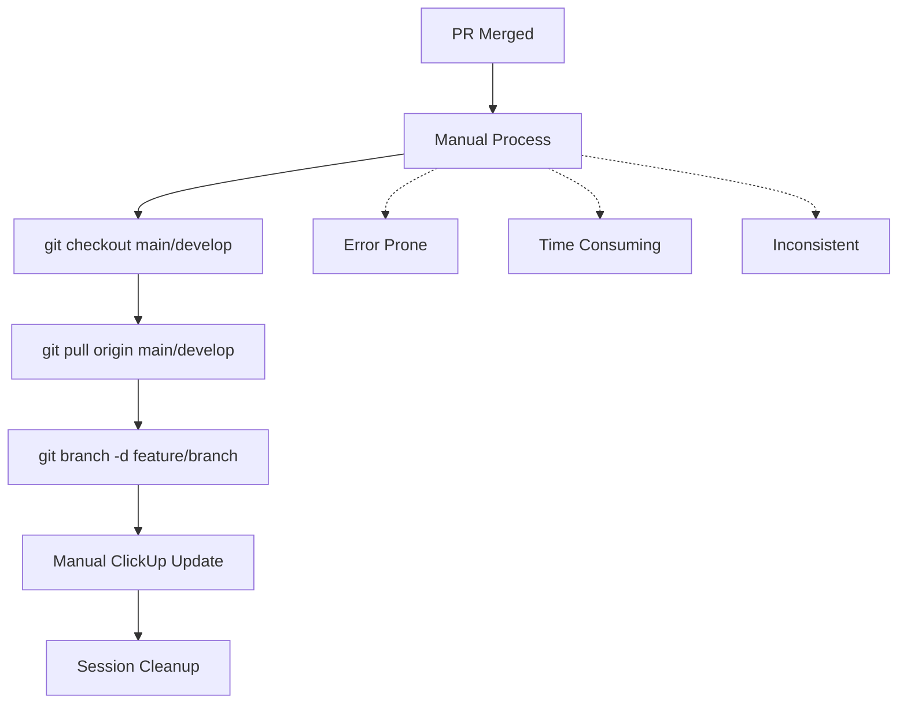
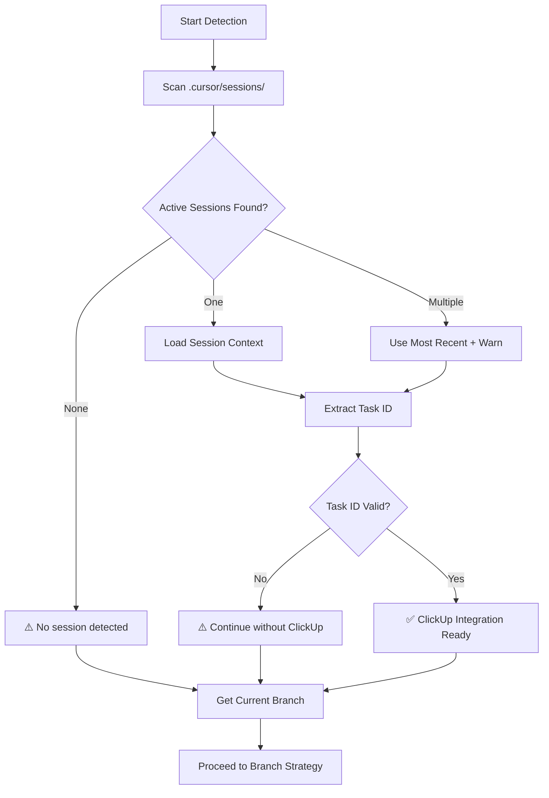
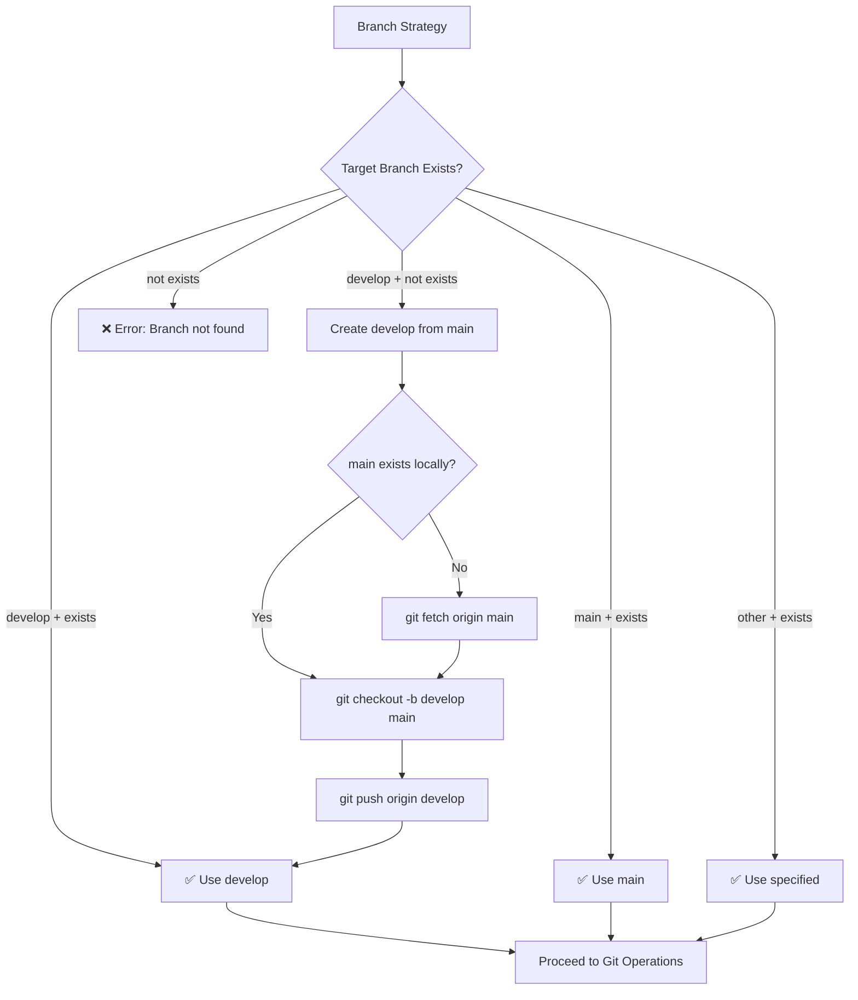
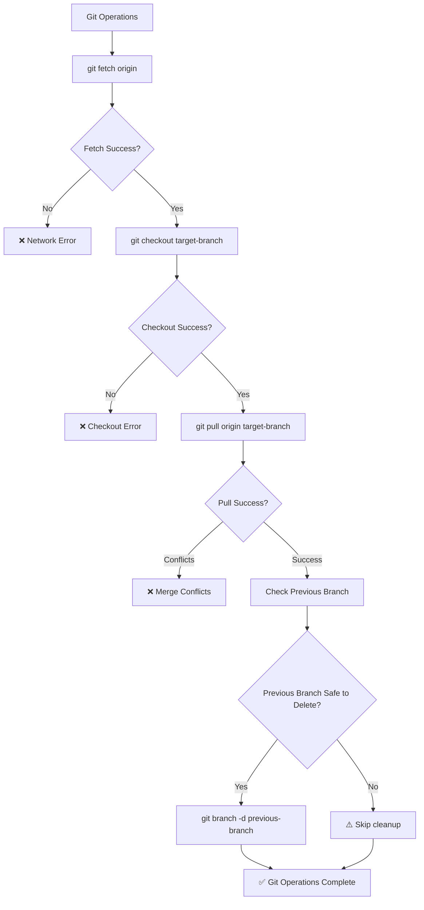
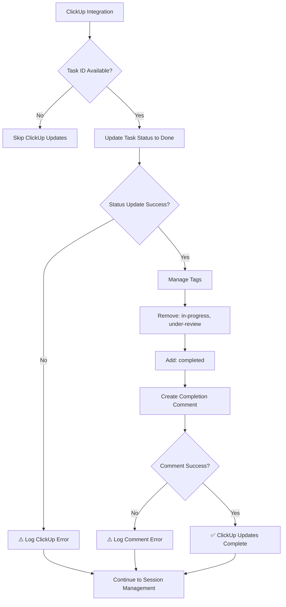
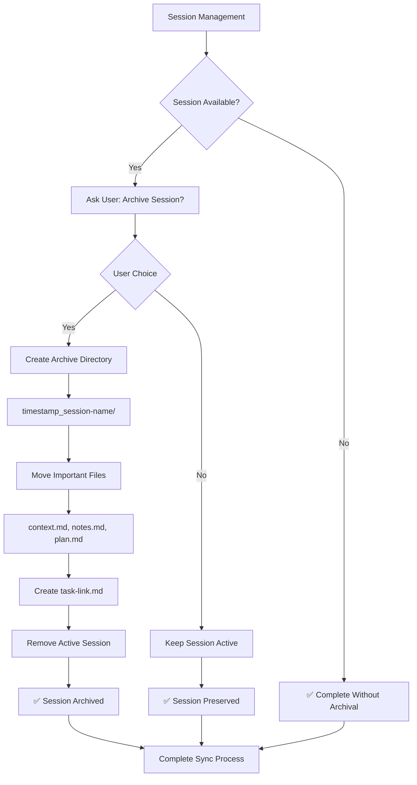

# 🏗️ Arquitetura - Comando Sync

**Task**: 86ac06261 - Comando Sync - Sincronização Automática de Branches  
**Data**: 22/09/2025  
**Status**: 🏗️ ARQUITETURA DEFINIDA

---

## 🎯 **Visão Geral de Alto Nível**

### **🔄 Estado Atual (Antes)**


### **✨ Estado Futuro (Depois)**
```mermaid
flowchart TD
    A[PR Merged] --> B[/git/sync main]
    B --> C{Auto Detection}
    C --> D[Git Operations]
    C --> E[ClickUp Integration]
    C --> F[Session Management]
    
    D --> G[✅ Git Sync Complete]
    E --> H[✅ ClickUp Updated]
    F --> I[✅ Session Archived]
    
    G --> J[🎯 Ready for Next Task]
    H --> J
    I --> J
```

---

## 🧩 **Componentes Arquiteturais**

### **1. 🎛️ Command Interface Layer**
```
.cursor/commands/git/
├── sync.md              # ✅ Comando principal
└── README.md           # ✅ Documentação git commands
```

**Responsabilidades:**
- Interface de comando unificada
- Parsing de parâmetros (`/git/sync [branch-name]`)
- Validação de entrada
- Delegação para camadas internas

### **2. 🔍 Context Detection Layer**
```
System Detection:
├── Branch Detection     # git branch --show-current
├── Session Discovery    # .cursor/sessions/*/context.md
├── Repository State     # git status --porcelain
└── Remote Validation    # git ls-remote origin
```

**Responsabilidades:**
- Detectar branch atual para limpeza
- Identificar sessão ativa automaticamente
- Extrair task ID do context.md
- Validar estado do repositório

### **3. 🌿 Branch Strategy Layer**
```
Branch Logic:
├── Default Resolution   # develop (criar se não existir)
├── Branch Validation    # Verificar existência remota
├── Auto Creation        # develop from main se necessário
└── Safety Checks        # Mudanças não commitadas
```

**Responsabilidades:**
- Implementar estratégia "develop-first"
- Criar develop a partir de main se não existir
- Validar branches remotas
- Proteger trabalho local

### **4. ⚙️ Git Operations Layer**
```
Git Commands:
├── Fetch               # git fetch origin
├── Checkout            # git checkout [target-branch]
├── Pull                # git pull origin [target-branch]
├── Branch Cleanup      # git branch -d [previous-branch]
└── State Validation    # Verificar cada operação
```

**Responsabilidades:**
- Sequência atômica de operações git
- Tratamento de conflitos
- Rollback em caso de erro
- Logs detalhados de operações

### **5. 🔗 ClickUp Integration Layer**
```
ClickUp Operations:
├── Task Status Update  # Move para "Done"
├── Tag Management      # Remove in-progress/under-review, add completed
├── Comment Creation    # Comentário formatado de conclusão
└── Error Handling      # Fallback gracioso se ClickUp falhar
```

**Responsabilidades:**
- Atualização automática conforme estratégia
- Formatação Unicode consistente
- Preservar operações git mesmo se ClickUp falhar
- Logging de operações ClickUp

### **6. 📁 Session Management Layer**
```
Session Operations:
├── Session Detection   # Identificar sessão ativa
├── Archival Prompt     # Perguntar sobre arquivamento
├── Archive Process     # Mover para .cursor/sessions/archived/
└── Cleanup             # Remover sessão ativa
```

**Responsabilidades:**
- Gestão inteligente de sessões
- Preservação de dados importantes
- Organização temporal
- Manutenção do workspace limpo

---

## 🔧 **Fluxo de Execução Detalhado**

### **📋 Fase 1: Inicialização e Validação**
```mermaid
flowchart TD
    A[/git/sync main] --> B{Parse Arguments}
    B --> C[branch = main]
    B --> D[branch = develop - default]
    
    C --> E[Validate Repository]
    D --> E
    
    E --> F{Git Repo Valid?}
    F -->|No| G[❌ Error: Not a git repository]
    F -->|Yes| H[Check Working Directory]
    
    H --> I{Uncommitted Changes?}
    I -->|Yes| J[⚠️ Warn User + Suggest Commit]
    I -->|No| K[Proceed to Detection]
    
    J --> L{User Resolves?}
    L -->|No| M[❌ Exit with guidance]
    L -->|Yes| K
```

### **📋 Fase 2: Context Detection**


### **📋 Fase 3: Branch Strategy**


### **📋 Fase 4: Git Operations**


### **📋 Fase 5: ClickUp Integration**


### **📋 Fase 6: Session Management**


---

## 🛠️ **Stack Tecnológico**

### **Core Technologies**
- **Git CLI**: Todas as operações git (fetch, checkout, pull, branch)
- **ClickUp MCP**: Sistema de integração existente do Onion
- **Bash Scripting**: Lógica de controle e tratamento de erros
- **Markdown**: Formato de comando seguindo padrão Sistema Onion

### **Dependências Externas**
- **Git**: Repositório deve estar configurado e com remote origin
- **ClickUp MCP**: Credenciais configuradas para auto-updates
- **Sistema de Sessões**: Estrutura `.cursor/sessions/` ativa

### **Bibliotecas/Ferramentas Internas**
- **Sistema de Comandos**: Framework `.cursor/commands/` existente
- **ClickUp Auto-Update Strategy**: Padrões estabelecidos
- **Unicode Formatting**: Patterns de formatação consistentes

---

## 📁 **Estrutura de Arquivos**

### **Arquivos a Criar**
```
.cursor/commands/git/
├── sync.md                 # ✅ Comando principal
└── README.md              # ✅ Documentação git commands

.cursor/sessions/archived/  # ✅ Pasta para arquivamento
└── [timestamp]_[slug]/     # ✅ Sessões arquivadas
```

### **Arquivos a Modificar**
```
.cursor/sessions/sync-command/
├── context.md             # ✅ Atualizar com arquitetura
├── plan.md               # ✅ Marcar progresso das fases
└── notes.md              # ✅ Adicionar decisões arquiteturais
```

### **Arquivos de Referência**
```
.cursor/commands/engineer/
├── pr.md                 # 📖 Padrão auto-update ClickUp
├── start.md              # 📖 Padrão sessões ativas
└── work.md               # 📖 Padrão comentários formatados

.cursor/utils/
└── clickup-auto-update-strategy.md  # 📖 Diretrizes de auto-update
```

---

## ⚖️ **Trade-offs e Alternativas**

### **🔄 Branch Strategy: develop-first**
**Escolhido**: develop como padrão com auto-criação
**Alternativa**: main como padrão
**Trade-off**: 
- ✅ **Vantagem**: Proteção da main branch, workflow GitFlow
- ⚠️ **Desvantagem**: Complexidade adicional de criação automática

### **📁 Session Archival: Optional**
**Escolhido**: Pergunta ao usuário
**Alternativa**: Sempre arquivar ou nunca arquivar
**Trade-off**:
- ✅ **Vantagem**: Flexibilidade, controle do usuário
- ⚠️ **Desvantagem**: Interação adicional requerida

### **⚠️ Error Recovery: Conservative**
**Escolhido**: Avisar usuário e sugerir ações
**Alternativa**: Auto-correção agressiva
**Trade-off**:
- ✅ **Vantagem**: Usuário mantém controle, segurança
- ⚠️ **Desvantagem**: Mais passos manuais em edge cases

### **🔗 ClickUp Dependency: Optional**
**Escolhido**: Continue git ops mesmo se ClickUp falhar
**Alternativa**: Falhar completamente se ClickUp indisponível
**Trade-off**:
- ✅ **Vantagem**: Robustez, git ops sempre funcionam
- ⚠️ **Desvantagem**: Status ClickUp pode ficar inconsistente

---

## 🚨 **Restrições e Suposições**

### **Restrições**
- **Git Repository**: Deve ser repositório git válido com remote origin
- **ClickUp MCP**: Deve estar configurado para auto-updates
- **Branch Permissions**: Usuário deve ter permissão para criar/deletar branches
- **Network**: Conectividade para operações remotas

### **Suposições**
- **Workflow Pattern**: Usuário segue padrão feature-branch → PR → merge
- **Session Structure**: Sessões seguem formato `.cursor/sessions/slug/context.md`
- **ClickUp Tasks**: Tasks têm ciclo de vida "To Do" → "In Progress" → "Done"
- **Branch Naming**: Branches seguem padrão `feature/slug-name`

### **Limitações**
- **Single Repository**: Funciona apenas no repositório atual
- **Branch Conflicts**: Não resolve conflitos de merge automaticamente
- **ClickUp Rate Limits**: Sujeito a limitações da API ClickUp
- **Network Dependency**: Requer conectividade para operações remotas

---

## ⚠️ **Consequências e Riscos**

### **🔴 Riscos Identificados**
1. **Perda de Trabalho Local**: Mudanças não commitadas podem ser perdidas
   - **Mitigação**: Validação rigorosa + avisos claros
2. **Estado Git Inconsistente**: Operações parciais podem deixar repo em estado ruim
   - **Mitigação**: Operações atômicas + rollback
3. **ClickUp Inconsistency**: Se API falhar, status pode ficar desatualizado
   - **Mitigação**: Continue git ops + log errors + retry logic
4. **Branch Conflicts**: Se develop/main divergiram significativamente
   - **Mitigação**: Orientação clara para resolução manual

### **🟡 Consequências de Design**
1. **Complexidade Adicional**: Auto-criação de develop adiciona complexity
   - **Aceitável**: Benefício de proteção da main compensa
2. **Dependência de Sessões**: Comando funciona melhor com sessões ativas
   - **Aceitável**: Comando ainda funciona sem sessões, só perde auto-update ClickUp
3. **Interação Usuário**: Pergunta sobre arquivamento quebra fluxo automático
   - **Aceitável**: Flexibilidade é mais importante que automação total

### **🟢 Benefícios Esperados**
1. **Redução de Erros**: Automação elimina passos manuais propensos a erro
2. **Economia de Tempo**: Processo completo em < 30 segundos
3. **Consistência**: Sempre mesmo processo, sempre mesmos resultados
4. **Integração**: Workflow completo do Sistema Onion fechado

---

## 📊 **Métricas de Sucesso**

### **Funcionais**
- ✅ Comando funciona com `/git/sync` (develop padrão)
- ✅ Comando funciona com `/git/sync main`
- ✅ Auto-criação de develop se não existir
- ✅ Limpeza segura de branches locais
- ✅ Auto-update ClickUp com tag "completed"

### **Não-Funcionais**
- ⏱️ **Performance**: Execução completa < 30 segundos
- 🛡️ **Segurança**: Zero perda de trabalho local
- 🔧 **Usabilidade**: Mensagens claras, logs informativos
- 🔄 **Robustez**: Funciona em 95%+ dos cenários git comuns
- 📈 **Manutenibilidade**: Código limpo, bem documentado

### **Integração**
- 🔗 **Sistema Onion**: Compatibilidade 100% com comandos existentes
- 📱 **ClickUp**: Auto-updates seguindo estratégia estabelecida
- 📁 **Sessões**: Gestão inteligente de arquivamento
- 🌿 **Git**: Suporte para workflows GitFlow e GitHub Flow

---

## 🚀 **Plano de Implementação**

### **Dependências Críticas**
1. **Criar pasta git commands**: `.cursor/commands/git/`
2. **Estudar ClickUp MCP**: Entender API calls exatos
3. **Analisar sistema de sessões**: Como detectar ativas
4. **Padrão de formatação**: Unicode patterns estabelecidos

### **Ordem de Implementação**
1. **Fase 1**: Estrutura base e parsing de comandos
2. **Fase 2**: Sistema de detecção (branches, sessões, tasks)
3. **Fase 3**: Operações git core (fetch, checkout, pull, cleanup)
4. **Fase 4**: Integração ClickUp (status, tags, comentários)
5. **Fase 5**: Gestão de sessões (arquivamento opcional)
6. **Fase 6**: Tratamento de erros e edge cases

### **Marcos de Validação**
- **6h**: MVP funcional (git operations working)
- **10h**: ClickUp integration complete
- **12h**: Session management + error handling
- **14h**: Documentation + testing complete

---

**Status**: ✅ **ARQUITETURA COMPLETA**  
**Aprovação**: ⏳ Aguardando review do usuário  
**Próximo**: Implementação Fase 1 após aprovação
