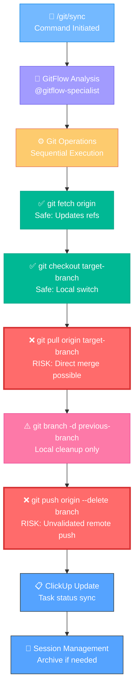
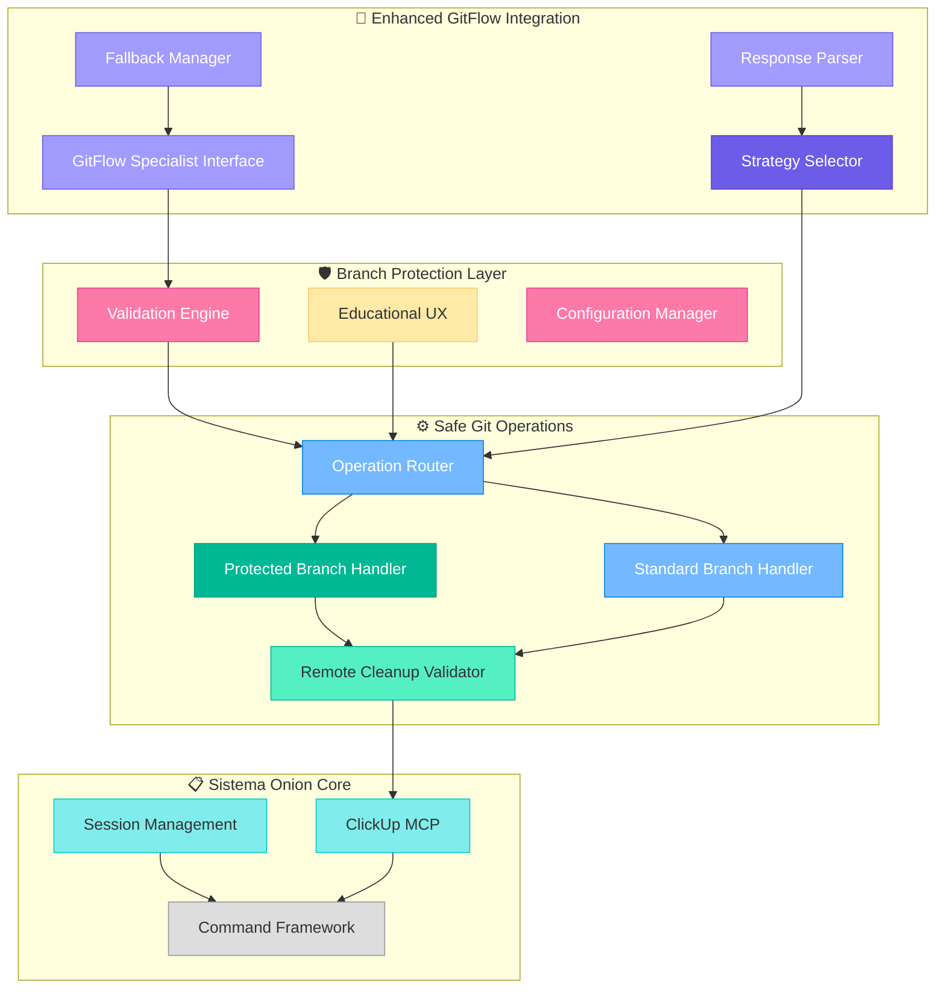
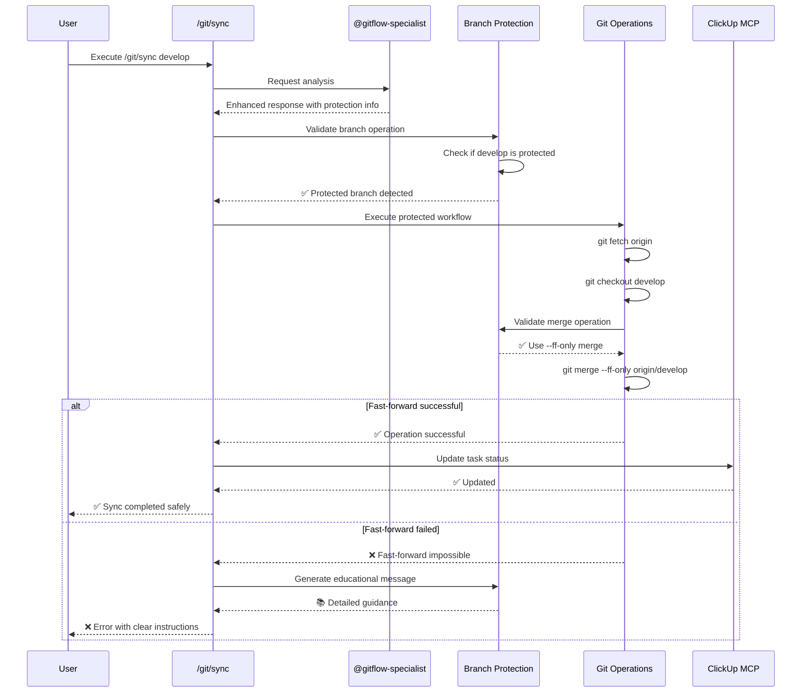
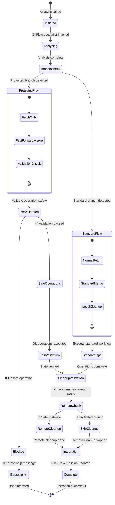
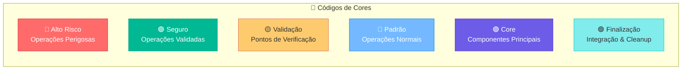
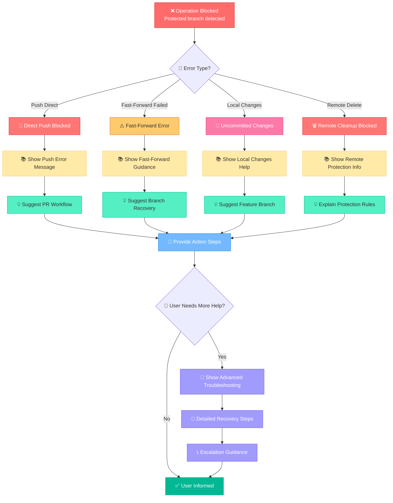

# 🏗️ Arquitetura: Git Sync PR Enforcement

## 📋 **Resumo Executivo**

Esta arquitetura implementa **PR Enforcement** no comando `/git/sync` do Sistema Onion, transformando-o de um sistema que permite operações diretas em branches protegidas para um sistema **PR-First** que bloqueia completamente pushes diretos para `develop`, `main` e `master`.

### **🎯 Decisões Estratégicas Aprovadas:**
- **Cenários de Emergência**: Bloqueio total mantido (sem overrides)
- **Fast-Forward Failures**: Bloquear + guidance educativa clara  
- **Branches Protegidas**: `['develop', 'main', 'master']` (básico, expansível)

---

## 🔄 **Visão Geral do Sistema**

### **📊 Estado Atual (ANTES)**


**⚠️ Pontos de Risco Identificados:**
- **git pull**: Permite merge commits acidentais em branches protegidas
- **push --delete**: Remove branches remotas sem validação de proteção
- **Ausência de validação**: Nenhuma verificação preventiva de branch protection

### **✅ Estado Futuro (DEPOIS)**

```mermaid
flowchart TD
    A["🔄 /git/sync<br/>Enhanced Command"] --> B["🤖 GitFlow Analysis<br/>Enhanced @gitflow-specialist"]
    B --> C["🛡️ Branch Protection<br/>Validation Layer"]
    
    C --> D{"🎯 Is Protected Branch?<br/>(develop/main/master)"}
    
    %% Protected Branch Path (Left Side)
    D -->|"✅ Protected"| E["🔒 Protected Branch Workflow<br/>PR-First Enforcement"]
    E --> E1["✅ git fetch origin<br/>Safe: Updates refs"]
    E1 --> E2["✅ git checkout target-branch<br/>Safe: Local switch"]
    E2 --> E3["🛡️ git merge --ff-only<br/>SAFE: Fast-forward only"]
    E3 --> E4["🔍 Post-Operation Validation<br/>Verify clean state"]
    
    %% Standard Branch Path (Right Side)
    D -->|"⚡ Standard"| F["⚙️ Standard Workflow<br/>Feature/Hotfix branches"]
    F --> F1["✅ git fetch origin<br/>Safe: Updates refs"]
    F1 --> F2["✅ git checkout target-branch<br/>Safe: Local switch"]
    F2 --> F3["✅ git pull origin target-branch<br/>Safe: Standard merge"]
    F3 --> F4["🧹 git branch -d previous-branch<br/>Local cleanup"]
    
    %% Convergence Point
    E4 --> G["🔍 Branch Cleanup Validation<br/>Enhanced Safety Checks"]
    F4 --> G
    
    G --> H{"🛡️ Safe to Delete Remote?<br/>Protection validation"}
    H -->|"✅ Safe"| I["🗑️ git push origin --delete<br/>VALIDATED remote cleanup"]
    H -->|"🚫 Protected"| J["⏩ Skip Remote Delete<br/>Protection preserved"]
    
    %% Final Steps
    I --> K["📋 ClickUp Update<br/>Task status & comments"]
    J --> K
    K --> L["📁 Session Management<br/>Archive & cleanup"]
    
    %% Styling - Protected Branch Path (Green/Safe)
    style E fill:#00b894,stroke:#00a085,stroke-width:2px,color:#fff
    style E1 fill:#00b894,stroke:#00a085,color:#fff
    style E2 fill:#00b894,stroke:#00a085,color:#fff
    style E3 fill:#00b894,stroke:#00a085,color:#fff
    style E4 fill:#00b894,stroke:#00a085,color:#fff
    
    %% Styling - Standard Branch Path (Blue/Normal)
    style F fill:#74b9ff,stroke:#0984e3,color:#fff
    style F1 fill:#74b9ff,stroke:#0984e3,color:#fff
    style F2 fill:#74b9ff,stroke:#0984e3,color:#fff
    style F3 fill:#74b9ff,stroke:#0984e3,color:#fff
    style F4 fill:#74b9ff,stroke:#0984e3,color:#fff
    
    %% Styling - Core Components (Purple/Important)
    style A fill:#6c5ce7,stroke:#5f3dc4,color:#fff
    style B fill:#a29bfe,stroke:#6c5ce7,color:#fff
    style C fill:#fd79a8,stroke:#e84393,stroke-width:3px,color:#fff
    
    %% Styling - Decision Points (Orange/Decision)
    style D fill:#fdcb6e,stroke:#e17055,stroke-width:2px,color:#333
    style H fill:#fdcb6e,stroke:#e17055,stroke-width:2px,color:#333
    
    %% Styling - Validation & Safety (Yellow/Validation)
    style G fill:#ffeaa7,stroke:#fdcb6e,color:#333
    style I fill:#55efc4,stroke:#00b894,color:#333
    style J fill:#ff7675,stroke:#d63031,color:#fff
    
    %% Styling - Final Steps (Light Blue/Completion)
    style K fill:#81ecec,stroke:#00cec9,color:#333
    style L fill:#81ecec,stroke:#00cec9,color:#333
```


**✅ Melhorias Implementadas:**
- **Branch Protection Layer**: Validação preventiva antes de qualquer operação
- **Safe Git Operations**: `git fetch` + `git merge --ff-only` para branches protegidas
- **Remote Delete Protection**: Validação antes de deletar branches remotas protegidas
- **Educational Error Handling**: Mensagens que ensinam workflow correto

### **🏗️ Diagrama de Componentes da Arquitetura**


### **⏱️ Diagrama de Sequência - Operação Protegida**


### **🔄 Diagrama de Estados da Operação**


### **🎨 Legenda dos Diagramas**


**📋 Símbolos e Elementos:**
- **🛡️** = Proteção e segurança
- **⚠️** = Atenção e validação  
- **✅** = Operação segura e aprovada
- **❌** = Operação bloqueada ou perigosa
- **🔍** = Verificação e análise
- **🎯** = Ponto de decisão importante
- **📋** = Atualização e integração
- **🔄** = Processo ou comando
- **💡** = Orientação educativa

---

## 🏗️ **Componentes da Arquitetura**

### **1. 🛡️ Branch Protection Layer (NOVO)**

#### **1.1 Core Validation Engine**
```typescript
interface ProtectedBranchConfig {
  branches: ['develop', 'main', 'master'];
  operations: {
    allowedOperations: ['fetch', 'merge --ff-only', 'checkout', 'status'];
    blockedOperations: ['push', 'pull', 'merge --no-ff', 'rebase'];
    enforceGitflow: true;
  };
  errorHandling: {
    showEducationalMessages: true;
    suggestAlternativeWorkflow: true;
    blockSilentFailures: true;
  };
}

interface ValidationResult {
  allowed: boolean;
  reason?: 'PROTECTED_BRANCH_VIOLATION' | 'LOCAL_CHANGES_ON_PROTECTED' | 'REMOTE_DELETE_BLOCKED';
  message?: string;
  suggestion?: string;
  guidance?: string[];
}
```

#### **1.2 Validation Functions**
```bash
# Função principal de validação
validateProtectedBranchOperation(branch, operation, context) {
  if (isProtectedBranch(branch)) {
    if (isUnsafeOperation(operation)) {
      return createBlockedResult(branch, operation);
    }
    
    if (hasLocalChanges() && operation === 'sync') {
      return createLocalChangesBlockedResult(branch);
    }
    
    if (operation === 'remote-delete' && isProtectedBranch(branch)) {
      return createRemoteDeleteBlockedResult(branch);
    }
  }
  
  return { allowed: true };
}

# Validação preventiva (Fase 1)
validatePreSync(targetBranch, currentBranch) {
  // Executada antes de qualquer operação Git
}

# Validação pós-operação (Fase 3)
validatePostSync(targetBranch, operationResult) {
  // Executada após operações para verificar estado
}
```

### **2. ⚙️ Safe Git Operations Engine (MODIFICADO)**

#### **2.1 Operações Git Atuais vs Seguras**
```bash
# ANTES (Estado Atual - INSEGURO):
git fetch origin                    # ✅ Safe
git checkout [target-branch]        # ✅ Safe
git pull origin [target-branch]     # ❌ UNSAFE: Pode criar merge commits
git branch -d [previous-branch]     # ⚠️  Safe localmente
git push origin --delete [previous-branch]  # ❌ UNSAFE: Push sem validação

# DEPOIS (Estado Futuro - SEGURO):
git fetch origin                     # ✅ Safe
validateProtectedBranchOperation()   # 🛡️  NOVA: Validação preventiva
git checkout [target-branch]         # ✅ Safe  
if (isProtectedBranch([target-branch])) {
  git merge --ff-only origin/[target-branch]  # ✅ SAFE: Fast-forward apenas
} else {
  git pull origin [target-branch]    # ✅ Safe para branches normais
}
git branch -d [previous-branch]      # ✅ Safe localmente
if (canDeleteRemoteBranch([previous-branch])) {
  git push origin --delete [previous-branch]  # 🛡️  SAFE: Com validação
}
validatePostSync()                   # 🛡️  NOVA: Validação pós-operação
```

#### **2.2 Estratégias de Sync Expandidas**
```bash
# Estratégias Existentes (mantidas):
- "standard": Sync padrão para branches normais
- "feature-cleanup": Otimizado para feature branches  
- "hotfix-sync": Especializado para hotfix branches
- "no-op": Quando já na branch correta

# Nova Estratégia (implementada):
- "protected-branch-sync": Para sync seguro de develop/main/master
  - skipRemoteCheck: false
  - forceCleanup: false (mais conservador)
  - fastForward: true (obrigatório)
  - enforceProtection: true (nova flag)
  - validationLevel: 'strict' (nova flag)
```

### **3. 🤖 GitFlow Specialist Integration (EXPANDIDO)**

#### **3.1 Enhanced JSON Response Schema**
```json
{
  "analysis": {
    "workflowType": "gitflow|github-flow|gitlab-flow|custom",
    "complianceLevel": "excellent|good|partial|poor", 
    "syncStrategy": "standard|feature-cleanup|hotfix-sync|no-op|protected-branch-sync",
    "confidence": "high|medium|low",
    "branchProtection": {
      "isTargetProtected": boolean,
      "isSourceProtected": boolean,
      "allowedOperations": ["fetch", "merge --ff-only"],
      "blockedOperations": ["push", "pull", "merge --no-ff"],
      "prEnforcementActive": boolean,
      "requiresPullRequest": boolean
    }
  },
  "validation": {
    "isOperationValid": boolean,
    "postMergeChecks": {
      "branchCleanupRequired": boolean,
      "remoteSyncNeeded": boolean,
      "workflowViolations": [...],
      "protectedBranchCompliance": boolean,
      "fastForwardPossible": boolean
    }
  },
  "guidance": {
    "syncBestPractices": [...],
    "cleanupInstructions": [...],
    "nextSteps": [...],
    "workflowOptimizations": [...],
    "prWorkflowGuidance": [
      "Create feature branch for changes",
      "Use /engineer/pr to create Pull Request", 
      "Get approval and merge via GitHub/GitLab",
      "Run /git/sync to update local repository"
    ]
  }
}
```

#### **3.2 Fallback Inteligente Enhanced**
```bash
# Fallback quando @gitflow-specialist indisponível
function createProtectedBranchFallback(repoContext) {
  return {
    analysis: {
      syncStrategy: "protected-branch-sync",
      branchProtection: {
        isTargetProtected: isProtectedBranch(targetBranch),
        prEnforcementActive: true,
        requiresPullRequest: true
      }
    },
    guidance: {
      prWorkflowGuidance: getStandardPRGuidance()
    }
  };
}
```

### **4. 📚 Educational UX System (NOVO)**

#### **4.1 Message Templates**
```bash
# Template para Push Direto Bloqueado
function createPushBlockedMessage(branch, operation) {
  return `
🚫 OPERAÇÃO BLOQUEADA: Push direto para branch protegida

━━━━━━━━━━━━━━━━━━━━━━━━

📋 Branch: ${branch} (protegida)
⚠️  Operação: ${operation}
🚫 Motivo: Branches protegidas requerem Pull Request

🎯 WORKFLOW CORRETO:
   1. /engineer/pr         # Criar Pull Request
   2. Review + Approve     # Processo de review no GitHub/GitLab
   3. Merge via Interface  # Merge aprovado pela interface
   4. /git/sync           # Sincronizar repositório local

💡 Por que? 
   Branches protegidas garantem que todo código passe por review,
   mantendo qualidade e permitindo colaboração segura da equipe.

🔗 Documentação: Sistema Onion - Workflow GitFlow
━━━━━━━━━━━━━━━━━━━━━━━━
`;
}

# Template para Fast-Forward Failure
function createFastForwardFailedMessage(branch) {
  return `
⚠️  FAST-FORWARD FALHOU: Não é possível atualizar ${branch}

━━━━━━━━━━━━━━━━━━━━━━━━

🔍 POSSÍVEIS CAUSAS:
   ∟ Commits locais não pushados em ${branch}
   ∟ Branch local divergiu da remota
   ∟ Merge commit criado acidentalmente

✅ COMO RESOLVER:
   1. Verificar estado:
      git status
      git log --oneline origin/${branch}..${branch}
   
   2. Se há commits locais não pushados:
      git checkout -b backup-${branch}
      git checkout ${branch}
      git reset --hard origin/${branch}
   
   3. Se commits são importantes:
      git checkout -b feature/recover-changes backup-${branch}
      # Use /engineer/pr para submeter via Pull Request

🎯 PREVENÇÃO:
   • Nunca commitar diretamente em ${branch}
   • Sempre usar feature branches para desenvolvimento
   • Sincronizar regularmente com /git/sync

━━━━━━━━━━━━━━━━━━━━━━━━
`;
}
```

#### **4.2 Progressive Disclosure**
```bash
# Nível 1: Mensagem básica (sempre mostrada)
# Nível 2: Detalhes técnicos (se usuário pedir help)
# Nível 3: Troubleshooting avançado (se problema persistir)

function showEducationalMessage(level, context) {
  case $level in
    "basic")    showBasicBlockedMessage() ;;
    "detailed") showDetailedGuidance() ;;
    "advanced") showAdvancedTroubleshooting() ;;
  esac
}
```

#### **4.3 Error Handling Flow**


---

## 🔗 **Dependências e Integrações**

### **📦 Dependências Existentes (Mantidas)**
```yaml
Core Dependencies:
  - git: "^2.x" # Git CLI tool
  - Sistema Onion: "current" # Framework de comandos
  - @gitflow-specialist: "current" # Agente GitFlow
  - ClickUp MCP: "current" # Integração ClickUp

External Services:
  - GitHub/GitLab: "any" # Para Pull Requests
  - Remote Git Repository: "any" # Origin remote
```

### **🆕 Novas Funcionalidades (Implementadas)**
```yaml
New Components:
  - BranchProtectionLayer: "v1.0" # Sistema de validação
  - SafeGitOperations: "v1.0" # Wrapper seguro para Git
  - EducationalUX: "v1.0" # Sistema de mensagens educativas
  - EnhancedGitFlowIntegration: "v1.1" # Extensão do GitFlow specialist

New Patterns:
  - PR-First Enforcement: "v1.0" # Workflow obrigatório
  - Fast-Forward Only Merging: "v1.0" # Para branches protegidas
  - Progressive Error Disclosure: "v1.0" # UX educativa
```

---

## ⚖️ **Trade-offs e Alternativas**

### **✅ Decisões Escolhidas vs Alternativas**

#### **1. Bloqueio Total vs Override de Emergência**
```markdown
ESCOLHIDO: Bloqueio Total
PRO: 
  - Zero risco de acidentes
  - Força workflow correto 100% do tempo
  - Mais simples de implementar e entender
CONTRA:
  - Pode atrasar hotfixes muito urgentes
  - Desenvolvedores experientes podem se sentir limitados

ALTERNATIVA REJEITADA: Override de Emergência
PRO:
  - Flexibilidade para situações críticas
  - Satisfaz desenvolvedores experientes
CONTRA:
  - Cria exceções que podem ser abusadas
  - Complexidade adicional na implementação
  - Dilui o valor da proteção

MITIGAÇÃO: Hotfixes podem usar workflow normal com PR fast-track
```

#### **2. Fast-Forward Only vs Merge Commit Permitido**
```markdown
ESCOLHIDO: Fast-Forward Only para Branches Protegidas
PRO:
  - Histórico linear e limpo
  - Previne merge commits acidentais
  - Força sincronização via PR
CONTRA:
  - Mais restritivo 
  - Requer conhecimento de Git avançado

ALTERNATIVA REJEITADA: Permitir Merge Commits
PRO:
  - Mais flexível
  - Familiar para desenvolvedores
CONTRA:
  - Histórico complexo e confuso
  - Permite contornar processo de PR

MITIGAÇÃO: Mensagens educativas explicam como resolver falhas de fast-forward
```

#### **3. Validation Preventiva vs Pós-Operação**
```markdown
ESCOLHIDO: Validation Preventiva + Pós-Operação
PRO:
  - Bloqueia operações perigosas antes de executar
  - Valida estado final após operações
  - Dupla camada de segurança
CONTRA:
  - Mais complexo de implementar
  - Potencial para falsos positivos

ALTERNATIVA REJEITADA: Apenas Pós-Operação
PRO:
  - Mais simples
  - Menos interferência no fluxo
CONTRA:
  - Operações perigosas podem ser executadas parcialmente
  - Mais difícil de fazer rollback

MITIGAÇÃO: Extensive testing para evitar falsos positivos
```

---

## ⚠️ **Restrições e Suposições**

### **🔒 Restrições Técnicas**
```yaml
Git Requirements:
  - Version: ">=2.0" # Para git flow commands
  - Remote: "origin must exist" # Para operações remotas
  - Network: "internet connectivity" # Para fetch/push operations

Repository Requirements:
  - GitFlow: "initialized or compatible" # Para @gitflow-specialist
  - Branches: "develop, main/master must exist" # Para protection
  - Permissions: "read/write access to repository" # Para sync operations

System Requirements:
  - Shell: "bash compatible" # Para command execution
  - Filesystem: "read/write access to .cursor/" # Para session management
```

### **🎯 Suposições de Design**
```yaml
Workflow Assumptions:
  - Teams: "use Pull Request workflow" # Fundamental para PR enforcement
  - Reviews: "code review is valued by team" # Motivo para proteção
  - Tools: "GitHub/GitLab available for PRs" # Para workflow completo

User Assumptions:
  - Knowledge: "basic Git understanding" # Para entender mensagens
  - Adoption: "willing to learn new workflow" # Para aceitar mudanças
  - Compliance: "will follow educational guidance" # Para sucesso

Technical Assumptions:
  - Network: "generally stable connection" # Para fetch operations
  - Repository: "well-maintained branch structure" # Para fast-forward success
  - Integration: "@gitflow-specialist remains functional" # Para analysis
```

### **📊 Performance Assumptions**
```yaml
Expected Usage:
  - Frequency: "multiple syncs per day per developer" # Design para performance
  - Latency: "educational messages acceptable" # UX vs speed trade-off
  - Volume: "small to medium teams (<50 developers)" # Scalability target

Performance Targets:
  - Validation: "<1s for branch protection checks" # Fast feedback
  - Messages: "<5s to display educational content" # UX requirement
  - Recovery: "<10s for error guidance display" # Help accessibility
```

---

## 🚨 **Consequências e Riscos**

### **📈 Consequências Positivas**
```yaml
Security:
  - Zero accidental pushes: "100% prevention of direct commits to protected branches"
  - Audit trail: "all changes go through PR process with review history"
  - Quality gates: "automated and manual checks before integration"

Team Collaboration:
  - Forced collaboration: "all changes require review and discussion"
  - Knowledge sharing: "PR process spreads knowledge across team"
  - Consistency: "standardized workflow for all developers"

Code Quality:
  - Review requirement: "all code gets human review before merge"
  - Testing integration: "PR process allows for CI/CD validation"
  - Documentation: "PR descriptions document change rationale"
```

### **⚠️ Consequências Negativas**
```yaml
Developer Experience:
  - Learning curve: "developers must adapt to stricter workflow"
  - Frustration potential: "experienced developers may feel constrained"
  - Emergency delays: "critical fixes take longer due to PR requirement"

Performance Impact:
  - Additional validation: "extra steps slow down sync process"
  - Network dependency: "more reliance on remote repository availability"
  - Complexity increase: "more moving parts and potential failure points"

Operational Risks:
  - Emergency response: "critical production fixes may be delayed"
  - Tool dependency: "increased reliance on GitHub/GitLab availability"
  - Training needs: "team requires education on new workflow"
```

### **🛡️ Mitigações Implementadas**
```yaml
For Learning Curve:
  - Educational messages: "clear guidance on what to do instead"
  - Progressive disclosure: "basic → detailed → advanced help levels"
  - Documentation links: "references to full workflow documentation"

For Emergency Situations:
  - Fast-track PR workflow: "encourage fast review for critical fixes"
  - Clear escalation path: "guidance on when and how to expedite"
  - Monitoring alerts: "track if emergency delays become problematic"

For Performance:
  - Optimized validation: "fast branch protection checks"
  - Cached results: "reuse @gitflow-specialist analysis when appropriate"
  - Parallel operations: "concurrent validation and operations where safe"
```

---

## 📁 **Arquivos Afetados**

### **🔧 Arquivo Principal (Modificado)**
```yaml
.cursor/commands/git/sync.md:
  changes:
    - Line 33: "Replace git pull with safe operations"
    - Lines 28-50: "Add branch protection validation" 
    - Lines 36-49: "Enhance remote branch cleanup with validation"
    - Lines 97-119: "Extend @gitflow-specialist JSON schema"
    - Lines 131-135: "Add protected-branch-sync strategy"
    - Lines 139-149: "Enhance security validations"
  additions:
    - "Branch Protection Layer implementation"
    - "Educational error message templates"
    - "Enhanced GitFlow integration patterns"
    - "Safe Git operations wrapper"
```

### **📋 Arquivos de Sessão (Atualizados)**
```yaml
.cursor/sessions/git-sync-pr-enforcement/:
  context.md: ✅ "Complete task context and decisions"
  plan.md: ✅ "Detailed implementation plan"
  notes.md: ✅ "Development notes and discoveries"
  architecture.md: 🔄 "This file - comprehensive architecture"
```

### **🧪 Arquivos de Teste (A Criar)**
```yaml
.cursor/sessions/git-sync-pr-enforcement/tests/:
  test-scenarios.md: "Comprehensive test scenarios"
  validation-checklist.md: "Pre-deployment validation checklist"
  rollback-plan.md: "Rollback strategy if issues arise"
```

### **📚 Documentação (A Atualizar)**
```yaml
.cursor/commands/git/README.md:
  additions:
    - "PR Enforcement section"
    - "Protected branches workflow"
    - "Educational guidance system"

.cursor/utils/clickup-formatting.md:
  changes:
    - "Update comment templates for PR enforcement messaging"
```

---

## 🔄 **Padrões e Melhores Práticas**

### **🏛️ Architectural Patterns Applied**

#### **1. Validation Chain Pattern**
```bash
# Cadeia de validação em multiple pontos
PreValidation → GitOperations → PostValidation → ResultValidation
     ↓              ↓              ↓              ↓
BranchProtection  SafeGitOps   StateCheck    ComplianceCheck
```

#### **2. Strategy Pattern para GitFlow**
```bash
# Diferentes estratégias baseadas em contexto
if (isProtectedBranch()) {
  strategy = "protected-branch-sync"
} else if (isFeatureBranch()) {
  strategy = "feature-cleanup"  
} else {
  strategy = "standard"
}
```

#### **3. Educational Facade Pattern**
```bash
# Interface simples para sistema complexo de mensagens
function showError(context) {
  message = createEducationalMessage(context)
  guidance = createGuidance(context)
  examples = createExamples(context)
  return combineUserFriendlyResponse(message, guidance, examples)
}
```

### **🎯 Sistema Onion Compliance**

#### **1. Command Structure Consistency**
```yaml
Follows System Onion patterns:
  - Markdown-based command documentation: ✅
  - @agent integration patterns: ✅ (@gitflow-specialist)
  - Session management integration: ✅
  - ClickUp auto-update integration: ✅
  - Error handling with educational UX: ✅
```

#### **2. Agent Collaboration Patterns**
```yaml
Maintains agent ecosystem:
  - @gitflow-specialist: Enhanced, not replaced
  - @product-agent: Continues task management
  - @cursor-specialist: Available for technical support
  - Other agents: Unaffected by changes
```

#### **3. Workflow Integration**
```yaml
Integrates with existing workflows:
  - /engineer/pr: Next step after feature development
  - /git/feature/start: Previous step for feature creation
  - /product/task: Works with task-driven development
  - Session archiving: Preserved after completion
```

---

## 🎯 **Success Metrics e Validation**

### **📊 Technical Success Metrics**
```yaml
Correctness Metrics:
  - Zero false positives: "valid operations never blocked"
  - Zero false negatives: "dangerous operations always blocked"
  - Fast-forward success rate: ">95% for normal sync operations"
  - Educational message clarity: ">90% user comprehension rate"

Performance Metrics:
  - Validation latency: "<1s for branch protection checks"
  - Error message display: "<5s for educational content"
  - GitFlow specialist integration: "<10s for enhanced analysis"
  - Overall sync time impact: "<20% increase from baseline"

Integration Metrics:
  - ClickUp sync success: "100% task updates when applicable"
  - Session management: "100% compatibility with existing patterns"
  - GitFlow specialist compatibility: "100% backward compatibility"
  - Existing workflow preservation: "100% for non-protected branches"
```

### **👥 User Experience Metrics**
```yaml
Adoption Metrics:
  - Developer compliance: ">95% PR workflow adoption"
  - Error recovery time: "<2min average time to resolve blocked operations"
  - Support request reduction: "<50% decrease in Git-related help requests"
  - Workflow satisfaction: ">80% positive feedback on new process"

Safety Metrics:
  - Accidental push prevention: "100% blocking of direct pushes to protected branches"
  - Merge commit prevention: "100% enforcement of fast-forward only"
  - Emergency response time: "<15min for critical fixes using new workflow"
  - Quality gate effectiveness: "100% code review coverage for protected branches"
```

### **🔍 Validation Checklist**
```yaml
Pre-Deployment Validation:
  - [ ] All test scenarios pass (normal sync, blocked operations, fast-forward failures)
  - [ ] Educational messages are clear and actionable
  - [ ] GitFlow specialist integration enhanced correctly
  - [ ] ClickUp integration preserved and functional
  - [ ] Session management works with new architecture
  - [ ] Backward compatibility verified for feature branches
  - [ ] Performance impact measured and acceptable
  - [ ] Rollback plan tested and ready

Post-Deployment Monitoring:
  - [ ] Monitor blocked operation attempts and user response
  - [ ] Track fast-forward failure rates and resolution times
  - [ ] Measure user satisfaction with educational messages
  - [ ] Verify PR workflow adoption rates
  - [ ] Monitor performance impact on daily operations
  - [ ] Track emergency response times using new workflow
```

---

## 🚀 **Implementation Roadmap**

### **🎯 Phase-by-Phase Breakdown**

#### **Phase 1: Core Architecture (Est: 45min)**
```yaml
Branch Protection Layer:
  - Implement validateProtectedBranchOperation()
  - Create branch protection configuration
  - Add educational message templates
  - Integrate pre-sync validation
```

#### **Phase 2: Safe Git Operations (Est: 60min)**  
```yaml
Git Operations Replacement:
  - Replace git pull with fetch + merge --ff-only
  - Add protected branch detection logic
  - Implement remote delete validation
  - Add post-operation state verification
```

#### **Phase 3: GitFlow Integration (Est: 30min)**
```yaml
Enhanced GitFlow Specialist:
  - Extend JSON response schema
  - Add protected-branch-sync strategy
  - Implement enhanced fallback logic
  - Update guidance generation
```

#### **Phase 4: Testing & Validation (Est: 45min)**
```yaml
Comprehensive Testing:
  - Test normal sync scenarios
  - Validate blocked operation handling
  - Test fast-forward failure recovery
  - Verify educational message clarity
  - Test ClickUp and session integration
```

#### **Phase 5: Documentation & Rollout (Est: 30min)**
```yaml
Documentation & Deployment:
  - Update command documentation
  - Create user guidance materials
  - Prepare rollback procedures
  - Deploy and monitor initial usage
```

---

**Status**: 🏗️ **ARQUITETURA COMPLETA** | **Pronto para implementação**  
**Próximo Passo**: Iniciar Fase 1 - Core Architecture Implementation

*Arquitetura criada pelo Sistema Onion - Task 86ac37xj0*
