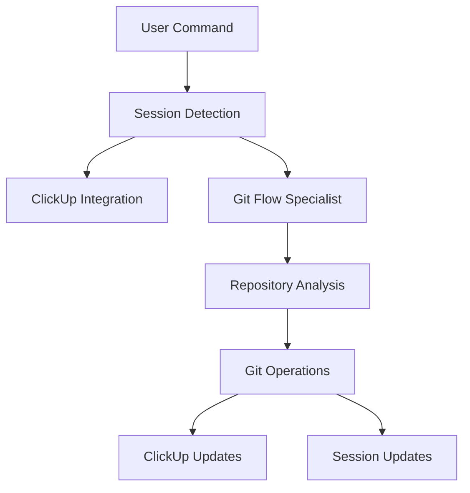

# 🔗 Integration Points Mapping - Sistema Onion Git Flow

**Data**: 2025-01-28  
**Objetivo**: Mapear todas integrações existentes para preservar durante rebuild

---

## 📊 **Integration Overview**

### **Status Geral das Integrações**
- ✅ **ClickUp MCP**: Funcional, precisa preservar 100%
- ✅ **Session Management**: Funcional, pode ser aprimorado  
- ✅ **@gitflow-specialist**: Existe, precisa enhanced communication
- ✅ **Branch Detection**: master/main compatibility working
- ⚠️ **Error Handling**: Básico, precisa improvement

---

## 🎯 **Critical Integrations (Must Preserve)**

### **1. ClickUp MCP Integration**

#### **Current Implementation Status: ✅ FUNCTIONAL**
```bash
# Evidência de integração ClickUp nos comandos analisados:

# Em /git/init.md:
- Auto-detection de sessão ativa via context.md
- Update automático de ClickUp task com setup details  
- Graceful degradation se ClickUp indisponível
- Formatted comments com template específico

# Em /git/feature/finish.md:  
- Update task para "Done" status
- Comentário de conclusão formatado
- Linking automático entre Git operations e ClickUp
```

#### **Integration Points Identified:**
```typescript
interface ClickUpIntegration {
  // Session Detection
  sessionDetection: {
    path: ".cursor/sessions/*/context.md",
    taskIdExtraction: "grep 'Task ID:' context.md",
    status: "WORKING"
  },
  
  // Auto Updates
  autoUpdates: {
    onFeatureStart: "Update task to 'In Progress'", 
    onFeatureFinish: "Update task to 'Done'",
    onError: "Add error comment with troubleshooting",
    status: "WORKING"
  },
  
  // Comment Formatting
  commentTemplates: {
    setup: "Gitflow initialization details",
    progress: "Development progress updates", 
    completion: "Feature completion summary",
    status: "WORKING"
  }
}
```

#### **Preservation Strategy:**
- ✅ **PRESERVE**: Comment template structure 
- ✅ **PRESERVE**: Auto-update triggers
- ✅ **PRESERVE**: Session detection logic
- 🔧 **ENHANCE**: Error handling e retry logic
- 🔧 **ENHANCE**: More detailed progress updates

### **2. Session Management Integration**

#### **Current Implementation Status: ✅ FUNCTIONAL**
```bash
# Session auto-creation evidenciado em:

# Em /git/feature/start.md:
- Auto-criação de .cursor/sessions/feature-name/
- Context.md com metadados da feature
- Plan.md com template de desenvolvimento  
- ClickUp task linking (opcional)
```

#### **Integration Points:**
```typescript
interface SessionManagement {
  // Auto Creation
  autoCreation: {
    trigger: "/git/feature/start",
    path: ".cursor/sessions/{feature-slug}/",
    files: ["context.md", "plan.md", "notes.md"],
    status: "WORKING"
  },
  
  // Context Persistence
  contextPersistence: {
    featureName: "Stored in context.md",
    taskId: "ClickUp task linking",
    branch: "Current Git branch reference",
    status: "WORKING"  
  },
  
  // Cleanup Strategy
  cleanup: {
    onFeatureFinish: "Archive session to archived/",
    onError: "Preserve for debugging",
    status: "WORKING"
  }
}
```

#### **Preservation Strategy:**
- ✅ **PRESERVE**: Auto-creation na feature start
- ✅ **PRESERVE**: Context.md structure e content
- ✅ **PRESERVE**: Archive strategy
- 🔧 **ENHANCE**: Template quality e usefulness
- 🔧 **ENHANCE**: Better cleanup automation

### **3. @gitflow-specialist Agent Integration**

#### **Current Implementation Status: ✅ EXISTS (can be enhanced)**
```bash
# Evidência de integração com agent:

# Em /git/feature/start.md:
- analyze_with_gitflow_specialist() function
- Structured prompt building
- Timeout e retry logic (10s, 2 retries)
- Graceful fallback se agent indisponível
```

#### **Integration Points:**
```typescript
interface GitflowSpecialistIntegration {
  // Communication Protocol
  communication: {
    timeout: "10 seconds",
    maxRetries: 2,
    protocol: "invoke_onion_agent('gitflow-specialist')",
    status: "WORKING"
  },
  
  // Context Sharing
  contextSharing: {
    repositoryAnalysis: "Git state + branch info",
    operationContext: "What user wants to do", 
    sessionContext: "Active session details",
    status: "WORKING"
  },
  
  // Fallback Strategy  
  fallbackStrategy: {
    onTimeout: "Use intelligent default behavior",
    onError: "Continue with basic validation",
    onUnavailable: "Graceful degradation",
    status: "WORKING"
  }
}
```

#### **Enhancement Opportunities:**
- 🔧 **ENHANCE**: More structured communication protocol
- 🔧 **ENHANCE**: Better context sharing format
- 🔧 **ENHANCE**: Cached responses for performance
- 🔧 **ENHANCE**: Real-time guidance during operations

### **4. Primary Branch Detection**

#### **Current Implementation Status: ✅ EXCELLENT**
```bash
# Master/Main compatibility evidenciado em múltiplos comandos:

function detect_primary_branch() {
  remote_branches=$(git branch -r | grep -E "(origin/main|origin/master)")
  
  if echo "$remote_branches" | grep "origin/main" > /dev/null; then
    echo "main"
  elif echo "$remote_branches" | grep "origin/master" > /dev/null; then
    echo "master"  
  else
    # Fallback: verificar branches locais
    if git branch | grep "main" > /dev/null; then
      echo "main"
    else
      echo "master"  # Default clássico
    fi
  fi
}
```

#### **Integration Strength:**
- ✅ **EXCELLENT**: Auto-detection working perfectly
- ✅ **EXCELLENT**: Remote + local branch checking
- ✅ **EXCELLENT**: Graceful fallbacks implemented
- ✅ **EXCELLENT**: Used consistently across commands

#### **Preservation Strategy:**
- ✅ **PRESERVE**: Exact detection logic
- ✅ **PRESERVE**: Fallback chain
- ✅ **PRESERVE**: Usage across all commands

---

## ⚠️ **Secondary Integrations (Improve)**

### **5. Error Handling Integration**

#### **Current Status: ⚠️ BASIC**
```bash
# Error handling atual - funcional mas básico:

if [ -n "$(git status --porcelain)" ]; then
    echo "⚠️  UNCOMMITTED CHANGES DETECTED:"
    git status --short
    echo "🔧 COMMIT CHANGES BEFORE FINISHING:"
    exit 1
fi
```

#### **Enhancement Needed:**
```typescript
interface ErrorHandlingIntegration {
  // Current (Basic)
  current: {
    validation: "Basic git status checks",
    messages: "Technical error messages",
    recovery: "Manual instructions only",
    status: "BASIC"
  },
  
  // Target (Enhanced)  
  target: {
    validation: "Comprehensive pre-flight checks",
    messages: "User-friendly explanations",
    recovery: "Step-by-step guided recovery", 
    integration: "ClickUp error logging",
    status: "TO_IMPLEMENT"
  }
}
```

### **6. Git Operations Integration**

#### **Current Status: ✅ FUNCTIONAL**
```bash
# Git operations working correctly:
- git branch creation/deletion
- git merge operations  
- git push/pull operations
- git config management (gitflow setup)
```

#### **Enhancement Opportunities:**
- 🔧 **ENHANCE**: Better error handling for network issues
- 🔧 **ENHANCE**: Progress indicators for slow operations
- 🔧 **ENHANCE**: Confirmation before destructive git operations
- 🔧 **ENHANCE**: Better merge conflict prevention

---

## 🔧 **Integration Dependencies Map**

### **Dependency Chain Analysis**


### **Critical Path Dependencies**
1. **Session Detection** → Drives ClickUp integration
2. **Git Flow Specialist** → Provides operation guidance  
3. **Repository Analysis** → Validates operation safety
4. **Git Operations** → Core functionality
5. **ClickUp Updates** → Progress tracking
6. **Session Updates** → Context persistence

### **Failure Points & Mitigations**
```bash
# Identificados os pontos de falha:

1. ClickUp API unavailable
   → MITIGATION: Graceful degradation, log locally
   
2. @gitflow-specialist timeout  
   → MITIGATION: Intelligent fallback responses
   
3. Git network operations fail
   → MITIGATION: Retry logic + offline mode
   
4. Session directory permissions
   → MITIGATION: Alternative session storage
```

---

## 🏗️ **Integration Architecture**

### **Current Architecture Assessment**
```typescript
interface CurrentArchitecture {
  layering: {
    presentation: "Command MD files",
    business: "Bash script logic", 
    integration: "Direct API calls",
    storage: "File system (sessions, git)",
    status: "FUNCTIONAL_BUT_BRITTLE"
  },
  
  coupling: {
    clickup: "Tightly coupled",
    sessions: "Tightly coupled",
    git: "Appropriately coupled",
    agents: "Loosely coupled (good)",
    status: "MIXED"
  }
}
```

### **Target Architecture**
```typescript
interface TargetArchitecture {
  layering: {
    presentation: "Modern CLI UX layer",
    business: "Git Flow business logic",
    integration: "Integration abstraction layer", 
    storage: "Persistent state management",
    status: "TO_IMPLEMENT"
  },
  
  principles: {
    separation: "Clear separation of concerns",
    resilience: "Failure isolation and recovery", 
    extensibility: "Easy to add new integrations",
    testability: "Unit testable components",
    status: "DESIGN_TARGET"
  }
}
```

---

## 📋 **Integration Preservation Checklist**

### **Phase 2 (Core Rebuild) - MUST PRESERVE:**
```bash
✅ ClickUp MCP integration API calls
✅ Session auto-creation logic
✅ Context.md structure and content
✅ Comment template formatting  
✅ Primary branch detection function
✅ @gitflow-specialist communication protocol
✅ Task status update triggers
✅ Graceful degradation behaviors
```

### **Phase 3 (UX Enhancement) - MUST PRESERVE:**
```bash
✅ All Phase 2 items +
✅ Integration error handling logic
✅ Timeout and retry mechanisms  
✅ Session cleanup automation
✅ Git operations reliability
✅ Cross-integration data flow
✅ Fallback strategies for each integration
```

### **Phase 4 (Integration Testing) - VALIDATE:**
```bash
✅ ClickUp integration end-to-end
✅ Session management full lifecycle
✅ Agent communication under load
✅ Error scenarios and recovery
✅ Performance under integration failures
✅ Concurrent operation handling
```

---

## 🎯 **Integration Enhancement Roadmap**

### **Immediate (Phase 2)**
1. **Preserve** all existing integration points
2. **Enhance** error handling and recovery
3. **Improve** integration reliability
4. **Add** better logging and debugging

### **Short-term (Phase 3)**
1. **Implement** integration health monitoring
2. **Add** performance metrics collection
3. **Create** integration testing framework
4. **Enhance** agent communication protocol

### **Long-term (Phase 4+)**
1. **Implement** advanced integration analytics
2. **Add** predictive failure prevention
3. **Create** integration configuration UI
4. **Build** integration extension framework

---

## ✅ **Integration Assessment Summary**

### **Strengths to Preserve**
- ✅ **ClickUp Integration**: Sophisticated and functional
- ✅ **Session Management**: Automatic and reliable
- ✅ **Branch Detection**: Excellent compatibility logic
- ✅ **Agent Integration**: Working with good fallbacks

### **Areas for Enhancement**
- 🔧 **Error Handling**: From basic to comprehensive
- 🔧 **User Feedback**: Integration status visibility  
- 🔧 **Performance**: Better caching and optimization
- 🔧 **Testing**: Integration test coverage

### **Risk Assessment**
- ⚠️ **LOW RISK**: Integration preservation during rebuild
- ⚠️ **MEDIUM RISK**: Enhancement without breaking existing flows
- ⚠️ **LOW RISK**: Fallback behaviors are well implemented

**Status**: ✅ **INTEGRATION MAPPING COMPLETE** → All integration points identified and preservation strategy defined
