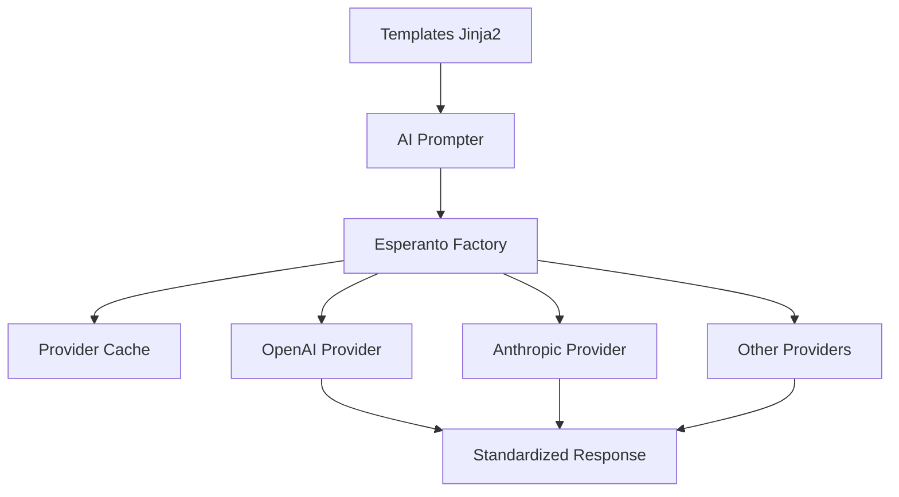

# 🌍 Sistema Esperanto - Documentação Completa

## 📋 Índice
1. [Visão Geral](#visão-geral)
2. [Arquitetura do Sistema](#arquitetura-do-sistema)
3. [Ciclo Completo de Uso](#ciclo-completo-de-uso)
4. [Estratégias de Organização](#estratégias-de-organização)
5. [Estrutura de Arquivos](#estrutura-de-arquivos)
6. [Variáveis e Templates](#variáveis-e-templates)
7. [Fluxo Agnóstico .md](#fluxo-agnóstico-md)
8. [Migração Python → .md](#migração-python--md)
9. [Casos de Uso Práticos](#casos-de-uso-práticos)
10. [Troubleshooting](#troubleshooting)

---

## 1. Visão Geral

### 🎯 **O que é o Sistema Esperanto?**
O Sistema Esperanto é uma arquitetura completa para interação com modelos de IA que combina duas bibliotecas principais:

- **🤖 Esperanto**: Factory pattern para múltiplos provedores de IA (OpenAI, Anthropic, etc.)
- **📝 AI Prompter**: Sistema de templates Jinja2 para prompts modulares e reutilizáveis

### 🎪 **Filosofia do Sistema**
```
Template Jinja2 → AI Prompter → Esperanto Factory → Provedor IA → Resposta Padronizada
```

**Vantagens:**
- ✅ **Modularity**: Templates reutilizáveis
- ✅ **Provider Agnostic**: Qualquer provedor de IA
- ✅ **Cache Inteligente**: Performance otimizada
- ✅ **Responses Padronizadas**: Interface comum
- ✅ **Version Control**: Templates versionados

---

## 2. Arquitetura do Sistema

### 🏗️ **Componentes Principais**



### 🔧 **Camada de Abstração**

#### **AI Prompter Layer**
- **Função**: Renderização de templates Jinja2
- **Input**: Template + Variáveis
- **Output**: Prompt renderizado
- **Features**: Includes, filters, loops, conditionals

#### **Esperanto Factory Layer**
- **Função**: Criação e gerenciamento de modelos IA
- **Pattern**: Factory + Singleton + Cache
- **Input**: Provider, Model, Config
- **Output**: Instância de modelo IA

#### **Provider Layer**
- **Função**: Comunicação com APIs dos provedores
- **Interface**: Padronizada entre todos os providers
- **Response**: Formato comum independente do provider

---

## 3. Ciclo Completo de Uso

### 🔄 **Fluxo End-to-End Detalhado**

#### **Fase 1: Preparação do Template**
```jinja2
<!-- prompts/customer_analysis.jinja -->
Analyze the following customer data:

Customer: {{ customer.name }}
Industry: {{ customer.industry }}
Revenue: ${{ customer.revenue | number_format }}


Please provide specific recommendations for:

- {{ area }}



Analysis Date: {{ current_time }}
```

#### **Fase 2: Renderização com AI Prompter**
```python
from ai_prompter import Prompter

# Carregar template
prompter = Prompter(prompt_template='customer_analysis')

# Preparar dados
data = {
    'customer': {
        'name': 'TechCorp Inc.',
        'industry': 'Technology',
        'revenue': 50000000
    },
    'include_recommendations': True,
    'focus_areas': ['Growth Strategy', 'Cost Optimization']
}

# Renderizar prompt
rendered_prompt = prompter.render(data)
```

#### **Fase 3: Processamento via Esperanto**
```python
from esperanto import AIFactory

# Criar instância de modelo (com cache automático)
model = AIFactory.create_language(
    provider="openai",
    model="gpt-4",
    temperature=0.7,
    structured={"type": "json"}
)

# Executar análise
messages = [
    {"role": "system", "content": "You are a business analyst expert."},
    {"role": "user", "content": rendered_prompt}
]

response = model.chat_complete(messages)
```

#### **Fase 4: Processamento da Resposta**
```python
# Resposta padronizada independente do provider
print(f"Model Used: {response.model}")
print(f"Tokens: {response.usage.total_tokens}")
print(f"Content: {response.content}")

# Para streaming
for chunk in model.chat_complete(messages, stream=True):
    print(chunk.choices[0].delta.content, end="", flush=True)
```

### ⏱️ **Timeline do Ciclo**
1. **0ms**: Template carregado (cached após primeiro uso)
2. **~5ms**: Variáveis renderizadas via Jinja2
3. **~10ms**: Model instance criada (cached se config existir)
4. **~2000ms**: API call para provider IA
5. **~50ms**: Response padronizada retornada

---

## 4. Estratégias de Organização

### 📁 **Estratégia de Diretórios**

#### **Opção A: Por Domínio**
```
prompts/
├── customer_analysis/
│   ├── basic_analysis.jinja
│   ├── deep_dive.jinja
│   └── comparative.jinja
├── content_generation/
│   ├── blog_posts.jinja
│   ├── social_media.jinja
│   └── email_campaigns.jinja
└── code_review/
    ├── python_review.jinja
    ├── javascript_review.jinja
    └── security_audit.jinja
```

#### **Opção B: Por Tipo de Operação**
```
prompts/
├── analysis/
├── generation/
├── classification/
├── summarization/
└── extraction/
```

#### **Opção C: Híbrida (Recomendada)**
```
prompts/
├── shared/
│   ├── _base_system.jinja
│   ├── _formatting.jinja
│   └── _validations.jinja
├── business/
│   ├── customer_analysis.jinja
│   └── market_research.jinja
├── technical/
│   ├── code_review.jinja
│   └── architecture_design.jinja
└── content/
    ├── blog_generation.jinja
    └── documentation.jinja
```

### 🎛️ **Estratégias de Configuração**

#### **Config por Ambiente**
```python
# config/development.py
ESPERANTO_CONFIG = {
    'default_provider': 'openai',
    'default_model': 'gpt-3.5-turbo',
    'cache_enabled': True,
    'debug_mode': True
}

# config/production.py
ESPERANTO_CONFIG = {
    'default_provider': 'openai',
    'default_model': 'gpt-4',
    'cache_enabled': True,
    'debug_mode': False,
    'rate_limiting': True
}
```

#### **Config por Use Case**
```python
# Análise rápida
quick_model = AIFactory.create_language("openai", "gpt-3.5-turbo", temperature=0.3)

# Criação criativa
creative_model = AIFactory.create_language("anthropic", "claude-3", temperature=0.9)

# Análise técnica
technical_model = AIFactory.create_language("openai", "gpt-4", temperature=0.1)
```

---

## 5. Estrutura de Arquivos

### 📂 **Estrutura Padrão de Projeto**

```
project_root/
├── prompts/                    # Templates Jinja2
│   ├── shared/                 # Templates compartilhados
│   │   ├── _base.jinja        # Template base comum
│   │   ├── _system_roles.jinja # System roles reutilizáveis
│   │   └── _formatters.jinja  # Formatters customizados
│   ├── business/              # Prompts de negócio
│   │   ├── analysis.jinja
│   │   ├── reporting.jinja
│   │   └── strategy.jinja
│   └── technical/             # Prompts técnicos
│       ├── code_review.jinja
│       ├── debugging.jinja
│       └── documentation.jinja
├── config/                    # Configurações
│   ├── __init__.py
│   ├── base.py               # Config base
│   ├── development.py        # Config dev
│   └── production.py         # Config prod
├── esperanto_manager/         # Gerenciador custom
│   ├── __init__.py
│   ├── factory.py           # Factory customizada
│   ├── cache.py             # Cache manager
│   └── monitoring.py        # Monitoring e logs
├── examples/                 # Exemplos práticos
│   ├── basic_usage.py
│   ├── advanced_templates.py
│   └── streaming_example.py
├── tests/                    # Testes
│   ├── test_templates.py
│   ├── test_integration.py
│   └── test_providers.py
├── requirements.txt          # Dependências
└── README.md                # Documentação
```

### 📄 **Tipos de Arquivos**

#### **Templates Base (_base.jinja)**
```jinja2
{# Base template com estrutura comum #}

You are a helpful AI assistant specialized in {{ domain | default('general tasks') }}.




Context: {{ context }}




{# Content vai aqui #}



Please format your response as {{ output_format | default('markdown') }}.

```

#### **Templates Específicos (analysis.jinja)**
```jinja2



You are a senior business analyst with 15+ years of experience.



Analyze the following data and provide insights:

Data: {{ data }}

Focus areas:

- {{ area }}


Analysis depth: {{ depth | default('detailed') }}

```

---

## 6. Variáveis e Templates

### 🔧 **Sistema de Variáveis**

#### **Variáveis Automáticas**
- `current_time`: Timestamp atual (YYYY-MM-DD HH:MM:SS)
- `template_name`: Nome do template atual
- `render_count`: Número de renderizações

#### **Variáveis Personalizadas**
```python
# Variáveis simples
data = {
    'user_name': 'João Silva',
    'task_type': 'analysis',
    'priority': 'high'
}

# Variáveis complexas (objetos)
data = {
    'user': {
        'name': 'João Silva',
        'role': 'analyst',
        'permissions': ['read', 'write']
    },
    'project': {
        'name': 'Q4 Analysis',
        'deadline': '2024-12-31',
        'stakeholders': ['Maria', 'Carlos', 'Ana']
    }
}

# Arrays/Lists
data = {
    'tasks': [
        {'name': 'Research', 'status': 'completed'},
        {'name': 'Analysis', 'status': 'in_progress'},
        {'name': 'Report', 'status': 'pending'}
    ]
}
```

### 🎨 **Filtros Jinja2 Úteis**

```jinja2
{# Formatação de números #}
Revenue: ${{ revenue | number_format }}

{# Formatação de datas #}
Due date: {{ deadline | strftime('%B %d, %Y') }}

{# Listas em texto #}
Stakeholders: {{ stakeholders | join(', ') }}

{# Conditional defaults #}
Priority: {{ priority | default('medium') }}

{# Transformações de texto #}
Title: {{ title | title }}
Code: {{ code | upper }}

{# Filtros customizados (se implementados) #}
URL: {{ base_url | ensure_protocol }}
```

### 🔄 **Estruturas de Controle**

```jinja2
{# Condicionais #}

You have administrative access.

You have management access.

You have standard access.


{# Loops #}
Tasks to complete:

{{ loop.index }}. {{ task.name }} ({{ task.status }})


{# Loop com condições #}
Pending tasks:

- {{ task.name }}


{# Includes #}


{# Macros (funções) #}

Task: {{ task.name }}
Status: {{ task.status }}
Assigned to: {{ task.assignee }}


{{ render_task(current_task) }}
```

---

## 7. Fluxo Agnóstico .md

### 📝 **Migração para .md - Estratégia**

#### **Problema Original**
- Templates em Jinja2 (.jinja)
- Lógica em Python
- Dependente de bibliotecas específicas

#### **Solução Agnóstica**
- Templates em Markdown (.md)
- Variáveis em formato padrão
- Processamento independente de linguagem

### 🔄 **Fluxo .md Agnóstico**

#### **Template .md com Variáveis**
```markdown
<!-- prompts/analysis.md -->

# Customer Analysis Report

## Customer Information
- **Name**: {{customer_name}}
- **Industry**: {{industry}}
- **Revenue**: ${{revenue}}

## Analysis Scope
{{#if include_financials}}
### Financial Analysis
- Revenue growth: {{revenue_growth}}%
- Profit margin: {{profit_margin}}%
{{/if}}

{{#if focus_areas}}
### Focus Areas
{{#each focus_areas}}
- {{this}}
{{/each}}
{{/if}}

## Analysis Date
Generated on: {{current_date}}

---
*Report generated by AI Assistant*
```

#### **Processor Agnóstico (Pseudo-código)**
```javascript
// Universal Template Processor
class TemplateProcessor {
  constructor(templatePath) {
    this.template = fs.readFileSync(templatePath, 'utf8');
  }
  
  render(variables) {
    let result = this.template;
    
    // Substituir variáveis simples
    for (let [key, value] of Object.entries(variables)) {
      result = result.replace(
        new RegExp(`{{${key}}}`, 'g'), 
        value
      );
    }
    
    // Processar condicionais
    result = this.processConditionals(result, variables);
    
    // Processar loops
    result = this.processLoops(result, variables);
    
    return result;
  }
}
```

#### **Uso Agnóstico**
```python
# Python
processor = TemplateProcessor('prompts/analysis.md')
result = processor.render(data)

# JavaScript
const processor = new TemplateProcessor('prompts/analysis.md');
const result = processor.render(data);

# Go
processor := NewTemplateProcessor("prompts/analysis.md")
result := processor.Render(data)
```

### 🎯 **Vantagens do Fluxo .md**
- ✅ **Language Agnostic**: Funciona em qualquer linguagem
- ✅ **Human Readable**: Markdown é legível sem processamento
- ✅ **Version Control Friendly**: Diffs claros em Git
- ✅ **Tool Agnostic**: Qualquer editor/ferramenta
- ✅ **Maintainable**: Fácil manutenção e colaboração

---

## 8. Migração Python → .md

### 🔄 **Guia de Migração Passo a Passo**

#### **Passo 1: Análise dos Templates Existentes**
```bash
# Encontrar todos os templates .jinja
find ./prompts -name "*.jinja" -type f

# Analisar complexidade dos templates
grep -r "{% if\|{% for\|{% include" ./prompts/
```

#### **Passo 2: Conversão de Sintaxe**

**De Jinja2 para Markdown + Handlebars:**
```jinja2
<!-- ANTES (Jinja2) -->

Welcome, {{ user.name }}! You have admin access.



- {{ item.name }}: {{ item.description }}

```

```markdown
<!-- DEPOIS (Markdown + Handlebars) -->
{{#if user.is_admin}}
Welcome, {{user.name}}! You have admin access.
{{/if}}

{{#each items}}
- {{name}}: {{description}}
{{/each}}
```

#### **Passo 3: Refatoração de Includes**

**ANTES:**
```jinja2
<!-- base.jinja -->

{{ main_content }}

```

**DEPOIS:**
```markdown
<!-- base.md -->
{{> shared/system_role}}
{{main_content}}
{{> shared/formatting}}
```

#### **Passo 4: Adaptação de Filtros**

**ANTES:**
```jinja2
{{ price | currency }}
{{ date | strftime('%Y-%m-%d') }}
{{ text | upper }}
```

**DEPOIS (com processor customizado):**
```markdown
{{currency price}}
{{date_format date 'YYYY-MM-DD'}}
{{upper text}}
```

#### **Passo 5: Criação de Processor Universal**

```python
# template_processor.py
import re
import json
from datetime import datetime

class UniversalTemplateProcessor:
    def __init__(self, template_path):
        with open(template_path, 'r') as f:
            self.template = f.read()
    
    def render(self, variables):
        result = self.template
        
        # Add automatic variables
        variables['current_date'] = datetime.now().strftime('%Y-%m-%d')
        variables['current_time'] = datetime.now().strftime('%Y-%m-%d %H:%M:%S')
        
        # Process simple variables
        for key, value in variables.items():
            result = re.sub(f'{{{{{key}}}}}', str(value), result)
        
        # Process conditionals
        result = self._process_conditionals(result, variables)
        
        # Process loops
        result = self._process_loops(result, variables)
        
        # Process partials/includes
        result = self._process_partials(result)
        
        return result
    
    def _process_conditionals(self, template, variables):
        # Implementar lógica de condicionais
        pass
    
    def _process_loops(self, template, variables):
        # Implementar lógica de loops
        pass
    
    def _process_partials(self, template):
        # Implementar lógica de includes
        pass
```

### 📋 **Checklist de Migração**

- [ ] **Inventário de Templates**
  - [ ] Listar todos os arquivos .jinja
  - [ ] Identificar complexidade de cada template
  - [ ] Mapear dependências entre templates

- [ ] **Conversão de Sintaxe**
  - [ ] Converter variáveis: `{{ var }}` → `{{var}}`
  - [ ] Converter condicionais: `` → `{{#if}}`
  - [ ] Converter loops: `` → `{{#each}}`
  - [ ] Converter includes: `` → `{{> partial}}`

- [ ] **Adaptação de Filtros**
  - [ ] Identificar filtros utilizados
  - [ ] Criar helpers equivalentes
  - [ ] Testar formatação de output

- [ ] **Criação de Processor**
  - [ ] Implementar parser de variáveis
  - [ ] Implementar lógica condicional
  - [ ] Implementar loops
  - [ ] Implementar sistema de partials

- [ ] **Testes e Validação**
  - [ ] Comparar outputs: Jinja2 vs .md
  - [ ] Testar casos edge
  - [ ] Validar performance

---

## 9. Casos de Uso Práticos

### 🎯 **Caso 1: Análise de Código**

#### **Template: code_review.md**
```markdown
# Code Review Report

## Repository Information
- **Project**: {{project_name}}
- **Branch**: {{branch_name}}
- **Files Changed**: {{files_count}}

## Review Criteria
Please review the following code changes focusing on:
{{#each review_criteria}}
- {{this}}
{{/each}}

## Code Changes
```{{language}}
{{code_diff}}
```

## Specific Questions
{{#if specific_questions}}
{{#each specific_questions}}
{{@index + 1}}. {{this}}
{{/each}}
{{/if}}

## Output Format
Please provide your review in the following format:
1. Overall Assessment (1-10 scale)
2. Key Issues (if any)
3. Suggestions for Improvement
4. Security Concerns (if any)
5. Performance Implications

---
*Review requested on: {{current_date}}*
```

#### **Uso:**
```python
data = {
    'project_name': 'E-commerce API',
    'branch_name': 'feature/payment-gateway',
    'files_count': 7,
    'language': 'python',
    'code_diff': '''
def process_payment(amount, card_token):
    # Código aqui
    ''',
    'review_criteria': [
        'Code quality and readability',
        'Security best practices',
        'Error handling',
        'Test coverage'
    ],
    'specific_questions': [
        'Is the error handling adequate?',
        'Are there any security vulnerabilities?'
    ]
}

processor = TemplateProcessor('prompts/code_review.md')
prompt = processor.render(data)
```

### 🎯 **Caso 2: Geração de Conteúdo**

#### **Template: blog_post.md**
```markdown
# Blog Post Generation Request

## Post Specifications
- **Topic**: {{topic}}
- **Target Audience**: {{target_audience}}
- **Word Count**: {{word_count}} words
- **Tone**: {{tone}}
- **SEO Keywords**: {{keywords}}

## Content Structure
{{#if include_outline}}
Please include the following sections:
{{#each sections}}
- {{this}}
{{/each}}
{{/if}}

## Key Points to Cover
{{#each key_points}}
- {{this}}
{{/each}}

## Brand Guidelines
{{#if brand_guidelines}}
Please adhere to these brand guidelines:
{{brand_guidelines}}
{{/if}}

## Output Requirements
1. Engaging title with main keyword
2. Meta description (150-160 characters)
3. Well-structured content with headers
4. Natural keyword integration
5. Call-to-action at the end

---
*Content request generated: {{current_time}}*
```

### 🎯 **Caso 3: Análise de Dados**

#### **Template: data_analysis.md**
```markdown
# Data Analysis Request

## Dataset Information
- **Dataset Name**: {{dataset_name}}
- **Records Count**: {{records_count}}
- **Time Period**: {{time_period}}

## Analysis Objectives
{{#each objectives}}
{{@index + 1}}. {{this}}
{{/each}}

## Key Metrics to Analyze
{{#each metrics}}
- **{{name}}**: {{description}}
{{/each}}

## Data Sample
```
{{data_sample}}
```

## Specific Analysis Requirements
{{#if correlation_analysis}}
### Correlation Analysis
Please analyze correlations between:
{{#each correlation_pairs}}
- {{variable1}} vs {{variable2}}
{{/each}}
{{/if}}

{{#if trend_analysis}}
### Trend Analysis
Analyze trends over time for: {{trend_variables}}
{{/if}}

{{#if segment_analysis}}
### Segment Analysis
Break down analysis by: {{segment_by}}
{{/if}}

## Output Format
1. Executive Summary
2. Key Findings
3. Detailed Analysis
4. Recommendations
5. Data Visualizations (descriptions)

---
*Analysis requested: {{current_date}}*
```

---

## 10. Troubleshooting

### 🔧 **Problemas Comuns e Soluções**

#### **Problema 1: Templates não encontrados**
```
Error: Template 'customer_analysis' not found
```

**Solução:**
```python
# Verificar caminhos
import os
print(os.listdir('prompts/'))

# Configurar path corretamente
prompter = Prompter(
    prompt_template='customer_analysis',
    prompts_directory='./prompts'
)
```

#### **Problema 2: Variáveis não renderizadas**
```
Output: "Hello {{name}}"
Expected: "Hello John"
```

**Soluções:**
```python
# Verificar data structure
data = {'name': 'John'}  # Não {'user': {'name': 'John'}}

# Debug template rendering
prompter = Prompter(template_text="Hello {{name}}")
print(prompter.render(data))

# Verificar encoding
with open('template.jinja', 'r', encoding='utf-8') as f:
    template_content = f.read()
```

#### **Problema 3: Erro de Sintaxe Jinja**
```
jinja2.exceptions.TemplateSyntaxError: Encountered unknown tag 'endfor'
```

**Soluções:**
```jinja2
<!-- ERRADO -->

{{ item }}
  <!-- espaço extra -->

<!-- CORRETO -->

{{ item }}

```

#### **Problema 4: Cache de Model não funcionando**
```python
# PROBLEMA: Novas instâncias sempre criadas
model1 = AIFactory.create_language("openai", "gpt-4", temperature=0.7)
model2 = AIFactory.create_language("openai", "gpt-4", temperature=0.7)
assert model1 is model2  # Falha!
```

**Solução:**
```python
# Usar configurações idênticas
config = {"temperature": 0.7}
model1 = AIFactory.create_language("openai", "gpt-4", **config)
model2 = AIFactory.create_language("openai", "gpt-4", **config)
assert model1 is model2  # Sucesso!
```

#### **Problema 5: Rate Limiting**
```
Error: Rate limit exceeded for gpt-4
```

**Soluções:**
```python
# Implementar retry logic
import time
from tenacity import retry, stop_after_attempt, wait_exponential

@retry(stop=stop_after_attempt(3), wait=wait_exponential(multiplier=1, min=4, max=10))
def safe_chat_complete(model, messages):
    return model.chat_complete(messages)

# Usar modelos mais rápidos para desenvolvimento
dev_model = AIFactory.create_language("openai", "gpt-3.5-turbo")
prod_model = AIFactory.create_language("openai", "gpt-4")
```

### 📊 **Performance Optimization**

#### **Template Caching**
```python
from functools import lru_cache

class CachedPrompter:
    @lru_cache(maxsize=100)
    def get_template(self, template_name):
        return Prompter(prompt_template=template_name)
    
    def render(self, template_name, data):
        prompter = self.get_template(template_name)
        return prompter.render(data)
```

#### **Response Streaming**
```python
# Para respostas longas, usar streaming
def stream_response(model, messages):
    for chunk in model.chat_complete(messages, stream=True):
        if chunk.choices[0].delta.content:
            yield chunk.choices[0].delta.content

# Uso
for content in stream_response(model, messages):
    print(content, end='', flush=True)
```

#### **Batch Processing**
```python
# Processar múltiplos prompts em paralelo
import asyncio

async def process_multiple_prompts(prompts_data):
    model = AIFactory.create_language("openai", "gpt-3.5-turbo")
    tasks = []
    
    for prompt_data in prompts_data:
        prompter = Prompter(prompt_template=prompt_data['template'])
        prompt = prompter.render(prompt_data['data'])
        messages = [{"role": "user", "content": prompt}]
        tasks.append(model.achat_complete(messages))
    
    return await asyncio.gather(*tasks)
```

---

## 🎉 Conclusão

O Sistema Esperanto oferece uma arquitetura robusta e flexível para integração com modelos de IA. A combinação de templates modulares (AI Prompter) com o factory pattern agnóstico (Esperanto) proporciona:

- ✅ **Escalabilidade**: Suporte a múltiplos providers e modelos
- ✅ **Maintainability**: Templates versionados e modulares  
- ✅ **Performance**: Cache inteligente e otimizações
- ✅ **Flexibility**: Agnóstico de linguagem e provider
- ✅ **Developer Experience**: Interface simples e poderosa

A migração para formato .md torna o sistema ainda mais universal e agnóstico, permitindo uso em qualquer linguagem ou plataforma.

---

*Documentação criada por: Sistema Esperanto*  
*Última atualização: {{current_date}}*
