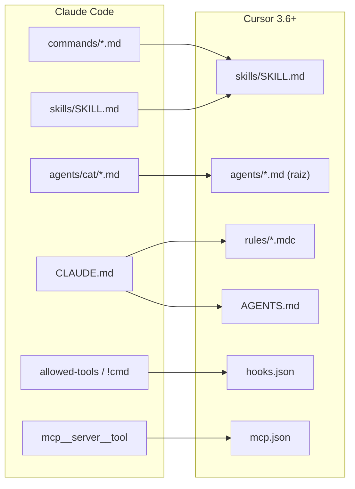
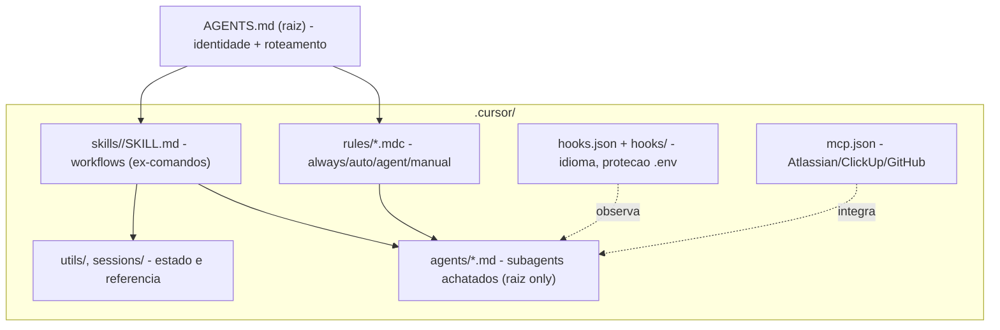

# Transformação do Sistema Onion: Claude Code para Cursor 3.6.14+

> **Tipo**: Spec de transformação (blueprint executável)
> **Versão**: 1.0.0 | **Data**: 2026-05-28 | **Idioma**: pt-BR (termos técnicos em inglês)
> **Direção aprovada**: Pivô total — Cursor passa a ser a plataforma única; Claude Code vira legado
> **Profundidade**: Spec completa com exemplos concretos por artefato

---

## Índice

1. [Sumário executivo e decisão de pivô](#1-sumário-executivo-e-decisão-de-pivô)
2. [Estado atual: inventário e dívidas técnicas](#2-estado-atual-inventário-e-dívidas-técnicas)
3. [Conceitos do Cursor 3.6.14+](#3-conceitos-do-cursor-36143-1)
4. [Matriz de mapeamento conceitual Claude → Cursor](#4-matriz-de-mapeamento-conceitual-claude--cursor)
5. [Arquitetura-alvo](#5-arquitetura-alvo)
6. [Spec por artefato (com exemplos concretos)](#6-spec-por-artefato-com-exemplos-concretos)
7. [Mapeamento arquivo-a-arquivo](#7-mapeamento-arquivo-a-arquivo)
8. [Roadmap faseado de execução](#8-roadmap-faseado-de-execução)
9. [Atualização das docs canônicas](#9-atualização-das-docs-canônicas)
10. [Riscos, lacunas e validação](#10-riscos-lacunas-e-validação)

---

## 1. Sumário executivo e decisão de pivô

### 1.1 Contexto

O Sistema Onion foi concebido como um **framework template em `.cursor/`** para orquestrar o ciclo completo de desenvolvimento (produto, engenharia e compliance) sobre o **Claude Code**, usando a abordagem _spec-as-code_. A identidade canônica atual, registrada em [docs/analysis/onion-review-2026-05.md](../analysis/onion-review-2026-05.md) e nas meta-specs, declara explicitamente:

- "Framework template em `.cursor/` — não é produto npm, não tem CLI standalone"
- "**Plataforma única: Claude Code**"
- Suporte multi-IDE (Cursor, Continue, Cline) e plano v4.0 FASES 5-9 **formalmente abandonados em 2026-05-18**

### 1.2 Decisão de pivô (reversão arquitetural)

Esta spec **reverte** a decisão de "Claude Code como plataforma única" e estabelece uma nova direção:

> **Cursor 3.6.14+ passa a ser a plataforma única e canônica do Sistema Onion. Claude Code é rebaixado a "legado/compatibilidade".**

Racional:

| Fator | Justificativa |
|-------|---------------|
| **Convergência de formatos** | O Cursor 3.6+ lê nativamente `.cursor/skills/` e `.cursor/agents/` por compatibilidade, o que reduz o custo de migração. |
| **Recursos nativos peer** | Cursor oferece equivalentes de primeira classe para todos os conceitos Onion: rules, AGENTS.md, skills, subagents, commands, hooks e MCP. |
| **Ganho de capacidade** | Hooks event-driven (`beforeShellExecution`, `afterFileEdit`, etc.) e MCP versionado em `mcp.json` permitem automatizar invariantes do Onion (idioma, proteção de `.env`, validação) que hoje vivem só em prosa nas skills. |
| **Estado de fato** | O repositório já tem cópia de trabalho em `.cursor/` (187 arquivos) e 4 skills Cursor-native — a migração já começou de forma informal. |

### 1.3 Escopo deste documento

Este documento é o **entregável** (blueprint). Ele **não executa** a migração física dos ~190 artefatos. Ele define:

- O inventário do estado atual e a dívida técnica de migração.
- O mapeamento conceitual e arquivo-a-arquivo Claude → Cursor.
- A spec concreta (frontmatter + corpo) de cada artefato-alvo.
- Um roadmap faseado executável.

### 1.4 Princípios da transformação

1. **Cursor-native first**: todo artefato novo segue o schema oficial do Cursor 3.6+, sem sintaxe Claude-only.
2. **Preservar invariantes do Onion**: os workflows faseados retomáveis (`product/collect→feature` e `engineer/plan→pr-update`) e as três dimensões peer (produto, engenharia, compliance) permanecem.
3. **Provider-agnóstico**: a Task Manager Abstraction (Jira/ClickUp/Asana/Linear) é mantida e ganha config formal via `mcp.json`.
4. **Idioma**: conteúdo em pt-BR, identificadores/commits/branches em inglês (conforme `language-standards`).
5. **Sem perda de conhecimento**: docs canônicas são atualizadas, não apagadas; o histórico Claude é arquivado como legado.

---

## 2. Estado atual: inventário e dívidas técnicas

### 2.1 Onde mora o código hoje

| Local | Status | Arquivos |
|-------|--------|----------|
| `.cursor/` no Git (`HEAD`) | **Fonte versionada canônica** | 190 |
| `.cursor/` no disco | **Ausente** (não existe no filesystem) | 0 |
| `.cursor/` no disco | **Cópia de trabalho** (não totalmente versionada) | 187 |

> Implicação: a migração deve tratar o **Git `.cursor/`** como fonte da verdade e o **`.cursor/`** como rascunho. Há 3 `help.md` faltando em `.cursor/` (`engineer/help.md`, `global/help.md`, `product/help.md`) que precisam ser recuperados do Git antes de qualquer corte.

### 2.2 Inventário de artefatos

| Artefato | Quantidade | Distribuição |
|----------|-----------|--------------|
| **Comandos** | 94 (.md) | 11 categorias + 2 na raiz (`onion.md`, `warm-up.md`) |
| **Agentes** | 49 (.md) | 9 categorias (subpastas) |
| **Skills** | 4 | `onion`, `onion-patterns`, `onion-validation`, `language-standards` |
| **Utils** | 11 | `task-manager/` (interface, factory, detector, types + 4 adapters) + wrappers |
| **Validation** | 1 | `product-task-validation.md` |
| **Docs internos** | 31–42 | templates, tools, onion, c4, product, engineer |

Distribuição de comandos por categoria (Git):

| Categoria | Qtd | Categoria | Qtd |
|-----------|-----|-----------|-----|
| `product/` | 22 | `docs/` | 11 |
| `git/` | 13 | `meta/` | 10 |
| `engineer/` | 12 | `validate/` | 6 |
| `common/` | 12 | `test/` | 3 |
| `development/` | 1 | `quick/` | 1 |
| `global/` | 1 | raiz | 2 |

Distribuição de agentes por categoria:

| Categoria | Qtd | Categoria | Qtd |
|-----------|-----|-----------|-----|
| `development/` | 20 | `git/` | 4 |
| `product/` | 8 | `testing/` | 3 |
| `meta/` | 5 | `review/` | 2 |
| `compliance/` | 5 | `research/` | 1 |
| | | `deployment/` | 1 |

### 2.3 Dívidas técnicas de migração (resíduos Claude Code)

| # | Dívida | Onde aparece | Impacto |
|---|--------|--------------|---------|
| D1 | Referências de path `.cursor/**` | Skills, commands, agents, docs (centenas de ocorrências) | Trocar por `.cursor/**` ou path agnóstico |
| D2 | Vocabulário de `tools` duplo nos agentes | `Read`/`Bash`/`Grep` (estilo Claude) vs `read_file`/`run_terminal_cmd` (estilo legado Cursor) | Subagent do Cursor **não tem campo `tools`** → remover de todos |
| D3 | `argumento-do-usuario` / `#argumento-do-usuario` | ~20 comandos/agentes | Substituir por instrução de captura de input no corpo da skill |
| D4 | Injeção dinâmica `` `cmd` `` | `skills/onion`, `meta/create-skill`, `agent-skills-specialist` (~9 ocorrências) | Não suportado em SKILL.md do Cursor → mover para hook ou instrução |
| D5 | `allowed-tools` no frontmatter | 4 skills + docs | Não é campo de SKILL.md do Cursor → remover |
| D6 | `@agente` para delegação | Dezenas de arquivos | Subagents do Cursor usam `/nome` ou menção natural; `@nome` é para rules |
| D7 | `mcp__claude_ai_Atlassian__*` | `jira-specialist`, adapters | Formalizar em `.cursor/mcp.json` |
| D8 | Sintaxe de comando inconsistente | `/product/spec` vs `/product:collect` | Normalizar para invocação Cursor (`/nome` ou skill) |
| D9 | Sessões em `.cursor/sessions/` | `engineer/start`, skill `onion` | Repontar para `.cursor/sessions/` (e `.gitignore`) |
| D10 | `.cursorignore`, `CLAUDE.md`, `.vscode` Claude | raiz | Migrar para `.cursorignore`, `AGENTS.md`, settings Cursor |
| D11 | Extensões Claude (`disable-model-invocation` ok; `context: fork`, `${CLAUDE_SKILL_DIR}`) | `agent-skills-specialist`, `create-skill` | Revisar; `disable-model-invocation` é suportado, os demais não |
| D12 | Docs declaram "Claude Code plataforma única" | `README.md`, `CLAUDE.md`, `docs/meta-specs/*`, `docs/analysis/onion-review-2026-05.md` | Reescrever conforme pivô |

---

## 3. Conceitos do Cursor 3.6.14+

Sumário dos sete mecanismos de customização de agente do Cursor, com campos e precedência. Fonte: documentação oficial do Cursor (rules, skills, subagents, hooks, mcp, plugins).

### 3.1 Rules — `.cursor/rules/*.mdc`

Instruções persistentes aplicadas automaticamente. Aceita `.mdc` (com frontmatter) e `.md` (simples). Três campos definem 4 tipos:

| Campo | Tipo | Quando |
|-------|------|--------|
| `description` | string | "Apply Intelligently" (Agent Requested) |
| `globs` | string CSV | "Apply to Specific Files" (Auto Attached) |
| `alwaysApply` | boolean | "Always" |

| Tipo | `alwaysApply` | `description` | `globs` | Comportamento |
|------|---------------|---------------|---------|---------------|
| **Always** | `true` | — | — | Em toda sessão |
| **Auto Attached** | `false` | — | fornecido | Quando arquivo casa com glob entra no contexto |
| **Agent Requested** | `false` | fornecido | omitido | Agent decide via `description` |
| **Manual** | `false` | omitido | omitido | Só via `@nome-da-rule` |

Suporta nested rules (subpastas em `.cursor/rules/`, só organizacional) e referência a arquivos com `@arquivo.ext`.

### 3.2 AGENTS.md

Markdown puro (**sem frontmatter**), alternativa simples às Project Rules. Fica na raiz e/ou subdiretórios (nested combina, mais específico prevalece). Precedência geral de rules: **Team → Project → User**.

### 3.3 Skills — `.cursor/skills/<name>/SKILL.md`

Workflows multi-step. Descoberta automática e recursiva (incl. subpastas e monorepo). Frontmatter:

| Campo | Obrigatório | Descrição |
|-------|-------------|-----------|
| `name` | **Sim** | minúsculas/números/hífens; **deve casar com a pasta** |
| `description` | **Sim** | o que faz + quando usar (base da decisão do Agent) |
| `paths` | Não | globs que escopam a skill (⚠️ campo novo; `globs` é fallback legado) |
| `disable-model-invocation` | Não | `true` → só via `/skill-name` (vira slash command) |
| `metadata` | Não | mapa chave-valor arbitrário |

> ⚠️ **Não existe** campo `model` nem `allowed-tools` em SKILL.md do Cursor. Diretórios auxiliares opcionais: `scripts/`, `references/`, `assets/`.

### 3.4 Commands — `.cursor/commands/*.md`

Arquivos markdown executáveis pelo agente, invocados via `/nome-do-arquivo`. **Não há página oficial com schema dedicado** — o corpo markdown é o prompt. Diferença vs skill: command é single-shot explícito; skill pode ser invocada automaticamente. A skill embutida `/migrate-to-skills` (desde 2.4) converte rules dinâmicas e slash commands em skills.

### 3.5 Subagents — `.cursor/agents/*.md`

| Campo | Tipo | Default | Descrição |
|-------|------|---------|-----------|
| `name` | string | filename | identificador (minúsculas + hífens) |
| `description` | string | — | usado para delegação pelo Agent |
| `model` | string | `inherit` | `inherit` ou model ID |
| `readonly` | boolean | `false` | `true` → sem edições/comandos de estado |
| `is_background` | boolean | `false` | `true` → roda em background |

> ⚠️ **Sem campo `tools`** — subagents herdam as ferramentas do pai (incl. MCP); o controle é `readonly`.
> ⚠️ **Descoberta SÓ na raiz** de `.cursor/agents/` — arquivos em subpastas **não** são descobertos (diferente das skills). Invocação: `/nome` ou menção natural.

### 3.6 Hooks — `.cursor/hooks.json`

```json
{
  "version": 1,
  "hooks": {
    "afterFileEdit": [
      { "command": ".cursor/hooks/format.sh", "timeout": 30, "matcher": "Write" }
    ]
  }
}
```

Opções por script: `command` (obrigatório), `type` (`command`|`prompt`), `timeout`, `loop_limit` (default 5), `failClosed` (default false), `matcher`. Eventos: `sessionStart/End`, `preToolUse`, `postToolUse`, `beforeShellExecution`, `afterShellExecution`, `beforeMCPExecution`, `beforeReadFile`, `afterFileEdit`, `beforeSubmitPrompt`, `stop`, etc. Scripts recebem JSON via stdin, retornam JSON via stdout; **exit code 2 bloqueia** a ação (equivale a `permission: "deny"`).

### 3.7 MCP — `.cursor/mcp.json`

Transportes: `stdio` (local), `SSE`, `Streamable HTTP`. STDIO:

```json
{ "mcpServers": { "name": { "command": "npx", "args": ["-y", "server"], "env": { "KEY": "value" } } } }
```

Remoto: `{ "url": "https://...", "headers": { "Authorization": "Bearer ${env:TOKEN}" } }`. Interpolação: `${env:NAME}`, `${userHome}`, `${workspaceFolder}`.

---

## 4. Matriz de mapeamento conceitual Claude → Cursor

| Conceito Claude Code | Equivalente Cursor 3.6+ | Notas de conversão |
|----------------------|--------------------------|--------------------|
| `CLAUDE.md` (workspace rule) | `AGENTS.md` (raiz) **ou** `.cursor/rules/*.mdc` Always | Identidade + roteamento → `AGENTS.md`; regras granulares → rules |
| `.cursor/commands/*.md` (slash) | `.cursor/skills/<n>/SKILL.md` (preferido) ou `.cursor/commands/*.md` | Workflows → skills; `disable-model-invocation: true` preserva `/comando` |
| `.cursor/agents/<cat>/*.md` | `.cursor/agents/*.md` (raiz, achatado) | Remover `tools:`; achatar subpastas; mapear para `model`/`readonly` |
| `.cursor/skills/<n>/SKILL.md` | `.cursor/skills/<n>/SKILL.md` | `globs`→`paths`; remover `allowed-tools` e `` `cmd` `` |
| `.cursor/rules/*.mdc` (histórico) | `.cursor/rules/*.mdc` | Direto; ajustar `description`/`globs`/`alwaysApply` |
| `allowed-tools` | (sem equivalente em skill) | Mover restrição para hook (`beforeShellExecution`) ou remover |
| `` `cmd` `` (injeção dinâmica) | Hook `sessionStart`/`beforeSubmitPrompt` ou instrução no corpo | Skills do Cursor não executam injeção inline |
| `argumento-do-usuario` | Instrução textual no corpo ("use o que o usuário pediu após `/skill`") | Não há placeholder nativo equivalente |
| `@agente` (delegação) | `/nome` do subagent ou menção natural | `@nome` no Cursor é mention de **rule** |
| `mcp__<server>__<tool>` | Servidor declarado em `.cursor/mcp.json` | Ferramentas MCP herdadas pelos subagents |
| `.cursor/sessions/<slug>/` | `.cursor/sessions/<slug>/` | Repontar refs + `.gitignore` |
| `.cursorignore` | `.cursorignore` | Mesmo formato glob |
| `.vscode` (Claude flags) | Settings do Cursor | Remover flags Claude-only |



---

## 5. Arquitetura-alvo

### 5.1 Estrutura de diretórios final

```
onion-cursor/
├── AGENTS.md                       # Identidade + roteamento por intenção (ex-CLAUDE.md)
├── .cursorignore                   # ex-.cursorignore
├── .cursor/
│   ├── rules/                      # Padrões persistentes (.mdc)
│   │   ├── onion-identity.mdc       # Always — identidade do framework
│   │   ├── language-standards.mdc   # Always — idioma pt-BR/en
│   │   ├── onion-patterns.mdc       # Auto Attached (globs: .cursor/**)
│   │   ├── onion-validation.mdc     # Agent Requested
│   │   └── task-manager-routing.mdc # Agent Requested — provider detection
│   ├── skills/                     # Workflows (ex-comandos + skills atuais)
│   │   ├── onion/SKILL.md            # Orquestrador (mantida)
│   │   ├── engineer-start/SKILL.md   # ex-/engineer/start
│   │   ├── product-feature/SKILL.md  # ex-/product/feature
│   │   └── ... (1 pasta por workflow)
│   ├── agents/                     # Subagents — TODOS na raiz (sem subpastas)
│   │   ├── jira-specialist.md
│   │   ├── react-developer.md
│   │   └── ... (49 arquivos achatados)
│   ├── hooks.json                  # Config de hooks
│   ├── hooks/                      # Scripts executáveis
│   │   ├── enforce-language.sh
│   │   ├── protect-env.sh
│   │   └── validate-onion-artifact.sh
│   ├── mcp.json                    # Servidores MCP (Atlassian, ClickUp, GitHub)
│   ├── sessions/                   # Contexto persistente de feature (ex-.cursor/sessions)
│   └── utils/                      # task-manager/, wrappers (referência interna)
├── docs/                           # Documentação (mantida + atualizada)
└── legacy/claude/                  # (opcional) snapshot do .cursor/ como legado
```

### 5.2 Fluxo de orquestração-alvo



### 5.3 Precedência de contexto

`Team Rules → Project Rules (.cursor/rules + AGENTS.md) → User Rules`. Skills são puxadas por relevância (`description`/`paths`) ou explicitamente (`/skill`). Subagents são delegados por `description` ou `/nome`. Hooks observam/bloqueiam ações em todas as camadas.

---

## 6. Spec por artefato (com exemplos concretos)

### 6.1 Rules (`.cursor/rules/*.mdc`)

#### 6.1.1 `onion-identity.mdc` — tipo **Always**

Derivada do topo de `CLAUDE.md` (identidade + dimensões peer + invariantes).

```md
---
alwaysApply: true
---
# Identidade do Sistema Onion

Framework de orquestração de desenvolvimento sobre Cursor 3.6+ (plataforma única).
Cobre tres dimensoes peer: produto, engenharia e compliance/governanca.

## Invariantes (nao consolidar)
- Workflow de produto faseado: collect -> refine -> spec -> feature
- Workflow de engenharia faseado: plan -> start -> work -> pre-pr -> pr -> pr-update
- Sessoes persistentes em `.cursor/sessions/<feature-slug>/`

## Roteamento rapido
- Workflows -> skills (`/skill` ou invocacao automatica)
- Especialistas -> subagents (`/nome` em `.cursor/agents/`)
- Tasks -> detectar `TASK_MANAGER_PROVIDER` no `.env` antes de operar
```

#### 6.1.2 `language-standards.mdc` — tipo **Always**

Conversão direta da skill `language-standards` (que é global/sempre aplicável).

```md
---
alwaysApply: true
---
# Padroes de idioma

- Codigo (vars, funcoes, classes, arquivos, branches, commits): ingles (en-US)
- Comentarios, docs, READMEs, mensagens ao usuario, respostas do assistente: pt-BR
- Commits seguem Conventional Commits em ingles: `feat: add user auth`
- Nomes de arquivo em kebab-case: `user-profile.tsx`
```

#### 6.1.3 `onion-patterns.mdc` — tipo **Auto Attached**

Conversão de `onion-patterns` (que usa `paths: [".cursor/**", "docs/onion/**"]`). No Cursor, rule usa `globs`.

```md
---
globs: .cursor/**,docs/onion/**
alwaysApply: false
---
# Padroes estruturais do Onion

- Slugs sempre kebab-case (`user-authentication`).
- Skills: pasta `.cursor/skills/<name>/` com `SKILL.md` (frontmatter `name`+`description`).
- Subagents: arquivo unico em `.cursor/agents/*.md` (raiz, sem subpastas).
- Limites: skill <= 500 linhas; subagent <= 1500 linhas.
```

#### 6.1.4 `onion-validation.mdc` — tipo **Agent Requested**

Conversão de `onion-validation`. Remove `allowed-tools` (não suportado em rule).

```md
---
description: Regras de validacao para artefatos Onion. Use ao criar, revisar ou auditar skills, subagents e rules do Cursor.
alwaysApply: false
---
# Checklist de validacao

- Frontmatter obrigatorio presente (skill: name+description; subagent: name+description).
- Categoria/proposito claros na `description`.
- Sem sintaxe Claude residual (`allowed-tools`, `!cmd`, `argumento-do-usuario`, `tools:` em subagent).
- Paths apontam para `.cursor/` (nunca `.cursor/`).
```

### 6.2 `AGENTS.md` (raiz)

Markdown puro, sem frontmatter. Substitui o `CLAUDE.md` como ponto de entrada. Consolida o roteamento por intenção da skill `onion`.

```markdown
# Sistema Onion — Instruções do Projeto

Framework de orquestração sobre Cursor 3.6+. Três dimensões peer: produto, engenharia, compliance.

## Idioma
Código/commits/branches em inglês; comentários, docs e respostas em pt-BR.

## Task Manager (obrigatório antes de operar com tasks)
1. Carregar `.env`; ler `TASK_MANAGER_PROVIDER` (jira|clickup|asana|linear|none).
2. Conferir variáveis do provider ativo; se faltarem, avisar e sugerir a skill `setup-integration`.
3. Delegar ao subagent correto (`/jira-specialist`, `/clickup-specialist`, `/task-specialist`).

## Roteamento por intenção
| Intenção | Recurso |
|----------|---------|
| Iniciar feature | skill `engineer-start` |
| Continuar feature | skill `engineer-work` |
| Criar PR | skill `engineer-pr` |
| Coletar requisitos | skill `product-collect` |
| Especificar produto | skill `product-spec` |
| Code review | subagent `/code-reviewer` |
| Validar arquitetura | subagent `/metaspec-gate-keeper` |

## Invariantes
Workflows faseados retomáveis; sessões em `.cursor/sessions/<feature-slug>/`.
```

### 6.3 Skills (conversão de comando → skill)

Exemplo: `/engineer/start` → skill `engineer-start`. **Antes** (`.cursor/commands/engineer/start.md`):

```yaml
---
name: start
description: |
  Iniciar desenvolvimento de feature. Cria sessão e analisa tasks.
model: sonnet
category: engineer
tags: [development, workflow, session]
version: "3.0.0"
updated: "2025-11-24"
---
# referencia .cursor/utils/task-manager/detector.md e sintaxe /engineer/start
```

**Depois** (`.cursor/skills/engineer-start/SKILL.md`):

```markdown
---
name: engineer-start
description: Inicia o desenvolvimento de uma feature no Onion. Use quando o usuário quer começar a trabalhar numa nova feature, criar a sessão de contexto e analisar as tasks do provider ativo. Suporta jira/clickup/asana/linear.
paths:
  - ".cursor/sessions/**"
---

# Engineer Start

Workflow faseado de início de feature.

## Passos
1. Verificar/criar feature branch (slug kebab-case).
2. Criar `.cursor/sessions/<feature-slug>/` com `context.md`, `plan.md`, `architecture.md`.
3. Detectar `TASK_MANAGER_PROVIDER` no `.env` e carregar a task (delegar ao subagent do provider).
4. Analisar objetivos, dependências e requisitos de teste.

> Para a próxima fase, use a skill `engineer-work`.
```

Notas de conversão aplicadas: remoção de `model`/`category`/`tags`/`version`; `name` passa a casar com a pasta; refs `.cursor/` → `.cursor/`; `description` reescrita para conter o "quando usar". Para preservar invocação explícita (slash command), adicionar `disable-model-invocation: true`.

#### 6.3.1 Skill `onion` (orquestrador) — limpeza de sintaxe Claude

**Antes** (trecho com injeção dinâmica e `allowed-tools`):

```yaml
---
description: > Orquestrador mestre ...
---
## Estado Atual do Projeto
`cat .env 2>/dev/null | grep TASK_MANAGER_PROVIDER | head -1`
`ls .cursor/sessions/ 2>/dev/null`
```

**Depois** (`.cursor/skills/onion/SKILL.md`):

```markdown
---
name: onion
description: Orquestrador mestre do Sistema Onion. Use quando o usuário precisar de orientação sobre por onde começar, qual skill/subagent usar, como executar um workflow (feature, hotfix, PR, docs, produto, testes) ou configurar integrações. Ative em perguntas como "o que faço agora?", "próximos passos", "qual agente para X?".
---

# Onion — Orquestrador

## Estado do projeto (instrução, não injeção)
Para inspecionar o estado, leia `.env` (`TASK_MANAGER_PROVIDER`), liste `.cursor/sessions/`
e verifique a branch atual com o terminal — então roteie conforme a tabela abaixo.

## Routing por intenção
... (tabela de roteamento, igual ao AGENTS.md) ...
```

> A injeção `` `cmd` `` vira **instrução** ("leia/execute X"); se for desejável estado automático no início da sessão, modelar como hook `sessionStart` (ver 6.5).

### 6.4 Subagents (achatamento + remoção de `tools`)

Exemplo: `development/jira-specialist.md` → `.cursor/agents/jira-specialist.md`. **Antes**:

```yaml
---
name: jira-specialist
description: | Especialista técnico em Jira via REST API v3/v2...
model: sonnet
tools:
  - Read
  - Write
  - Edit
  - Bash
  - mcp__claude_ai_Atlassian__authenticate
color: blue
priority: alta
category: development
expertise: [jira-rest-api-v3, jql-optimization]
---
```

**Depois**:

```markdown
---
name: jira-specialist
description: Especialista técnico em Jira (Cloud e Server/DC) via REST API v3/v2 — JQL, ADF, transitions, bulk, sprints. Use quando o provider ativo for jira e a tarefa exigir operação técnica de issues.
model: inherit
---

Você é o especialista em Jira do Sistema Onion.
Ferramentas: herdadas do agente principal (incl. MCP Atlassian configurado em `.cursor/mcp.json`).

## Responsabilidades
- JQL otimizado, ADF para descrições/comments, transitions workflow-aware.
- Bulk via POST /rest/api/3/issue/bulk; search via POST /rest/api/3/search/jql.
...
```

Conversões aplicadas: **remoção de `tools:`** (subagent herda do pai), `color`/`priority`/`category`/`expertise` removidos (não fazem parte do schema), `model: sonnet` → `model: inherit` (ou model ID específico se desejado), referência a MCP movida para `mcp.json`. Subagents de revisão/auditoria (ex.: `code-reviewer`, `metaspec-gate-keeper`, `branch-*`, `security-*`) recebem `readonly: true`.

> ⚠️ **Achatamento obrigatório**: os 49 agentes estão em 9 subpastas; o Cursor só descobre `.cursor/agents/*.md` na raiz. Como os nomes já são únicos (ver §7.2), basta mover para a raiz preservando o filename. Verificar colisão de nomes antes (não há colisões no inventário atual).

### 6.5 Hooks (`.cursor/hooks.json` + `.cursor/hooks/`)

Config:

```json
{
  "version": 1,
  "hooks": {
    "beforeShellExecution": [
      { "command": ".cursor/hooks/protect-env.sh", "failClosed": true }
    ],
    "afterFileEdit": [
      { "command": ".cursor/hooks/enforce-language.sh", "matcher": "Write" }
    ],
    "sessionStart": [
      { "command": ".cursor/hooks/onion-context.sh" }
    ]
  }
}
```

`protect-env.sh` (bloqueia commit/edição de `.env` com segredos; exit 2 = deny):

```bash
#!/usr/bin/env bash
# Le payload JSON do stdin; bloqueia comandos git que adicionem .env
payload="$(cat)"
cmd="$(printf '%s' "$payload" | grep -oE '"command"\s*:\s*"[^"]*"' || true)"
if printf '%s' "$cmd" | grep -qE 'git (add|commit).*\.env([^.]|$)'; then
  printf '{"permission":"deny","user_message":"Bloqueado: .env nao deve ser commitado.","agent_message":"Use .env.example."}'
  exit 2
fi
printf '{"permission":"allow"}'
exit 0
```

`onion-context.sh` (substitui a injeção `` `cmd` `` da skill `onion`; roda no `sessionStart`):

```bash
#!/usr/bin/env bash
provider="$(grep -E '^TASK_MANAGER_PROVIDER=' .env 2>/dev/null | head -1 | cut -d= -f2)"
sessions="$(ls .cursor/sessions/ 2>/dev/null | tr '\n' ' ')"
branch="$(git branch --show-current 2>/dev/null)"
printf '{"agent_message":"Onion: provider=%s | sessoes=%s | branch=%s"}' "${provider:-none}" "${sessions:-nenhuma}" "${branch:-n/a}"
exit 0
```

> Todos os scripts em `.cursor/hooks/` precisam de `chmod +x`.

### 6.6 MCP (`.cursor/mcp.json`)

Formaliza as integrações hoje referenciadas como `mcp__...`. Exemplo cobrindo Atlassian (Jira), ClickUp e GitHub:

```json
{
  "mcpServers": {
    "atlassian": {
      "url": "https://mcp.atlassian.com/v1/sse",
      "headers": { "Authorization": "Bearer ${env:JIRA_API_TOKEN}" }
    },
    "clickup": {
      "command": "npx",
      "args": ["-y", "@clickup/mcp-server"],
      "env": { "CLICKUP_API_TOKEN": "${env:CLICKUP_API_TOKEN}" }
    },
    "github": {
      "command": "npx",
      "args": ["-y", "@modelcontextprotocol/server-github"],
      "env": { "GITHUB_PERSONAL_ACCESS_TOKEN": "${env:GITHUB_TOKEN}" }
    }
  }
}
```

> Os nomes/endpoints exatos dos servidores MCP devem ser confirmados na publicação de cada provider; os valores acima são o template. Tokens vêm do `.env` via `${env:...}` (nunca hardcoded).

---

## 7. Mapeamento arquivo-a-arquivo

Convenção de nomes: skills usam o padrão `<categoria>-<comando>` para evitar colisão e preservar a origem (ex.: `engineer-start`). Subagents mantêm o filename atual (já únicos) movidos para a raiz de `.cursor/agents/`.

### 7.1 Comandos → destino Cursor

> Destino padrão dos workflows é **skill**. Comandos puramente informativos/utilitários viram **skill com `disable-model-invocation: true`** (comportam-se como `/comando`). Templates/prompts em `common/` viram **referências internas** (`references/` de skills ou `.cursor/utils/`), não skills.

#### engineer/ (12)

| Origem | Destino (skill) |
|--------|-----------------|
| `engineer/start.md` | `engineer-start` |
| `engineer/work.md` | `engineer-work` |
| `engineer/plan.md` | `engineer-plan` |
| `engineer/pre-pr.md` | `engineer-pre-pr` |
| `engineer/pr.md` | `engineer-pr` |
| `engineer/pr-update.md` | `engineer-pr-update` |
| `engineer/hotfix.md` | `engineer-hotfix` |
| `engineer/bump.md` | `engineer-bump` |
| `engineer/docs.md` | `engineer-docs` |
| `engineer/validate-phase-sync.md` | `engineer-validate-phase-sync` |
| `engineer/warm-up.md` | `engineer-warm-up` |
| `engineer/help.md` (recuperar do Git) | `engineer-help` (`disable-model-invocation: true`) |

#### product/ (19 no disco / 22 no Git)

| Origem | Destino (skill) |
|--------|-----------------|
| `product/collect.md` | `product-collect` |
| `product/refine.md` | `product-refine` |
| `product/spec.md` | `product-spec` |
| `product/feature.md` | `product-feature` |
| `product/task.md` | `product-task` |
| `product/check.md` | `product-check` |
| `product/task-check.md` | `product-task-check` |
| `product/validate-task.md` | `product-validate-task` |
| `product/checklist-sync.md` | `product-checklist-sync` |
| `product/light-arch.md` | `product-light-arch` |
| `product/estimate.md` | `product-estimate` |
| `product/branding.md` | `product-branding` |
| `product/presentation.md` | `product-presentation` |
| `product/whisper.md` | `product-whisper` |
| `product/extract-meeting.md` | `product-extract-meeting` |
| `product/consolidate-meetings.md` | `product-consolidate-meetings` |
| `product/convert-to-tasks.md` | `product-convert-to-tasks` |
| `product/transform-consolidated.md` | `product-transform-consolidated` |
| `product/analyze-pain-price.md` | `product-analyze-pain-price` |
| `product/warm-up.md` | `product-warm-up` |
| `product/help.md` (recuperar do Git) | `product-help` (`disable-model-invocation: true`) |
| `product/README.md` | referência interna (não-skill) |

#### git/ (13)

| Origem | Destino (skill) |
|--------|-----------------|
| `git/init.md` | `git-init` |
| `git/sync.md` | `git-sync` |
| `git/fast-commit.md` | `git-fast-commit` |
| `git/code-review.md` | `git-code-review` |
| `git/feature/start.md` | `git-feature-start` |
| `git/feature/finish.md` | `git-feature-finish` |
| `git/feature/publish.md` | `git-feature-publish` |
| `git/hotfix/start.md` | `git-hotfix-start` |
| `git/hotfix/finish.md` | `git-hotfix-finish` |
| `git/release/start.md` | `git-release-start` |
| `git/release/finish.md` | `git-release-finish` |
| `git/help.md` | `git-help` (`disable-model-invocation: true`) |
| `git/README.md` | referência interna |

#### docs/ (11)

| Origem | Destino (skill) |
|--------|-----------------|
| `docs/build-tech-docs.md` | `docs-build-tech-docs` |
| `docs/build-business-docs.md` | `docs-build-business-docs` |
| `docs/build-compliance-docs.md` | `docs-build-compliance-docs` |
| `docs/build-index.md` | `docs-build-index` |
| `docs/refine-vision.md` | `docs-refine-vision` |
| `docs/consolidate-documents.md` | `docs-consolidate-documents` |
| `docs/reverse-consolidate.md` | `docs-reverse-consolidate` |
| `docs/validate-docs.md` | `docs-validate-docs` |
| `docs/docs-health.md` | `docs-health` |
| `docs/sync-sessions.md` | `docs-sync-sessions` |
| `docs/help.md` | `docs-help` (`disable-model-invocation: true`) |

#### meta/ (10)

| Origem | Destino (skill) |
|--------|-----------------|
| `meta/create-command.md` | `meta-create-command` (revisar: agora cria **skills**) |
| `meta/create-skill.md` | `meta-create-skill` (limpar `allowed-tools`/`!cmd`) |
| `meta/create-agent.md` | `meta-create-agent` (gerar subagent Cursor) |
| `meta/create-agent-express.md` | `meta-create-agent-express` |
| `meta/create-abstraction.md` | `meta-create-abstraction` |
| `meta/create-task-structure.md` | `meta-create-task-structure` |
| `meta/create-knowledge-base.md` | `meta-create-knowledge-base` |
| `meta/setup-integration.md` | `meta-setup-integration` (gera `.cursor/mcp.json`) |
| `meta/analyze-complex-problem.md` | `meta-analyze-complex-problem` |
| `meta/all-tools.md` | `meta-all-tools` (`disable-model-invocation: true`) |

#### validate/ (6), test/ (3), quick/ (1), development/ (1), raiz (2)

| Origem | Destino (skill) |
|--------|-----------------|
| `validate/workflow.md` | `validate-workflow` |
| `validate/collab/three-amigos.md` | `validate-three-amigos` |
| `validate/collab/pair-testing.md` | `validate-pair-testing` |
| `validate/qa-points/estimate.md` | `validate-qa-points-estimate` |
| `validate/test-strategy/create.md` | `validate-test-strategy-create` |
| `validate/test-strategy/analyze.md` | `validate-test-strategy-analyze` |
| `test/unit.md` | `test-unit` |
| `test/integration.md` | `test-integration` |
| `test/e2e.md` | `test-e2e` |
| `quick/analisys.md` | `quick-analysis` (corrigir typo no slug) |
| `development/runflow-dev.md` | `runflow-dev` |
| `onion.md` (raiz) | já é skill `onion` (consolidar) |
| `warm-up.md` (raiz) | `warm-up` (`disable-model-invocation: true`) |

#### common/ (12) — não viram skills

| Origem | Destino |
|--------|---------|
| `common/templates/*.md` (5) | `.cursor/utils/templates/` (referência) |
| `common/prompts/*.md` (6) | `.cursor/utils/prompts/` ou `references/` de skills |
| `common/prompts/README.md` | referência interna |

### 7.2 Agentes → `.cursor/agents/*.md` (achatado, raiz)

Todos perdem `tools:`, `color`, `priority`, `category`, `expertise`; ganham `model: inherit` e `readonly: true` quando aplicável. Filename preservado (todos únicos).

| Origem (`.cursor/agents/<cat>/`) | Destino (`.cursor/agents/`) | `readonly` |
|----------------------------------|------------------------------|-----------|
| `development/react-developer.md` | `react-developer.md` | não |
| `development/nodejs-specialist.md` | `nodejs-specialist.md` | não |
| `development/postgres-specialist.md` | `postgres-specialist.md` | não |
| `development/jira-specialist.md` | `jira-specialist.md` | não |
| `development/clickup-specialist.md` | `clickup-specialist.md` | não |
| `development/gitflow-specialist.md` | `gitflow-specialist.md` | não |
| `development/nx-monorepo-specialist.md` | `nx-monorepo-specialist.md` | não |
| `development/nx-migration-specialist.md` | `nx-migration-specialist.md` | não |
| `development/linux-security-specialist.md` | `linux-security-specialist.md` | não |
| `development/zen-engine-specialist.md` | `zen-engine-specialist.md` | não |
| `development/docs-reverse-engineer.md` | `docs-reverse-engineer.md` | não |
| `development/gamma-api-specialist.md` | `gamma-api-specialist.md` | não |
| `development/runflow-specialist.md` | `runflow-specialist.md` | não |
| `development/whisper-specialist.md` | `whisper-specialist.md` | não |
| `development/mermaid-specialist.md` | `mermaid-specialist.md` | não |
| `development/task-specialist.md` | `task-specialist.md` | não |
| `development/c4-architecture-specialist.md` | `c4-architecture-specialist.md` | sim |
| `development/c4-documentation-specialist.md` | `c4-documentation-specialist.md` | não |
| `development/system-documentation-orchestrator.md` | `system-documentation-orchestrator.md` | não |
| `development/claude-code-specialist.md` | `cursor-specialist.md` (renomear: contexto Cursor) | não |
| `product/product-agent.md` | `product-agent.md` | não |
| `product/story-points-framework-specialist.md` | `story-points-framework-specialist.md` | não |
| `product/storytelling-business-specialist.md` | `storytelling-business-specialist.md` | não |
| `product/branding-positioning-specialist.md` | `branding-positioning-specialist.md` | não |
| `product/extract-meeting-specialist.md` | `extract-meeting-specialist.md` | não |
| `product/meeting-consolidator.md` | `meeting-consolidator.md` | não |
| `product/pain-price-specialist.md` | `pain-price-specialist.md` | não |
| `product/presentation-orchestrator.md` | `presentation-orchestrator.md` | não |
| `meta/onion.md` | `onion.md` | não |
| `meta/metaspec-gate-keeper.md` | `metaspec-gate-keeper.md` | sim |
| `meta/agent-creator-specialist.md` | `agent-creator-specialist.md` | não |
| `meta/agent-skills-specialist.md` | `agent-skills-specialist.md` | não |
| `meta/command-creator-specialist.md` | `command-creator-specialist.md` | não |
| `compliance/iso-27001-specialist.md` | `iso-27001-specialist.md` | sim |
| `compliance/iso-22301-specialist.md` | `iso-22301-specialist.md` | sim |
| `compliance/soc2-specialist.md` | `soc2-specialist.md` | sim |
| `compliance/pmbok-specialist.md` | `pmbok-specialist.md` | sim |
| `compliance/security-information-master.md` | `security-information-master.md` | sim |
| `git/branch-code-reviewer.md` | `branch-code-reviewer.md` | sim |
| `git/branch-documentation-writer.md` | `branch-documentation-writer.md` | não |
| `git/branch-test-planner.md` | `branch-test-planner.md` | sim |
| `git/branch-metaspec-checker.md` | `branch-metaspec-checker.md` | sim |
| `testing/test-agent.md` | `test-agent.md` | não |
| `testing/test-engineer.md` | `test-engineer.md` | não |
| `testing/test-planner.md` | `test-planner.md` | sim |
| `review/code-reviewer.md` | `code-reviewer.md` | sim |
| `review/corporate-compliance-specialist.md` | `corporate-compliance-specialist.md` | sim |
| `research/research-agent.md` | `research-agent.md` | sim |
| `deployment/docker-specialist.md` | `docker-specialist.md` | não |

> Total: 49 agentes → 49 arquivos na raiz. Renomeação recomendada: `claude-code-specialist` → `cursor-specialist` (alinhar ao pivô).

---

## 8. Roadmap faseado de execução

> Cada fase é independente e validável. Recomenda-se branch dedicada (`feature/cursor-migration`) e PRs por fase.

### Fase 0 — Preparação e baseline

- [ ] Restaurar `.cursor/` do Git para inspeção lado a lado (ou snapshot em `legacy/claude/`).
- [ ] Recuperar os 3 `help.md` faltantes em `.cursor/` (`engineer`, `global`, `product`).
- [ ] Criar branch `feature/cursor-migration`.
- [ ] Congelar mudanças funcionais no `.cursor/` durante a migração.

### Fase 1 — Rules + AGENTS.md

- [ ] Criar `.cursor/rules/onion-identity.mdc` (Always) a partir do topo de `CLAUDE.md`.
- [ ] Criar `.cursor/rules/language-standards.mdc` (Always) a partir da skill homônima.
- [ ] Criar `.cursor/rules/onion-patterns.mdc` (Auto Attached, `globs: .cursor/**,docs/onion/**`).
- [ ] Criar `.cursor/rules/onion-validation.mdc` (Agent Requested).
- [ ] Criar `AGENTS.md` na raiz (roteamento + provider detection).
- [ ] Validar que rules carregam e não conflitam.

### Fase 2 — Subagents (achatamento)

- [ ] Mover 49 agentes para a raiz de `.cursor/agents/` (preservar filename; renomear `claude-code-specialist`→`cursor-specialist`).
- [ ] Remover `tools:`, `color`, `priority`, `category`, `expertise` de todos.
- [ ] Ajustar `model: inherit` e marcar `readonly: true` nos de auditoria/review (ver §7.2).
- [ ] Reescrever `description` para conter "quando usar".
- [ ] Trocar `@agente` por `/nome` nas referências cruzadas.
- [ ] Validar descoberta (`/nome` funciona; subpastas não restam).

### Fase 3 — Comandos → Skills

- [ ] Converter os 94 comandos conforme §7.1 (1 pasta por skill, `name` casa com pasta).
- [ ] Remover `model`/`category`/`tags`/`version`/`allowed-tools`; reescrever `description`.
- [ ] Substituir `` `cmd` `` por instrução ou hook; remover `argumento-do-usuario`.
- [ ] Marcar `disable-model-invocation: true` nos comandos informativos (`*-help`, `all-tools`, `warm-up`).
- [ ] Mover `common/templates` e `common/prompts` para `.cursor/utils/` ou `references/`.
- [ ] Repointar todas as refs `.cursor/` → `.cursor/`.
- [ ] (Opcional) rodar `/migrate-to-skills` para validar/cruzar conversões.

### Fase 4 — Hooks + MCP + ignore

- [ ] Criar `.cursor/hooks.json` + scripts (`protect-env.sh`, `enforce-language.sh`, `onion-context.sh`) com `chmod +x`.
- [ ] Criar `.cursor/mcp.json` (Atlassian, ClickUp, GitHub) com tokens via `${env:...}`.
- [ ] Criar `.cursorignore` (migrar de `.cursorignore`).
- [ ] Garantir `.cursor/sessions/` ativo como diretório canônico de sessões; atualizar `.gitignore`.
- [ ] Ajustar settings do Cursor (remover flags Claude-only do `.vscode`).

### Fase 5 — Docs canônicas

- [x] Atualizar `README.md`, `docs/INDEX.md`, `docs/meta-specs/*`, `docs/analysis/onion-review-2026-05.md` (ver §9).
- [x] Converter/arquivar `CLAUDE.md`.
- [x] Registrar a reversão da decisão de plataforma única.

### Fase 6 — Validação e corte

- [x] Rodar checklist de validação (§10.3).
- [ ] Smoke test: invocar 1 skill por categoria + 3 subagents + 1 hook + 1 servidor MCP.
- [ ] Arquivar `.cursor/` como legado (mover para `legacy/claude/` ou tag Git).
- [ ] Merge da branch de migração.

---

## 9. Atualização das docs canônicas

| Arquivo | Mudança necessária |
|---------|--------------------|
| `README.md` | Atualizado para Cursor-first com snapshot validado (`49` subagentes, `83` skills, `4` rules, `94` comandos legados). |
| `CLAUDE.md` | Convertido para stub legado apontando para `AGENTS.md` e `.cursor/rules/`. |
| `docs/meta-specs/architecture.md` | Reescrito para arquitetura canônica em `.cursor/` e plataforma Cursor 3.6+. |
| `docs/meta-specs/agents.md` | Atualizado para schema de subagentes Cursor (sem `tools`, raiz achatada, `readonly` opcional). |
| `docs/meta-specs/commands.md` | Atualizado para skill-first com comandos legados como compatibilidade e workflows invariantes. |
| `docs/meta-specs/code-standards.md` | Manter idioma; ajustar refs de paths. |
| `docs/meta-specs/integrations.md` | Atualizado com `.cursor/mcp.json` e `.cursor/utils/task-manager/` como referências canônicas. |
| `docs/INDEX.md` | Reescrito com navegação canônica Cursor-first e contagens verificadas no workspace. |
| `docs/analysis/onion-review-2026-05.md` | Atualizado com nota de direcionamento Cursor-first e Claude como legado. |
| `docs/plans/onion-v4-*.md` | Marcar relação com a nova direção (histórico). |

---

## 10. Riscos, lacunas e validação

### 10.1 Riscos

| Risco | Severidade | Mitigação |
|-------|-----------|-----------|
| Subagents em subpastas não descobertos | Alta | Achatamento obrigatório na Fase 2; validar `/nome` |
| Perda de granularidade de `tools` por subagent | Média | Usar `readonly` + hooks (`beforeShellExecution`) para restringir |
| Injeção dinâmica `` `cmd` `` sem equivalente direto | Média | Converter para hook `sessionStart` ou instrução textual |
| Volume de conversão (94+49 artefatos) | Média | Faseamento + branch dedicada + PRs por categoria |
| Reversão de decisão arquitetural registrada | Baixa | Documentar formalmente em §9 e na análise |
| 3 `help.md` ausentes em `.cursor/` | Baixa | Recuperar do Git na Fase 0 |

### 10.2 Lacunas conhecidas (a confirmar empiricamente)

- **Schema de `.cursor/commands/*.md`**: não há página oficial detalhando frontmatter. Decisão desta spec: priorizar **skills**; usar commands só se necessário, confirmando o formato via `/commands` no chat do Cursor.
- **Nomes/endpoints exatos dos servidores MCP** (Atlassian, ClickUp): confirmar na publicação de cada provider antes de fixar `mcp.json`.
- **`disable-model-invocation`**: suportado; demais extensões Claude (`context: fork`, `${CLAUDE_SKILL_DIR}`) não — remover.

### 10.3 Checklist de validação pós-migração

- [ ] `.cursor/agents/` contém apenas arquivos `.md` na raiz; nenhum subagent com campo `tools`.
- [ ] Toda skill tem pasta própria com `SKILL.md`; `name` casa com a pasta; `description` contém "quando usar".
- [ ] Zero ocorrências de `allowed-tools`, `` `cmd` ``, `argumento-do-usuario` em skills/subagents.
- [ ] Zero referências residuais a `.cursor/` em artefatos operacionais (paths repontados para `.cursor/`).
- [x] Rules carregam por tipo correto (Always/Auto/Agent Requested; sem Manual nesta baseline).
- [x] `AGENTS.md` na raiz presente e legível.
- [x] `.cursor/hooks.json` válido; scripts executáveis (`chmod +x`); hook de `.env` configurado.
- [ ] `.cursor/mcp.json` válido; servidores conectam; tokens vêm de `${env:...}`.
- [x] `.cursorignore` presente; `.cursor/sessions/` no `.gitignore`.
- [x] Docs canônicas refletem o pivô (sem "Claude Code plataforma única").
- [ ] Smoke test executado (skill, subagent, hook, MCP) sem erro.

---

> **Próximo passo sugerido**: aprovar este blueprint e iniciar pela Fase 0 em uma branch `feature/cursor-migration`, com um PR por fase para revisão incremental.
