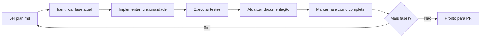
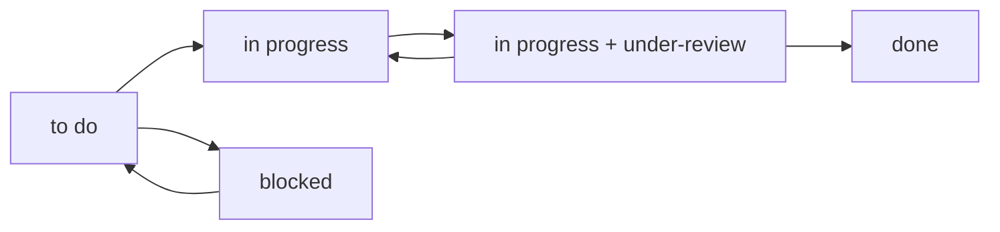

# 🔄 Fluxos de Engenharia Detalhados

> **Versão**: 3.0.0 | **Última atualização**: 2025-11-24

Este guia documenta os workflows completos de desenvolvimento, desde a concepção até a entrega, com integração total ao ClickUp MCP.

## 🆕 Novidades v3.0

- **Sessions estruturadas** em `.claude/sessions/<feature-slug>/`
- **Comentários duais** no ClickUp (detalhado + resumido)
- **Mapeamento fase→subtask** automático
- **Prompts modulares** em `common/prompts/`

## 📋 Índice de Fluxos

- [🚀 Fluxo Completo: Feature Development](#-fluxo-completo-feature-development)
- [🐛 Fluxo de Correção de Bugs](#-fluxo-de-correção-de-bugs)
- [📚 Fluxo de Documentação](#-fluxo-de-documentação)
- [🔧 Fluxo de Refatoração](#-fluxo-de-refatoração)
- [⚡ Fluxo de Hotfix](#-fluxo-de-hotfix)
- [🎯 Integrações ClickUp por Fluxo](#-integrações-clickup-por-fluxo)
- [🤖 Workflows com Agentes Especializados](#-workflows-com-agentes-especializados)

---

## 🚀 Fluxo Completo: Feature Development

### **Fase 1: Planejamento e Criação da Task**

#### 1.1 Criação da Task
```bash
/product/task "Implementar sistema de autenticação OAuth2 com Google e GitHub"
```

**O que acontece**:
-  Sistema analisa requisitos e contexto do projeto
-  Cria task estruturada no ClickUp com:
  - Título descritivo
  - Descrição detalhada
  - Critérios de aceitação
  - Estimativa inicial
  - Tags relevantes (`feature`, `auth`, `oauth2`)
-  Task fica com status `to do` no ClickUp

**Output esperado**:
```
✅ Task criada no ClickUp: AUTH-123
📋 Título: "🔐 Implementar sistema de autenticação OAuth2"
📝 Descrição: Funcionalidade completa de autenticação...
🏷️ Tags: feature, auth, oauth2, high-priority
📊 Estimativa: 8-12 horas
```

#### 1.2 Refinamento (Opcional)
```bash
/product/refine
```

**Usar quando**:
- Requisitos iniciais não estão claros
- Funcionalidade é complexa e precisa de detalhamento
- Stakeholders precisam alinhar expectativas

### **Fase 2: Início do Desenvolvimento**

#### 2.1 Inicialização
```bash
/engineer/start
```

**Input necessário**: ID da task ClickUp (`AUTH-123`)

**O que acontece**:
-  Verifica se está em feature branch apropriada
-  Cria pasta `.claude/sessions/auth-oauth2/`
-  Busca detalhes da task no ClickUp
-  Analisa contexto, objetivos e dependências
-  Identifica arquivos e componentes necessários
-  Cria plan.md inicial

**Estrutura criada**:
```
.claude/sessions/auth-oauth2/
├── plan.md          # Plano de desenvolvimento em fases
├── context.md       # Contexto e requisitos
├── decisions.md     # Decisões arquiteturais
└── progress.md      # Log de progresso
```

#### 2.2 Análise Arquitetural (se necessário)
```bash
/product/light-arch
```

**Usar quando**:
- Funcionalidade impacta arquitetura existente
- Novas integrações são necessárias
- Decisões técnicas precisam ser documentadas

### **Fase 3: Desenvolvimento Iterativo**

#### 3.1 Trabalho na Funcionalidade
```bash
/engineer/work .claude/sessions/auth-oauth2/
```

**O que acontece em cada iteração**:
-  Lê plan.md e identifica fase atual
-  Apresenta próximos passos específicos
-  Delega trabalho para sub-agentes especializados:
  - `python-developer` para backend
  - `react-developer` para frontend
  - `test-engineer` para testes
-  Atualiza progresso no plan.md
-  Solicita validação antes de próxima fase

**Ciclo típico**:


#### 3.2 Validações Contínuas
Durante o desenvolvimento, o sistema:
- 🔍 Executa testes automaticamente após mudanças
- 📝 Atualiza documentação conforme necessário
- 🔗 Mantém rastreabilidade com task ClickUp
- 📊 Monitora progresso e estima tempo restante

### **Fase 4: Preparação para Review**

#### 4.1 Validações Pré-PR
```bash
/engineer/pre-pr
```

**Verificações realizadas**:
-  Todos os testes passando
-  Cobertura de testes adequada
-  Linting sem erros
-  Documentação atualizada
-  Commits organizados
-  Task ClickUp sincronizada

#### 4.2 Criação do Pull Request
```bash
/engineer/pr
```

**O que acontece**:
1. ✅ Execução final de todos os testes
2. ✅ Commit final com mensagem padronizada
3. ✅ **Atualização ClickUp**: Task → `in progress` + tag `under-review`
4. ✅ Criação do PR com:
   - Descrição detalhada da implementação
   - Checklist de validações
   - Link para task ClickUp
   - Screenshots/demos se aplicável
5. ✅ Aguarda feedback automatizado (3 min)
6. ✅ Processa comentários e sugere correções

**Template do PR**:
```markdown
## 🔐 Implementar sistema de autenticação OAuth2

### 📋 Resumo
- Implementado OAuth2 com Google e GitHub
- Adicionado middleware de autenticação
- Criados testes unitários e de integração

### 🔗 Relacionado
- ClickUp Task: AUTH-123
- Sessão: .claude/sessions/auth-oauth2/

### ✅ Checklist
- [x] Testes passando
- [x] Documentação atualizada
- [x] Linting sem erros
- [x] Task ClickUp atualizada
```

### **Fase 5: Review e Finalização**

#### 5.1 Processamento de Feedback
Quando feedback é recebido:
- 🔍 Analisa cada comentário automaticamente
- 💡 Sugere correções específicas
- 🔄 Aplica mudanças aprovadas pelo usuário
-  Marca conversas como resolvidas

#### 5.2 Merge e Finalização
Após aprovação:
- 🔄 Merge do PR
-  **Atualização ClickUp**: Task → `done`
- 📝 Adição de comentário final com resumo
- 🏷️ Adição de tags de conclusão
- 📊 Atualização de métricas de tempo

---

## 🐛 Fluxo de Correção de Bugs

### **Início Rápido para Bugs**
```bash
# Para bugs simples (< 2h)
/product/collect "Bug: Dashboard não carrega dados do usuário após login"
# → Análise rápida e criação de task
/engineer/start
# → Desenvolvimento direto sem sessão complexa
/engineer/work "correção dashboard login"
# → Fix implementado
/engineer/pr
# → PR com correção
```

### **Fluxo Detalhado para Bugs Complexos**

#### 1. Investigação e Documentação
```bash
/product/task "Bug: Dashboard não carrega após login em ambiente de produção"
```

**Informações coletadas**:
- 🔍 Steps to reproduce
- 📊 Dados de erro/logs
- 🎯 Impacto nos usuários
- ⏱️ Urgência da correção

#### 2. Análise Técnica
```bash
/engineer/start  # ID da task de bug
```

**Análise específica para bugs**:
- 🕵️ Root cause analysis
- 📊 Análise de logs e métricas
- 🧪 Testes para reproduzir o problema
- 🔄 Identificação de possíveis regressões

#### 3. Implementação da Correção
```bash
/engineer/work .claude/sessions/bug-dashboard-login/
```

**Foco em**:
- 🎯 Correção mínima necessária
- 🧪 Testes para prevenir regressão
- 📝 Documentação do que causou o bug
- ⚡ Deploy rápido se crítico

#### 4. Validação Extensiva
```bash
/engineer/pre-pr
```

**Validações específicas para bugs**:
-  Bug original corrigido
-  Nenhuma regressão introduzida
-  Testes de edge cases
-  Validação em ambiente similar à produção

---

## 📚 Fluxo de Documentação

### **Documentação Técnica**
```bash
/docs/build-tech-docs
```

**Produz**:
- 📄 Architecture Decision Records (ADRs)
- 🗺️ Guia de navegação do codebase
- 🤖 Contexto otimizado para IA
- 📋 Guias de desenvolvimento

**Integração ClickUp**:
-  Cria task de documentação
- 📊 Organiza por workspace/space
- 🏷️ Tags por tipo de documentação

### **Documentação de Negócio**
```bash
/docs/build-business-docs
```

**Produz**:
- 👥 Personas e jornadas de usuário
- 📈 Análise competitiva
- 🎯 Estratégia de produto
- 📋 Processos de vendas

---

## 🔧 Fluxo de Refatoração

### **Planejamento de Refatoração**
```bash
/product/task "Refatoração: Migrar sistema de cache para Redis"
/product/light-arch  # Planejar nova arquitetura
```

### **Execução Incremental**
```bash
/engineer/start  # Task de refatoração
/engineer/work   # Implementação por fases
```

**Características especiais**:
- 📊 Métricas de performance antes/depois
- 🧪 Testes de compatibilidade
- 📝 Documentação de migration path
- ⚡ Deploy incremental com feature flags

---

## ⚡ Fluxo de Hotfix

### **Hotfix Crítico (< 30min)**
```bash
# Criação urgente
/product/collect "CRÍTICO: Sistema de pagamento fora do ar"

# Desenvolvimento express
/engineer/start  # Branch hotfix/payment-fix
/engineer/work "correção sistema pagamento"
/engineer/pr     # PR de emergência

# ClickUp: Task marcada como URGENT + notificações
```

**Características do fluxo de hotfix**:
- 🚨 Prioridade máxima no ClickUp
- ⚡ Branch `hotfix/*` automaticamente
- 🧪 Testes mínimos mas críticos
- 📢 Notificações para todos stakeholders
- 📊 Deploy direto para produção após approve

---

## 🎯 Integrações ClickUp por Fluxo

### **Estados da Task no ClickUp**



### **Mapeamento de Comandos → Estados ClickUp**

| Comando | Estado Inicial | Estado Final | Tags Adicionadas |
|---------|---------------|-------------|------------------|
| `/product/task` | - | `to do` | Baseado no tipo |
| `/engineer/start` | `to do` | `in progress` | `development` |
| `/engineer/pr` | `in progress` | `in progress` | `under-review` |
| **Após merge** | `in progress + under-review` | `done` | `completed` |
| **Se blockeado** | Qualquer | `blocked` | `blocked` + razão |

### **Comentários Automáticos no ClickUp**

| Evento | Comentário Adicionado |
|--------|----------------------|
| Início desenvolvimento | "🚀 Desenvolvimento iniciado na branch: feature/auth-oauth2" |
| Progresso significativo | "📊 Fase X completada: [detalhes da implementação]" |
| PR criado | "🔍 Pull Request criado: [link] - Pronto para review" |
| PR aprovado | "✅ Pull Request aprovado e merged - Funcionalidade entregue" |
| Bug encontrado | "🐛 Bug identificado durante desenvolvimento: [detalhes]" |

### **Campos Customizados Sincronizados**

| Campo ClickUp | Origem | Atualização |
|---------------|--------|-------------|
| **Tempo Estimado** | `/product/task` análise | Refinado durante desenvolvimento |
| **Tempo Real** | Timer automático | Durante `/engineer/work` |
| **Branch** | `/engineer/start` | Nome da branch Git |
| **PR Link** | `/engineer/pr` | Link direto do GitHub/GitLab |
| **Arquivos Alterados** | Análise Git | Lista de arquivos modificados |
| **Linhas de Código** | Análise Git | Stats de adição/remoção |

### **Notificações e Webhooks**

**Configurações recomendadas**:
- 📧 **Email**: Mudanças de status críticas
- 💬 **Slack**: Updates de desenvolvimento em canal do projeto  
- 📱 **Mobile**: Apenas para tasks URGENT/HIGH priority
- 🔔 **Desktop**: Pull Requests prontos para review

---

## 📊 Métricas e Relatórios

### **Métricas Coletadas Automaticamente**
- ⏱️ Tempo por fase de desenvolvimento
- 🧪 Cobertura de testes por funcionalidade
- 🔄 Frequência de revisões de código
- 📈 Velocity da equipe (story points/sprint)
- 🐛 Taxa de bugs encontrados pós-deploy

### **Dashboards ClickUp Sugeridos**
1. **Desenvolvimento Ativo**: Tasks in progress + tempo decorrido
2. **Pipeline de Review**: PRs aguardando review + tempo de espera
3. **Bugs e Hotfixes**: Tasks críticas + tempo de resolução
4. **Documentação**: Status de docs por projeto

---

## 💡 Melhores Práticas

### **Para Desenvolvimento Eficiente**
1. ✅ **Sempre use `/product/task`** antes de começar desenvolvimento
2. ✅ **Execute `/engineer/start`** para setup completo do ambiente
3. ✅ **Trabalhe em sessões focadas** com `/engineer/work`
4. ✅ **Faça commits pequenos e frequentes** durante o desenvolvimento
5. ✅ **Use `/engineer/pre-pr`** antes de submeter para review

### **Para Integração ClickUp Otimizada**
1. 🏷️ **Use tags consistentes** para facilitar filtros e busca
2. 📝 **Mantenha descrições atualizadas** durante o desenvolvimento
3. 🔗 **Vincule sempre** PRs às tasks correspondentes
4. 📊 **Monitore métricas** para identificar bottlenecks
5. 📢 **Configure notificações** adequadas para sua equipe

### **Para Qualidade de Código**
1. 🧪 **Testes primeiro** - escreva testes antes da implementação
2. 📝 **Documente decisões** importantes em ADRs
3. 🔍 **Code review obrigatório** - nunca merge sem review
4. 📊 **Monitore cobertura** de testes em cada PR
5. ⚡ **Deploy incremental** para funcionalidades complexas

---

## 🤖 Workflows com Agentes Especializados

### **Fluxo de Desenvolvimento Especializado por Tecnologia**

#### **Node.js/Backend Development**
```bash
# 1. Iniciar com agente especializado
@nodejs-specialist "Implementar API REST com Express e TypeScript"

# 2. Desenvolvimento focado
/engineer/start 
# → O sistema detecta contexto Node.js e sugere nodejs-specialist

# 3. Review especializado
@code-reviewer "Review de código Node.js com foco em performance"
```

**Vantagens**:
- 🎯 **Contexto especializado** em Node.js v22.14.0+
- ⚡ **Performance otimizada** para aplicações backend
- 🔒 **Segurança** com melhores práticas Node.js
- 📊 **Métricas** específicas de APIs e serviços

#### **Frontend/React Development**
```bash
# Desenvolvimento React com agente especializado
@react-developer "Criar componente de dashboard com hooks customizados"

# Seguindo o fluxo padrão mas com contexto React
/engineer/start
/engineer/work
/engineer/pr
```

**Recursos Exclusivos**:
- ⚛️ **React 18+ patterns** (Concurrent Features, Suspense)
- 🎨 **CSS-in-JS** e styling best practices
- 🧪 **Testing Library** e Jest configurações otimizadas
- 📱 **Responsive design** automático

### **Fluxo de Arquitetura e Documentação**

#### **C4 Architecture Modeling**
```bash
# Para mudanças arquiteturais significativas
@c4-architecture-specialist "Modelar arquitetura de microserviços"

# Seguido por documentação especializada
@c4-documentation-specialist "Documentar decisões arquiteturais"
```

**Entregáveis Automáticos**:
- 📐 **Diagramas C4** (Context, Container, Component, Code)
- 📋 **ADRs** (Architecture Decision Records)
- 🗂️ **Documentação técnica** estruturada
- 📊 **Análise de impacto** em sistemas existentes

#### **Mermaid Diagrams Workflow**
```bash
# Para visualizações técnicas
@mermaid-specialist "Criar fluxograma do processo de checkout"

# Integrado ao desenvolvimento
/engineer/work "documentar fluxos com diagramas"
```

### **Fluxo Git Avançado com Specialists**

#### **GitFlow Specialist Workflow**
```bash
# Para repositórios complexos
@gitflow-specialist "Configurar strategy de branching para equipe"

# Comandos especializados
/git/release/start
/git/hotfix/start
/git/feature/finish
```

#### **ClickUp Specialist Integration**
```bash
# Otimização de integrações ClickUp
@clickup-specialist "Configurar automações avançadas ClickUp"

# Melhorias técnicas específicas
/engineer/work "otimizar sincronização ClickUp MCP"
```

### **Coordenação Multi-Agente**

#### **Exemplo: Feature Complexa com Múltiplos Agentes**
```bash
# Sistema ativa automaticamente:
# - @python-developer: Backend de pagamentos
# - @react-developer: Interface de checkout  
# - @test-engineer: Testes de integração
# - @c4-architecture-specialist: Modelagem de segurança
```

**Fluxo Coordenado**:
1. **Fase 1**: Modelagem arquitetural
2. **Fase 2**: Implementação backend
3. **Fase 3**: Desenvolvimento frontend
4. **Fase 4**: Testes de integração
5. **Fase 5**: Deploy coordenado

---

**Próximo**: [Integração ClickUp Detalhada →](clickup-integration.md)
