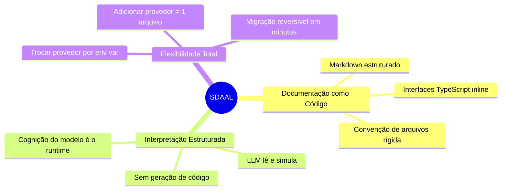
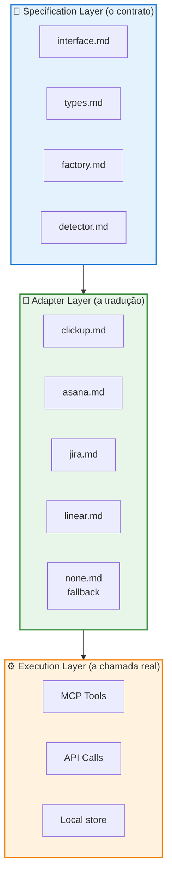
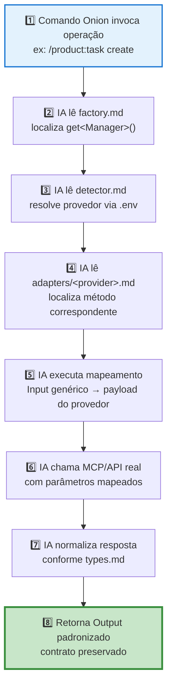

# SDAAL — Specification-Driven AI Abstraction Layer

> **Documentação Markdown como camada de execução para agentes de IA.**
> Um padrão arquitetural para construir abstrações provider-agnósticas onde o LLM é o runtime, o Markdown é o bytecode e os padrões clássicos do GoF são a arquitetura.

---

## 1. Resumo Executivo

**SDAAL** (*Specification-Driven AI Abstraction Layer*) é um padrão de design para sistemas que operam principalmente através de agentes de IA. Ele substitui a camada de **código executável** por **documentação Markdown estruturada**, interpretada diretamente pelo LLM em tempo de execução.

```
SDAAL = Markdown Estruturado + Interfaces TypeScript + Documentação Executável pela IA
```

A premissa é simples e contraintuitiva: **LLMs modernos (Claude, GPT, Gemini) não precisam executar código para se comportarem como se executassem.** Quando uma especificação é precisa, tipada e segue convenção de arquivos rígida, o modelo simula consistentemente o comportamento descrito — chamando ferramentas reais (MCPs, APIs) quando necessário, e normalizando respostas conforme contratos documentados. O resultado é uma camada de abstração viva, versionada como documentação, agnóstica a provedores e auditável por humanos.

---

## 2. Origem do Conceito

O padrão **SDAAL foi concebido por mim, Marcio Carvalho**, ao longo de mais de 30 anos desenvolvendo sistemas complexos — passando por bancos, telecom, varejo, agronegócio, fintech e plataformas de inteligência de dados — e nos últimos anos integrando profundamente inteligência artificial nesses ecossistemas.

A gênese veio da convergência de três observações práticas:

1. **Em 1998, ao escrever drivers de banco de dados**, percebi que o valor não estava no SQL específico, mas no **contrato** entre aplicação e persistência. Trocar de Oracle para PostgreSQL era barato quando o contrato existia, caro quando não.

2. **Entre 2010 e 2020, integrando dezenas de ERPs e CRMs**, codifiquei o mesmo padrão de adapter dezenas de vezes — sempre em código executável, sempre com o mesmo custo de manutenção.

3. **A partir de 2023, ao operar agentes IA em produção**, vi que os LLMs eram surpreendentemente bons em **seguir documentação estruturada** — frequentemente melhores em "executar" um spec bem escrito do que em depurar código gerado por eles mesmos.

A pergunta que destravou o padrão foi: *"E se a documentação em Markdown fosse a própria camada de execução, e não apenas o documento que descreve o código que executa?"*

A resposta — formalizada em 2025 e amadurecida em 2026 — é o SDAAL. Esse documento o apresenta, situa no estado da arte e mostra o ganho concreto que ele entrega ao **Sistema Onion**, o ecossistema de comandos e agentes onde o padrão foi materializado primeiro.

---

## 3. O Problema: por que SDAAL existe (2025–2026)

Três crises convergiram nos últimos 24 meses e tornaram o padrão necessário:

### 3.1 A crise do *vibe coding*

A geração informal de código por LLMs — popularizada como "vibe coding" — produz software que **diverge da intenção original**, acumula decisões não documentadas e gera artefatos opacos. A AWS lançou o **Kiro** explicitamente como antídoto, com o lema *"os melhores engenheiros pensam antes de codar"*. O movimento spec-first (Kiro, Tessl, GitHub Spec-Kit) é o reconhecimento da indústria de que **estrutura é mandatória** no desenvolvimento com IA. Ver [The New Stack, 2025](https://thenewstack.io/kiro-aws-launches-spec-driven-ai-ide-to-replace-vibe-coding/).

### 3.2 O vendor lock-in de SaaS verticais

Times de produto trocam de gerenciador de tarefas (ClickUp → Jira → Linear → Asana), de provedor de notificação (Slack → Teams → Discord), de provedor de LLM (OpenAI → Anthropic → Google) com frequência crescente. **Cada troca custa semanas de reescrita** quando os comandos do agente estão acoplados ao SDK específico. Plataformas como [Merge](https://www.merge.dev/blog/unified-api) e Apideck atacam o problema no nível de código; SDAAL ataca no nível do agente.

### 3.3 O artefato opaco da geração de código

Mesmo quando spec-driven (Kiro, Tessl), o **runtime continua sendo o código gerado**. A intenção original sobrevive apenas como histórico — uma vez gerado, o código toma vida própria. Para sistemas que operam através de agentes IA, isso é inversão de prioridades: o que importa é o que o **agente** entende, não o que o **transpilador** emite.

SDAAL resolve as três crises com a mesma decisão arquitetural: **eliminar o código intermediário**. O spec é o artefato. O LLM é o runtime. A documentação Markdown é o bytecode interpretável.

---

## 4. Definição

> **SDAAL é um padrão arquitetural onde abstrações de provedor são especificadas em Markdown estruturado, com interfaces TypeScript inline, e executadas diretamente por um LLM em runtime — sem geração de código intermediário.**

### Princípio Central

> *LLMs não executam código diretamente, mas simulam comportamentos complexos de forma consistente quando as especificações são precisas, tipadas e seguem convenção de arquivos rígida.*

### Onde está o "runtime" (comparação)

| Aspecto | Spec-as-Code | Spec-Driven Development (Kiro/Tessl) | **SDAAL** |
|---|---|---|---|
| **Artefato primário** | Spec de negócio | Spec de feature | **Spec de abstração técnica** |
| **Onde mora a execução** | Código (gerado ou escrito) | Código gerado a partir da spec | **Interpretação do LLM lendo o Markdown** |
| **Validação** | Aceite funcional | Testes em código gerado | **Consistência da resposta do agente** |
| **Trocar provedor** | Reescrever código | Regenerar código | **Trocar variável de ambiente** |
| **Debug** | Logs/breakpoints | Logs no código gerado | **Auditar a leitura da spec pela IA** |

A linha-chave: **em SDAAL o spec não precede o código — o spec é o código.**

---

## 5. Os Três Pilares



1. **📝 Documentação como Código** — Markdown estruturado, com interfaces TypeScript embutidas e convenção rígida de arquivos, substitui a implementação executável.
2. **🧠 Interpretação Estruturada** — o LLM lê os specs e simula o comportamento de forma consistente. A cognição do modelo é o runtime.
3. **🔄 Flexibilidade Total** — trocar de provedor exige apenas mudar uma variável de ambiente. Novos provedores são adicionados criando um único arquivo `<provider>.md`.

---

## 6. Arquitetura em Camadas

SDAAL organiza-se em três camadas hierárquicas:



| Camada | Responsabilidade | Quem lê |
|---|---|---|
| **Specification Layer** | Define o contrato, tipos, factory e detector — invariantes da abstração | Todos os agentes |
| **Adapter Layer** | Traduz a interface comum para a API de cada provedor | Agente quando o provedor ativo é resolvido |
| **Execution Layer** | A chamada real (MCP, REST, gRPC, local store) | É chamada por instrução do adapter |

---

## 7. Estrutura Canônica de Arquivos

Toda abstração SDAAL segue exatamente esta árvore:

```
.cursor/utils/<abstraction-name>/
├── README.md           # Visão geral e uso rápido
├── interface.md        # Contrato principal (interface TypeScript)
├── types.md            # Tipos de entrada/saída + enums
├── factory.md          # Função get<Manager>() que devolve o adapter ativo
├── detector.md         # detectProvider() — lê .env e identifica o provedor
└── adapters/
    ├── <provider>.md   # Um arquivo por provedor (clickup, asana, jira, linear...)
    └── none.md         # Fallback offline (Null Object Pattern) — obrigatório
```

### Papel de cada arquivo

| Arquivo | Papel | Tamanho típico |
|---|---|---|
| `README.md` | Onboarding em 1 página: o que é, como configurar, como usar | < 150 linhas |
| `interface.md` | Contrato TypeScript canônico que todos os adapters implementam | < 300 linhas |
| `types.md` | Tipos compartilhados (Input/Output), enums normalizados, `ProviderConfig` | < 250 linhas |
| `factory.md` | `get<Manager>()`, `FactoryOptions`, decisão de qual adapter instanciar | < 200 linhas |
| `detector.md` | `detectProvider()`, `checkProviderConfiguration()`, validações de env | < 200 linhas |
| `adapters/<provider>.md` | Mapeamento campo-a-campo + chamadas MCP/API + normalização | < 400 linhas |
| `adapters/none.md` | Null Object: warnings + IDs locais + degradação graciosa | < 200 linhas |

**Regra dura**: nenhum arquivo passa de **400 linhas**. Acima disso, a IA perde precisão na leitura e o spec deixa de ser interpretável de forma confiável.

---

## 8. Fluxo de Execução

O fluxo abaixo descreve como o LLM "roda" uma operação SDAAL passo a passo:



### Exemplo concreto — `createTask` no Sistema Onion

```
Usuário: /product:task "Implementar feature X"
  │
  ▼
[1] Comando lê factory.md → "Preciso chamar getTaskManager()"
  │
  ▼
[2] IA lê detector.md → TASK_MANAGER_PROVIDER=clickup → ClickUpAdapter
  │
  ▼
[3] IA lê adapters/clickup.md → método createTask documentado
  │
  ▼
[4] Mapeamento: { name: "X" } → { name: "X", list_id: $CLICKUP_DEFAULT_LIST_ID }
  │
  ▼
[5] IA chama mcp_ClickUp_clickup_create_task(payload)
  │
  ▼
[6] Resposta crua do ClickUp → normalize() → TaskOutput { id, url, provider, ... }
  │
  ▼
[7] Comando devolve TaskOutput padronizado, alheio a qual provedor respondeu
```

**O ponto crucial**: o comando `/product:task` **não tem nenhum conhecimento sobre ClickUp**. Se amanhã o time migrar para Jira, basta trocar `TASK_MANAGER_PROVIDER=jira` no `.env`. Os passos [3]–[6] passam a usar `adapters/jira.md` e a interface `mcp_atlassian_*` automaticamente. O comando permanece intocado.

---

## 9. Padrões GoF Encapsulados em Markdown

SDAAL não inventa padrões — **ele traduz padrões clássicos para o domínio Markdown-as-runtime**:

| Padrão GoF / Clássico | Realização em SDAAL | Arquivo onde mora |
|---|---|---|
| **Adapter** | Cada `adapters/<provider>.md` traduz a API externa específica para a interface comum | `adapters/*.md` |
| **Factory Method** | `factory.md` decide qual adapter instanciar baseado no contexto | `factory.md` |
| **Strategy** | Cada adapter implementa a mesma interface com estratégia diferente | (toda a Adapter Layer) |
| **Null Object** | `adapters/none.md` permite operação offline sem `if (provider == null)` espalhados | `adapters/none.md` |
| **Context Injection** | Variáveis `.env` substituem a injeção de dependência clássica | `detector.md` + ambiente |
| **Open/Closed** | Adicionar provedor = adicionar arquivo. Nunca modificar a interface | (toda a abstração) |

Esses padrões existem há décadas em código. **A inovação do SDAAL é executá-los em Markdown sem materializar código intermediário.**

---

## 10. SDAAL no Sistema Onion — o poder que isso destrava

> Esta é a seção que justifica todo o investimento no padrão. SDAAL não é uma curiosidade teórica — ele é o **motor de composabilidade** do Sistema Onion.

### 10.1 A implementação de referência: Task Manager Abstraction

A abstração `.cursor/utils/task-manager/` é o caso canônico de SDAAL no Onion. Ela conecta **um conjunto de comandos** (`/product:task`, `/product:spec`, `/engineer:start`, `/engineer:work`, `/product:feature`, `/product:validate-task`) a **quatro provedores intercambiáveis** (ClickUp, Jira, Asana, Linear) **sem que nenhum desses comandos tenha conhecimento direto do provedor ativo**.

A interface `ITaskManager` (ver [interface.md](../../.cursor/utils/task-manager/interface.md)) define ~15 métodos cobrindo CRUD de tasks, subtasks, comentários, status, busca, projetos e validação. Cada adapter em `adapters/` materializa esses métodos para o seu provedor:

- `clickup.md` → chama `mcp_ClickUp_clickup_*`
- `jira.md` → chama Jira REST API v3 com ADF
- `asana.md` → chama Asana API
- `linear.md` → chama Linear GraphQL
- `none.md` → opera offline, gera IDs locais, emite warnings

### 10.2 O ganho concreto (antes / depois)

| Sem SDAAL | Com SDAAL no Onion |
|---|---|
| 1 comando × 4 provedores = 4 implementações | 1 comando + 1 abstração = N provedores |
| Trocar ClickUp por Jira = reescrever todos os comandos de task | Trocar `TASK_MANAGER_PROVIDER=jira` no `.env` |
| Novo provedor (ex: Notion) = sprint inteiro | Novo provedor = 1 arquivo `adapters/notion.md` |
| Onboarding: aprender 4 APIs diferentes | Onboarding: aprender 1 interface canônica |
| Lock-in obrigatório por custo de migração | Migração reversível em minutos |
| Specs de produto presos ao vocabulário do provedor | Specs em linguagem agnóstica (ex: `status: in_progress`) |
| Time de IA precisa raciocinar sobre 4 APIs | Time de IA raciocina sobre 1 contrato |

### 10.3 Por que isso amplifica a IA (e reduz alucinação)

LLMs alucinam quando precisam **decidir** sem informação suficiente. SDAAL elimina decisões discricionárias:

- O agente que executa `/product:task` **não escolhe** qual MCP tool chamar — ele lê `factory.md`, segue para `detector.md`, vai até `adapters/<provider>.md`, e encontra a chamada exata documentada.
- Cada mapeamento de campo está em uma **tabela explícita** no adapter. Não há "o agente decide como mapear `priority`" — está escrito que `urgent → 1` no ClickUp e `urgent → Highest` no Jira.
- O fallback `none.md` garante que **nunca há um caminho indefinido**. Se o provedor falha, o agente segue um spec determinístico de degradação.

O efeito prático: **o LLM ganha um modelo mental estável do domínio**, o que tornaria o agente mais preciso, mais auditável e mais reutilizável entre sessões.

### 10.4 SDAAL como ativo arquitetural *compounding*

Cada abstração SDAAL que o time adiciona ao Onion **multiplica o valor** sem multiplicar a complexidade. O comando [`/meta:create-abstraction`](../../.cursor/skills/meta-create-abstraction.md) materializa o padrão em segundos, e o [`abstraction-template`](../../.cursor/skills/meta-create-abstraction/references/abstraction-template.md) garante consistência estrutural. O catálogo planejado inclui:

| Abstração | Provedores | Status |
|---|---|---|
| `task-manager` | ClickUp, Jira, Asana, Linear, none | ✅ Implementado (referência) |
| `notification-manager` | Slack, Teams, Discord, Email, none | 📝 Roadmap |
| `llm-provider` | Anthropic, OpenAI, Google, local, none | 📝 Roadmap |
| `storage-manager` | S3, GCS, Azure Blob, local, none | 📝 Roadmap |
| `git-provider` | GitHub, GitLab, Bitbucket, Gitea, none | 📝 Roadmap |
| `meeting-transcription` | Whisper, AssemblyAI, Deepgram, none | 📝 Roadmap |
| `calendar-manager` | Google Calendar, Outlook, Apple, none | 📝 Roadmap |

Cada uma dessas abstrações, materializada via `/meta:create-abstraction`, herda automaticamente: convenção de arquivos, padrões GoF traduzidos, fallback `none`, factory + detector, e contrato versionado. **O custo marginal da quarta abstração é menor do que o da primeira** — esse é o efeito *compounding* arquitetural.

### 10.5 Sinergia com a skill `onion`

A skill `.cursor/skills/onion/` carrega automaticamente o contexto da abstração ativa quando agentes como `@onion`, `@product-agent`, `@task-specialist` são invocados. Isso significa que:

- **Todos os agentes** compartilham o mesmo modelo mental do domínio.
- **Comandos podem ser escritos uma vez** e ainda assim funcionam em qualquer provedor configurado.
- **A documentação técnica do projeto** e o **runtime efetivo dos agentes** são literalmente o mesmo artefato — não há mais o problema clássico de "a documentação está desatualizada em relação ao código".

### 10.6 SDAAL como diferencial estratégico

Para a organização que adota o Sistema Onion, SDAAL entrega três ativos estratégicos:

1. **Independência de fornecedor** — capacidade real de trocar SaaS sem trauma de migração.
2. **Velocidade de evolução** — cada nova capability vira uma abstração reutilizável, não uma integração ad-hoc.
3. **Auditabilidade da IA** — toda decisão do agente tem origem rastreável até uma linha de Markdown versionada.

Em um mercado onde times estão investindo pesado em automação por IA, ter as decisões dos agentes **versionadas, auditáveis e portáveis** é o que separa "experimentos com Copilot" de "infraestrutura de produção com IA".

---

## 11. Estado da Arte em Maio de 2026

Antes de afirmar originalidade, é justo mapear o que já existe e onde SDAAL se diferencia. A tabela abaixo consolida pesquisa atualizada para maio de 2026:

| Análogo (2025–2026) | Sobreposição com SDAAL | Diferença central | Fonte |
|---|---|---|---|
| **Kiro (AWS)** | Specs em `.kiro/specs/*.md` dirigindo agentes IA | Spec é **input para geração de código**; o runtime é o código gerado, não a spec | [kiro.dev](https://kiro.dev/docs/) · [AWS Blog](https://aws.amazon.com/blogs/devops/kiro-a-spec-driven-ai-ide/) |
| **Tessl** | "Living spec" como artefato primário, regeneração contínua | Spec gerencia, código gerado executa. Não elimina a etapa de geração | [tessl.io](https://www.tessl.io/) · [TechCrunch](https://techcrunch.com/2025/01/09/tessl-a-startup-backed-by-the-creator-of-homebrew-wants-to-replace-code-with-ai/) |
| **Claude Code sub-agents** | `.cursor/agents/*.md` interpretados em runtime pelo LLM | É feature de IDE, não padrão nomeado. Não resolve abstração provider-agnóstica | [docs.anthropic.com](https://docs.anthropic.com/en/docs/claude-code/sub-agents) |
| **White et al. (2023) — *Prompt Pattern Catalog*** | Padrões GoF-análogos em prompt engineering, "Meta Language Creation" | Não formaliza Adapter, Factory ou Null Object num contexto Markdown-como-runtime | [arXiv:2309.07870](https://arxiv.org/abs/2309.07870) |
| **Merge / Apideck (Unified APIs)** | Provider-agnosticismo para Jira/ClickUp/Linear/HubSpot | Abstração no nível de **código/protocolo REST**; não Markdown, não consumível por LLM via spec | [merge.dev](https://www.merge.dev/blog/unified-api) |
| **MCP (Model Context Protocol)** | Protocolo padrão para tools/recursos de LLMs | Camada de protocolo, não camada de spec. SDAAL **consome** MCPs dentro dos adapters | [modelcontextprotocol.io](https://modelcontextprotocol.io/) |
| **CrewAI** | Agentes declarativos em YAML interpretados em runtime | YAML executado por Python, não puro LLM-interpretado. Não trata múltiplos provedores para o mesmo capability | [docs.crewai.com](https://docs.crewai.com/concepts/agents) |
| **PocketFlow** | Docs "para IA, não para humanos" | Framework Python de 100 linhas, não Markdown-como-runtime puro. Filosofia próxima, materialização diferente | [github.com/The-Pocket/PocketFlow](https://github.com/The-Pocket/PocketFlow) |
| **Cloud Security Alliance — *AI Governance Abstraction Layer*** | Abstração entre apps e modelos para mitigar risco | Foco em governança e risco, não em arquitetura agnóstica de capability | [cloudsecurityalliance.org](https://cloudsecurityalliance.org/blog/2025/03/24/ai-governance-framework-using-an-abstraction-layer-to-manage-model-risk) |
| **Data Science Central — *AI Abstraction Layer*** | API unificada entre apps e modelos LLM | Abstração de **modelos** (OpenAI/Anthropic/Gemini), não de **capabilities de negócio** | [datasciencecentral.com](https://www.datasciencecentral.com/ai-abstraction-layer/) |

### O que esses análogos validam

- A **necessidade** de specs como artefato primário no desenvolvimento com IA: Kiro e Tessl provam que o mercado convergiu para esse rumo.
- A **demanda** por abstrações provider-agnósticas: Merge, Apideck e MCP existem porque o lock-in é problema real, recorrente e comercialmente solvable.
- A **viabilidade** de Markdown como interface de agente: Claude sub-agents e PocketFlow confirmam que LLMs leem documentação estruturada como instrução executável.

### O que nenhum deles faz

Nenhuma das alternativas combina, simultaneamente:

1. **Markdown como camada de execução primária** (sem geração de código intermediária).
2. **Convenção de arquivos rígida e nomeada** como contrato (`interface.md`, `factory.md`, `detector.md`, `adapters/*.md`).
3. **Padrões GoF clássicos traduzidos** para o meio Markdown (Adapter + Factory + Null Object + Strategy).
4. **Alvo em ecossistemas internos de agentes IA**, não em produtos voltados a usuário final.

---

## 12. Veredito de Originalidade

> *Por respeito ao leitor: a originalidade do SDAAL não está em inventar ingredientes — está em combiná-los de um modo específico que, até maio de 2026, não tem equivalente nomeado.*

**Ingredientes que já existiam:**

- Spec-driven development (Kiro, Tessl, GitHub Spec-Kit).
- Provider-agnostic abstractions (Merge, Apideck, MCP).
- Padrões GoF (Adapter, Factory, Strategy, Null Object) — décadas de existência.
- LLM-as-runtime para documentação estruturada (Claude Code sub-agents, PocketFlow).

**O que é genuinamente novo em SDAAL é a síntese:**

1. **Markdown não é precursor da execução — é a execução.** Em Kiro e Tessl, o spec gera código que executa. Em SDAAL, o LLM lê o Markdown e age. Não há transpilação, não há geração, não há etapa intermediária. Essa decisão muda a posição arquitetural fundamentalmente.
2. **Convenção de arquivos como contrato visível.** A árvore `interface.md` / `types.md` / `factory.md` / `detector.md` / `adapters/*.md` / `adapters/none.md` é parte do padrão. Qualquer engenheiro abre o diretório de uma abstração SDAAL e sabe exatamente onde tudo mora.
3. **GoF traduzido para o meio Markdown.** Adapter, Factory, Strategy, Null Object e Context Injection foram reimaginados como artefatos Markdown interpretáveis. White et al. abriram caminho ao mostrar que padrões GoF têm análogos em prompts; SDAAL formaliza esses análogos em arquitetura.
4. **Alvo em ecossistemas internos de agentes IA.** A maior parte dos análogos visa o desenvolvedor humano (gerar código melhor, integrar SaaS mais rápido). SDAAL visa o **agente IA como cliente de primeira classe** da abstração.

A formulação que captura o espírito do padrão — e que, até a data deste documento, não aparece em nenhuma fonte pesquisada — é:

> *"O LLM é a VM. O Markdown é o bytecode. Os padrões GoF são a arquitetura."*

Essa frase é a contribuição autoral central. Se ela ressoar com sua experiência, SDAAL provavelmente será útil ao seu contexto.

---

## 13. Quando Usar (e Quando NÃO Usar)

### ✅ Use SDAAL quando…

- Existem **múltiplos provedores intercambiáveis** para o mesmo capability (task manager, notificação, LLM, storage, calendário, etc.).
- O sistema é **operado primariamente por agentes IA** (Claude Code, Cursor, Continue, agentes próprios sobre Anthropic/OpenAI SDK).
- **Independência de fornecedor** é critério estratégico (compliance, custo, soberania de dados).
- A organização **versiona conhecimento operacional** e quer que ele seja consumível tanto por humanos quanto por agentes.
- Há **disciplina cultural** para manter specs vivas (revisão obrigatória, dono claro por abstração).

### ❌ Não use SDAAL quando…

- O sistema exige **garantias compile-time** (banco crítico, controle industrial, embedded).
- A capability tem **um único provedor estável** (overhead de Adapter/Factory não compensa).
- A equipe **não tem maturidade** para manter especificações disciplinadamente — neste caso, o padrão vira lastro morto rapidamente.
- A operação é **stateful complexa** com alto throughput (>1k ops/s por agente) — o overhead cognitivo do LLM relendo specs por chamada vira gargalo.
- O contexto é **fora de ecossistemas IA** (CLI determinístico, microsserviço puro): use Adapter Pattern em código mesmo.

---

## 14. Anti-Padrões

Os erros mais comuns ao adotar SDAAL — todos catalogados na implementação de referência. Cada item mostra a **versão errada** e logo depois **como deveria ser a versão correta**.

### 14.1 Documentação Incompleta

**❌ Errado** — descrição genérica, sem configuração, sem métodos, sem mapeamento:

```markdown
# Adapter X
Faz coisas com o Provider X.
```

**✅ Correto** — configuração explícita, métodos tipados, chamadas reais e mapeamento documentado:

```markdown
# Adapter X

## Configuração
- `PROVIDER_X_TOKEN` — Token de API (obrigatório)
- `PROVIDER_X_WORKSPACE` — ID do workspace (opcional)

## Métodos
### createTask(input: CreateTaskInput): Promise<TaskOutput>
Cria task no Provider X.

\`\`\`typescript
await mcp_provider_x_create({
  title: input.name,
  body: input.description
});
\`\`\`

## Mapeamento de Campos
| Interface     | Provider X API |
|---------------|----------------|
| `name`        | `title`        |
| `description` | `body`         |
```

**Por que importa**: a IA não consegue inferir o que não está escrito. Tudo que importa precisa ser **explícito** — configuração, métodos, mapeamentos, chamadas reais, normalização.

---

### 14.2 Tipos Vagos

**❌ Errado** — `any` apaga o contrato:

```typescript
interface ITaskManager {
  createTask(data: any): Promise<any>;
}
```

**✅ Correto** — tipos específicos, com campos obrigatórios e opcionais documentados:

```typescript
interface ITaskManager {
  createTask(input: CreateTaskInput): Promise<TaskOutput>;
}

interface CreateTaskInput {
  name: string;            // Obrigatório
  description?: string;    // Opcional
  priority?: TaskPriority; // Enum normalizado
  tags?: string[];
}

interface TaskOutput {
  id: string;
  url: string;
  provider: TaskManagerProvider;
  createdAt: string; // ISO 8601
}
```

**Por que importa**: `any` destrói o valor do contrato — a IA perde a referência para validar payloads e o mapeamento por adapter vira chute.

---

### 14.3 Ausência de Fallback (`none.md`)

**❌ Errado** — cada comando carrega o `if` espalhado:

```typescript
const tm = getTaskManager();
if (!tm || !tm.isConfigured) {
  console.warn('Sem provedor configurado, abortando...');
  return;
}
await tm.createTask({ ... });
```

**✅ Correto** — `NoProviderAdapter` documentado em `adapters/none.md` que degrada graciosamente:

```typescript
// adapters/none.md
class NoProviderAdapter implements ITaskManager {
  readonly provider = 'none';
  readonly isConfigured = false;

  async createTask(input: CreateTaskInput): Promise<TaskOutput> {
    console.warn('⚠️ Modo offline — task gerada localmente');
    return {
      id: `local-${Date.now()}`,
      url: '',
      provider: 'none',
      createdAt: new Date().toISOString(),
      ...input
    };
  }
}
```

**Por que importa**: sem Null Object, todo comando carrega `if (provider == null)` espalhado. Com `none.md`, a degradação é **graciosa, localizada e testável**.

---

### 14.4 Mapeamentos Inconsistentes

**❌ Errado** — cada adapter mapeia o mesmo valor de forma diferente, sem documentação:

```markdown
Adapter A: status "done" → "completed"
Adapter B: status "done" → "Completed"
Adapter C: status "done" → true
```

**✅ Correto** — tabela canônica em `interface.md` (ou `types.md`) e cada adapter referencia o mesmo mapeamento:

```markdown
## Mapeamento de Status

| Interface     | ClickUp       | Asana             | Jira          | Linear        |
|---------------|---------------|-------------------|---------------|---------------|
| `backlog`     | "backlog"     | —                 | "Backlog"     | "Backlog"     |
| `todo`        | "to do"       | —                 | "To Do"       | "Todo"        |
| `in_progress` | "in progress" | —                 | "In Progress" | "In Progress" |
| `done`        | "done"        | `completed: true` | "Done"        | "Done"        |
```

E cada adapter consome essa tabela:

```typescript
// adapters/clickup.md
private mapStatus(status: TaskStatus): string {
  return STATUS_MAP_CLICKUP[status]; // tabela canônica
}
```

**Por que importa**: sem tabela explícita, o agente improvisa — e improviso quebra a consistência entre provedores.

---

### 14.5 Arquivos > 400 Linhas

**❌ Errado** — um único `clickup.md` com 800 linhas misturando CRUD, busca, comentários, webhooks, normalização e helpers:

```
adapters/clickup.md  (823 linhas)  ❌
```

**✅ Correto** — divida em sub-arquivos ou crie sub-abstrações coerentes:

```
adapters/
└── clickup/
    ├── index.md            # Entry point + composição (< 100 linhas)
    ├── crud.md             # createTask, getTask, updateTask, deleteTask
    ├── comments.md         # addComment, getComments
    ├── search.md           # searchTasks
    └── mappings.md         # Tabelas de status, priority, etc.
```

**Por que importa**: acima de ~400 linhas, a IA perde precisão na leitura e o spec deixa de ser interpretável de forma confiável.

---

### 14.6 Specs Mortas (Sem Dono)

**❌ Errado** — abstração sem responsável, sem revisão periódica, sem registro de mudanças:

```yaml
# .cursor/utils/task-manager/README.md
title: Task Manager Abstraction
# (sem dono, sem data, sem revisão programada)
```

**✅ Correto** — dono nomeado, data de última revisão e cadência explícita:

```yaml
---
title: Task Manager Abstraction
owner: marcio@grana.ai
last_reviewed: 2026-05-10
review_cadence: trimestral
status: active
providers_validated: [clickup, jira]
providers_stub: [asana, linear]
---
```

E um checklist de revisão em `README.md`:

```markdown
## 🧭 Revisão Trimestral
- [ ] Mapeamentos de status ainda batem com a API de cada provedor
- [ ] Métodos depreciados foram removidos
- [ ] `none.md` continua coerente com a interface
- [ ] Exemplos de uso ainda compilam
```

**Por que importa**: sem dono, a spec apodrece e o agente passa a operar em desacordo com a realidade do provedor. **Isso é pior do que não ter spec** — porque o agente *acredita* na spec desatualizada e age com confiança no erro.

---

## 15. Glossário

| Termo | Definição |
|---|---|
| **SDAAL** | Specification-Driven AI Abstraction Layer — o padrão descrito neste documento |
| **Adapter** | Arquivo Markdown que traduz uma interface comum para a API específica de um provedor |
| **Factory** | Arquivo Markdown que decide qual adapter instanciar (lê detector, retorna implementação) |
| **Detector** | Arquivo Markdown que identifica o provedor ativo via variáveis de ambiente |
| **Null Object** | Adapter de fallback (`none.md`) que permite operação offline graciosa |
| **Normalização** | Processo (documentado) de converter resposta específica do provedor em formato canônico |
| **Specification Layer** | Camada com `interface.md`, `types.md`, `factory.md`, `detector.md` |
| **Adapter Layer** | Camada com `adapters/<provider>.md` para cada provedor suportado |
| **Execution Layer** | Camada das chamadas reais (MCP, REST, gRPC, local store) — chamada pelos adapters |
| **Markdown-as-runtime** | Princípio de tratar Markdown estruturado como a camada executada pelo LLM, sem código intermediário |
| **MCP** | Model Context Protocol — protocolo padrão para que LLMs invoquem ferramentas externas |

---

## 16. Referências

### Internas (Sistema Onion)

- KB técnica completa: [`docs/knowledge-base/concepts/specification-driven-ai-abstraction-layer.md`](../knowledge-base/concepts/specification-driven-ai-abstraction-layer.md)
- Apresentação visual: [`docs/sdaal/index.html`](./index.html)
- Implementação de referência: [`.cursor/utils/task-manager/`](../../.cursor/utils/task-manager/)
- Comando gerador: [`.cursor/skills/meta-create-abstraction.md`](../../.cursor/skills/meta-create-abstraction.md)
- Template canônico: [`.cursor/skills/meta-create-abstraction/references/abstraction-template.md`](../../.cursor/skills/meta-create-abstraction/references/abstraction-template.md)
- Conceito complementar (negócio): [`docs/knowledge-base/concepts/spec-as-code-strategy.md`](../knowledge-base/concepts/spec-as-code-strategy.md)
- Conceito complementar (geração): [`docs/knowledge-base/concepts/spec-driven-development.md`](../knowledge-base/concepts/spec-driven-development.md)

### Externas — Spec-Driven Development e IA

- AWS Kiro (Spec-Driven IDE): https://kiro.dev/docs/ · https://aws.amazon.com/blogs/devops/kiro-a-spec-driven-ai-ide/
- Tessl (Living Spec / Intent-Driven Development): https://www.tessl.io/ · https://techcrunch.com/2025/01/09/tessl-a-startup-backed-by-the-creator-of-homebrew-wants-to-replace-code-with-ai/
- Claude Code Sub-Agents (Anthropic): https://docs.anthropic.com/en/docs/claude-code/sub-agents
- White et al. (2023), *A Prompt Pattern Catalog to Enhance Prompt Engineering with ChatGPT*: https://arxiv.org/abs/2309.07870
- PocketFlow (docs-as-AI-interface): https://github.com/The-Pocket/PocketFlow
- CrewAI (declarative agent specs): https://docs.crewai.com/concepts/agents
- Model Context Protocol: https://modelcontextprotocol.io/

### Externas — Provider-Agnostic Abstractions

- Merge Unified API: https://www.merge.dev/blog/unified-api
- Cloud Security Alliance — *AI Governance Abstraction Layer* (mar/2025): https://cloudsecurityalliance.org/blog/2025/03/24/ai-governance-framework-using-an-abstraction-layer-to-manage-model-risk
- Data Science Central — *AI Abstraction Layer*: https://www.datasciencecentral.com/ai-abstraction-layer/

### Externas — Padrões GoF clássicos

- Adapter Pattern: https://refactoring.guru/design-patterns/adapter
- Factory Method: https://refactoring.guru/design-patterns/factory-method
- Strategy Pattern: https://refactoring.guru/design-patterns/strategy
- Null Object Pattern: https://refactoring.guru/design-patterns/null-object

### Externas — Mídia e análise (2025)

- The New Stack — *Programmers' New Superpower: Specification-Driven Development with AI*: https://thenewstack.io/programmers-new-superpower-specification-driven-development-with-ai/
- The New Stack — *Kiro: AWS Launches Spec-Driven AI IDE to Replace Vibe Coding*: https://thenewstack.io/kiro-aws-launches-spec-driven-ai-ide-to-replace-vibe-coding/
- The New Stack — *When the Spec is the Product: AI Tools That Start with Intent*: https://thenewstack.io/when-the-spec-is-the-product-ai-tools-that-start-with-intent/

---

## 17. Sobre o Autor

**Marcio Carvalho** é engenheiro de software com mais de **30 anos** projetando e implementando sistemas complexos em domínios que vão de telecom e bancos a varejo, agronegócio, fintech e plataformas de inteligência de dados. Nos últimos anos, dedicou-se à integração profunda de inteligência artificial em ecossistemas operacionais — não como ferramenta acessória, mas como camada arquitetural primária.

É o criador do **Sistema Onion**, framework de orquestração de produto e engenharia onde o SDAAL foi materializado pela primeira vez como abstração executável. Acredita que o próximo salto de produtividade em desenvolvimento de software não vem de "IA que gera mais código", mas de **arquiteturas onde a IA precisa gerar menos código** — e onde a documentação versionada substitui o que antes precisava ser compilado.

- **Email**: [marcio@grana.ai](mailto:marcio@grana.ai)
- **Sistema Onion**: https://github.com/grana-ai/onion (referência)

---

> *"O LLM é a VM. O Markdown é o bytecode. Os padrões GoF são a arquitetura."*
> — Marcio Carvalho

**Documento**: SDAAL Whitepaper v1.0.0 · 2026-05-16 · Licença MIT
